# Overview

-   MARC record standard
-   Deconstructing MARC records
-   MARC and RDA
-   Authorized Access points and authority control
-   Definitions
-   Purpose of authority control
-   Authority work
-   Establishing an authorized access point

::: notes
In this lecture, we will be discussing two topics: 1) MARC record
standard and MARC records, and 2) Authority Control (AC), how we effect
AC in our organization systems (library catalogs), and the purpose it
plays in representation and retrieval of bibliographic records.

We will cover the following aspects:

1.  MARC record standard

2.  Deconstruction of MARC records

3.  MARC and RDA

4.  What is authority control and access control?

5.  What do we consider “access points” and what is their function in
    our library systems?

6.  We will review useful definitions for a.Access Points b.Headings
    c.Authority control d.Authority work

We will discuss the purpose of authority control and how it works in the
bibliographic catalog.

Lastly, we will learn about the practice of Authority Work and how
libraries create systems to hold local authority records, and we will
take a look at authority systems developed at the Library of Congress
and OCLC.
:::

## MARC: Machine-Readable Cataloging

-   Digital record format
-   Developed in late 60’s, early 70’s
-   Encodes representations of information to be processed by computers
-   Originally designed for bibliographic data
-   Can be used for many types of data

::: notes
So, what is MARC?

MARC stands for Machine Readable Cataloging and represents a hugely
significant development in the history of libraries and bibliographic
control.

It was developed by Henriette Avram in the late 1960’s and became more
widely accepted in the early 1970s.

MARC was and still is the digital structure and encoding standard used
by libraries and other information organizations around the world to
create and share bib records.

There are other formats of MARC also, such as Authority records,
Holdings records, Community database records, etc. so it really is a
fairly flexible standard.

One of the main criticisms of MARC is that it does not play well with
the representation needs of objects created in the digital environment.

Keep this thought in mind as you look at MARC records.
:::

## Data Sharing

`MARC allows libraries to...`

-   Share bibliographic data
-   Avoid duplication of cataloging effort
-   Obtain predictable, reliable data
-   Integrate cataloging for all materials
-   Edit records to suit local needs\
-   Implement standard online catalog software
-   Support a variety of retrieval mechanisms
-   Support a variety of online display options

::: notes
So, what does MARC do?

-   MARC (Machine-Readable Cataloging) facilitates efficient data
    sharing among libraries by enabling them to exchange bibliographic
    information seamlessly.
-   It allows libraries to share standardized data, thereby reducing the
    need for duplicative cataloging efforts.
-   By using MARC, libraries can obtain consistent and reliable records,
    ensuring that the data is accurate and predictable.
-   It also supports the integration of cataloging for diverse types of
    materials, making it easier to manage different collections under
    one system.
-   Additionally, libraries can customize MARC records to meet specific
    local requirements.
-   MARC supports the implementation of standard online catalog
    software, allowing for a wide range of retrieval mechanisms and
    display options, ensuring flexible and user-friendly access to
    library materials.
:::

## Record Structure Standards

`MARC standards are related to:`

-   `ANSI/NISO Z39.2`: American National Standard for Information
    Interchange (1971)
    -   provides structure
    -   does NOT address content or content designation
-   `ISO 2709`: International Organization for Standardization
    Documentation; Format for Bibliographic Information Interchange
    (1973) 

::: notes
MARC standards have been developed by ANSI/NISO and ISO, two standards
organizations that we discussed in Module 5.
:::

## Multiple Standards

`National and International MARC`

-   `MARC 21`: harmonized USMARC (U.S.) and CANMARC (Canada)
-   UNIMARC: Eastern Europe, other parts of world
-   UKMARC: Great Britain and Europe
-   IBERMARC: Spain
-   Others

::: notes
MARC is used all over the world and is actually multiple standards.
:::

## Multiple Standards

`MARC 21 is really a family of formats`

*Each carries specific kinds of data*

*Structure of each is same; semantics differ*

-   MARC 21 Format for Bibliographic Data
-   MARC 21 Format for Authority Data
-   MARC 21 Format for Holdings Data
-   MARC 21 Format for Classification Data
-   MARC 21 Format for Community Information

::: notes
As mentioned earlier, it is really a family of formats, meaning we can
use the MARC metadata structure to represent MORE than just
bibliographic records for libraries.
:::

## Example of Multiple Standards {.smaller}

`MARC 21 bibliographic format field groups`

0XX -- Control information, numbers, codes

1XX -- Main entry

2XX -- Titles, edition, imprint

3XX -- Physical description, etc.

4XX -- Series statement

5XX -- Notes

6XX -- Subject access fields

7XX -- Added entries, linking fields

8XX -- Series added entries, holdings, etc.

9XX -- Local implementation fields

::: notes
Here is an example of the MARC field structure for bibliographic
records.

Note that we do not use field labels that are words, we use numbers.

For example, title information is included in the 2XX fields. Subject
information is in the 6XX fields.

You will be exploring the MARC structure further in AE#5.
:::

## Record Structure Parts

*These fields are used by programmers*

-   `Leader`: fixed-length field containing data about record itself

-   `Directory`: series of fixed-length entries containing index data
    describing each variable-length data field in the record and its
    length and position

::: notes
Behind the interface, MARC records are structured in four parts: Leader,
Directory, Control fields and Data fields. Each are described on the
next slides.
:::

## Record Structure Parts

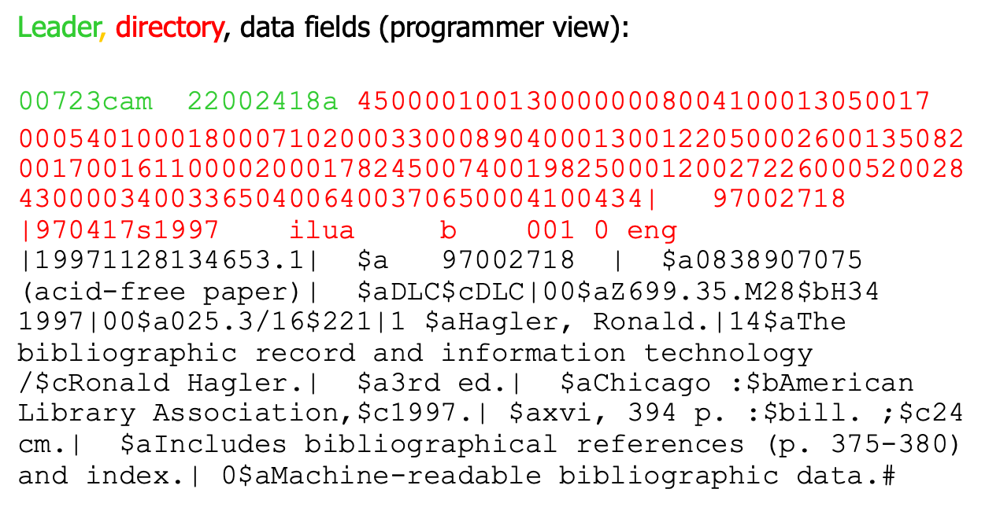{fig-align="center"}

::: notes
The leader (in green on the slide), directory (in red), and data fields
(in black) each include important instructions to the computer on how to
process the record and the data in the record.

Believe it or not we used to actually show the raw leader and directory
data to users in very early library catalogs. The information in the
leader is encoded by the cataloger when developing the control fields in
the record, such as the 008 field.

The directory is developed by the computer and the cataloger as the
program extracts and builds the coding based on the values the cataloger
enters in the fixed and variable length fields. The data fields are
developed by the cataloger when they create a new catalog record for an
item in the collection.

This record is for a book by Ronald Hagler entitled “The bibliographic
record and information technology.”
:::

## Record Structure Parts

*These fields are created and used by catalogers*

-   `Control Fields`: mostly variable-length fields containing data
    necessary for processing record and representing content
    -   tagged (labeled) 0xx
-   `Field 008`: fixed-length control field containing coded data
    describing books (*year, type of publication, illustrations,
    audience, literary form, language, etc.*)

::: notes
Control fields hold data that the computer needs to help it process the
record but they also hold numeric data such as classification numbers
and ISBN codes.
:::

## Record Structure Parts

*These fields are seen by catalog users*

-   `Data Fields`: variable-length fields containing substantive data
    representing an information object
    -   tagged 1xx – 9xx
        -   also called tagged fields
        -   often contain subfields

::: notes
Data fields hold the data that describes the information object.
:::

## Record Structure Parts

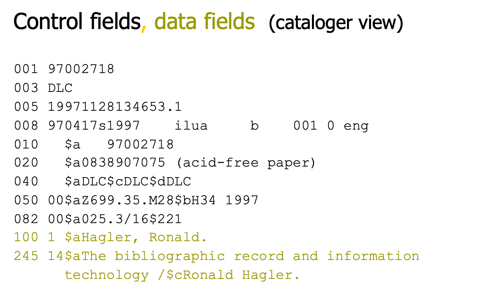{fig-align="center"}

::: notes
This slide shows you an example of which fields are *Control fields* and
which are *Data fields*.

This is the view a cataloger sees and also what the MARC record looks
like as the cataloger develops the metadata within the fields.
:::

## Content Designation

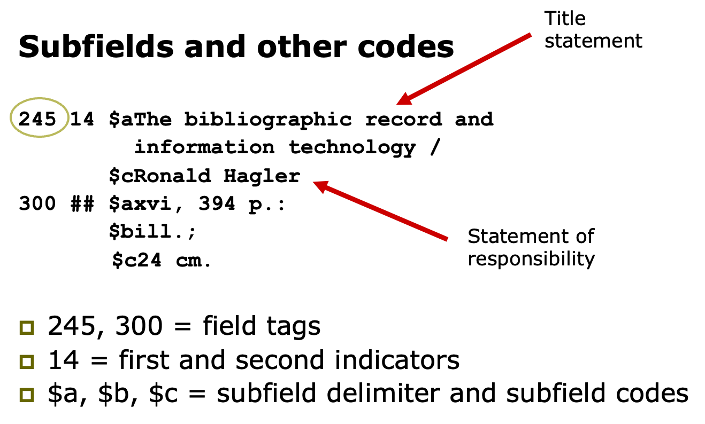{fig-align="center"}

::: notes
Let’s take a closer look at a MARC record.

This slide decodes it a bit for you. For example, the Title of the
object is included in the 245 field. The 245 is called a field tag. The
1 and 4 are what are called indicators. They give instructions to the
computer on how to process the data that follows in the record.

For example, the 1 (first indicator), tells the computer that there is
an added entry (in this case there is other title information) to look
for also when searching. The second indicator (4) tells the computer how
many spaces to drop when sorting.

The computer would then sort on the word “bibliographic” INSTEAD of
“The”. How useful would it be to sort on “the” when displaying titles to
the users?

Each field may have one or more subfields that hold yet different data
about the item. Subfields are indicated by a symbol, such as the \$ or
\| (called subfield delimiters) in records, followed by an alphanumeric
subfield code, usually a one alpha or numeric character such as the \$a,
\$b, \$c examples shown on the slide.

You will be using an online tool called the MARC Bibliographic Format to
decode the different field tags/subfields, indicators, etc. in AE#5.
:::

## MARC Bibliographic Format

-   To determine what each “tag” includes in a MARC record, we use an
    online source called the MARC Bibliographic Format. It is available
    at:

1.  Library of Congress at: <http://www.loc.gov/marc/> , then click on
    Bibliographic Format link or go directly to:
    <http://www.loc.gov/marc/bibliographic/>

::: notes
Here is the link out to the MARC Bibliographic Format you can use to
learn more about how MARC records are structured.
:::

## MARC Bibliographic Format

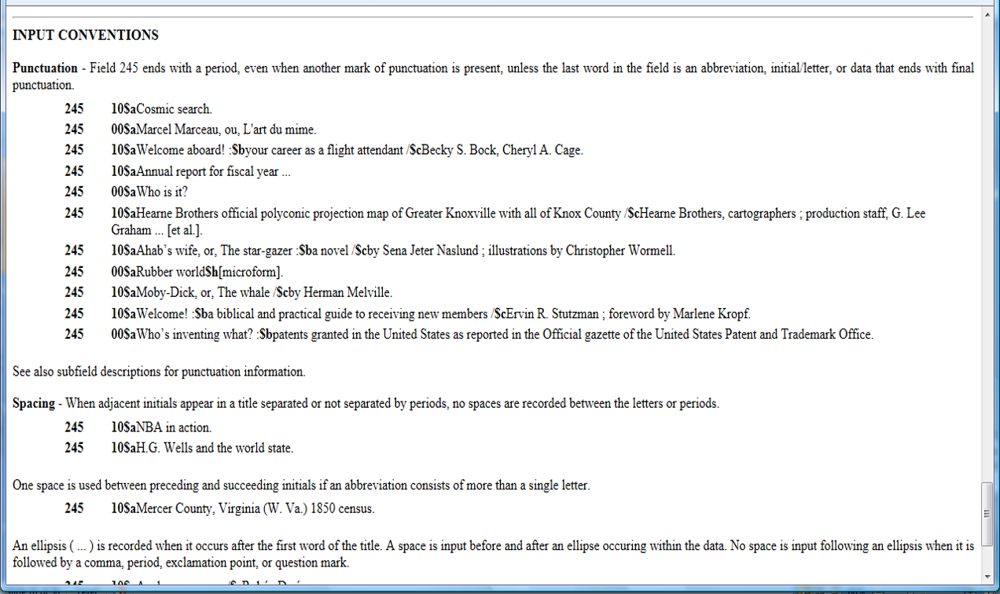

::: notes
Input conventions on the Bib Format for the 245 (title) field.
:::

## Data Content

::: notes
And, here is the result from a user view after a cataloger using the
MARC record structure and MARC Bibliographic Format to develop a catalog
record.
:::

## What does a MARC record look like?

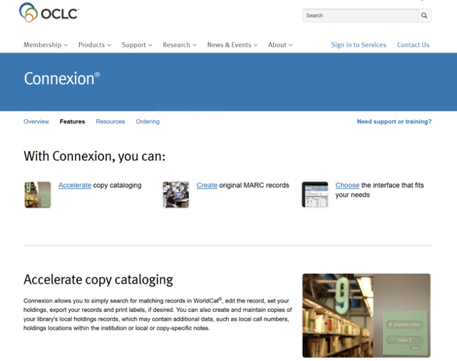{fig-align="center" width="359"}

::: notes
To develop MARC records libraries use different tools. The one used most
often in libraries, is the OCLC Connexion web interface.

OCLC is a large, world-wide nonprofit consortium (also called a
bibliographic utility) that catalogers use to develop MARC records.

You must be a member of OCLC to copy, develop, or edit records in
Connexion. Connexion is the cataloger’s view of MARC records.

You may already be using the user’s view of OCLC’s Connexion database.
It is called WorldCat. The WorldCat database is developed by catalogers
around the world who belong to the OCLC consortium.

The slide shows you what the web access page to Connexion looks like. If
you take the Cataloging and Classification course you will use Connexion
to develop MARC records.

In this class we will not be developing records but will instead use the
Library of Congress Catalog to examine MARC record components in depth.
:::

## MARC record in OCLC Connexion: MARC Text View

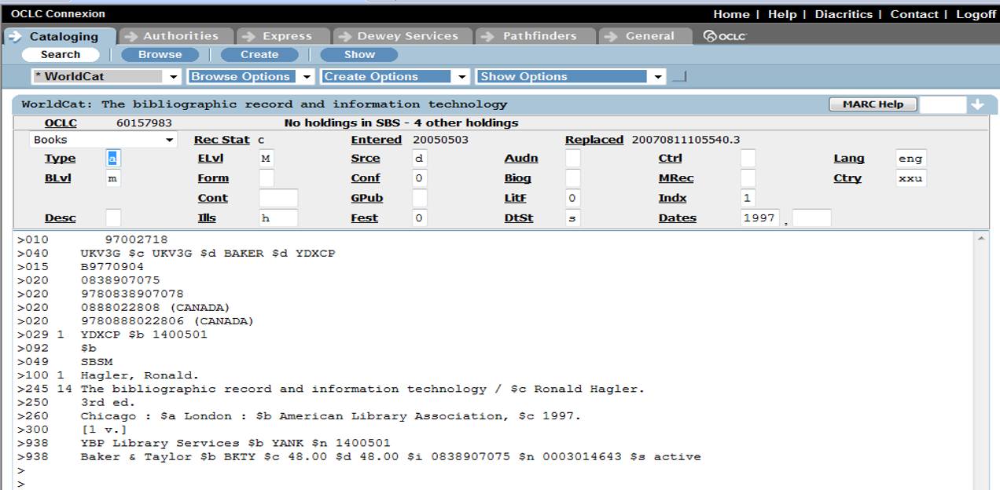{fig-align="center"}

::: notes
There are several different views a cataloger may use to develop MARC
records.

The Text View is shown on this screen. This view basically works like a
word processor. The cataloger determines which fields to add to the
record, and then encodes the record using the MARC Bibliographic Format
instructions, including all tags, indicators, subfield delimiters and
codes, as well as the data values that describe the object.

Each field or subfield holds the data values for either descriptive
cataloging (as we discussed in Module 6.1.1 and 6.1.2) and the subject
cataloging (we will discuss in Module 7) and classification (Module 8).

Combining all of these elements results in one bibliographic record in
our library catalog.
:::

## MARC Record: Display Mode

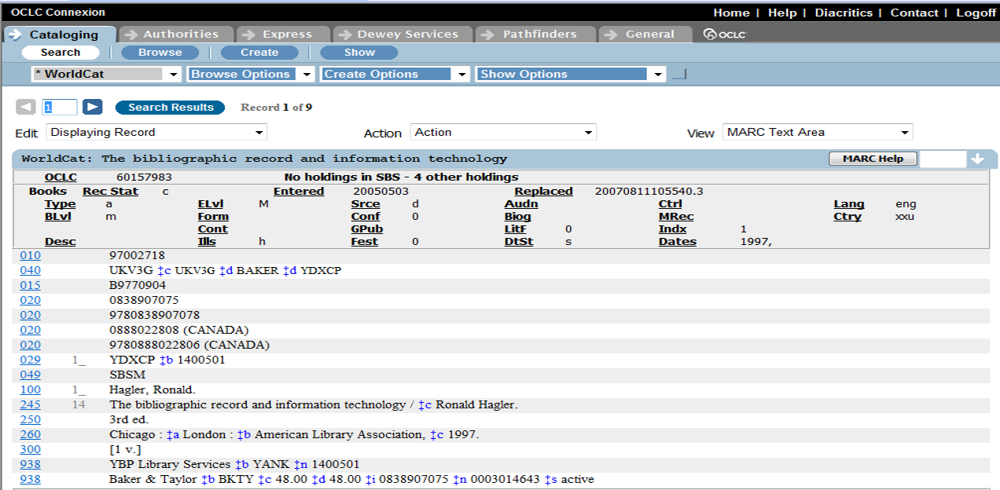{fig-align="center"}

::: notes
This slide shows the Display Mode that a cataloger uses to check their
work once they have developed the record.
:::

## MARC Record: Editing Mode/Template View

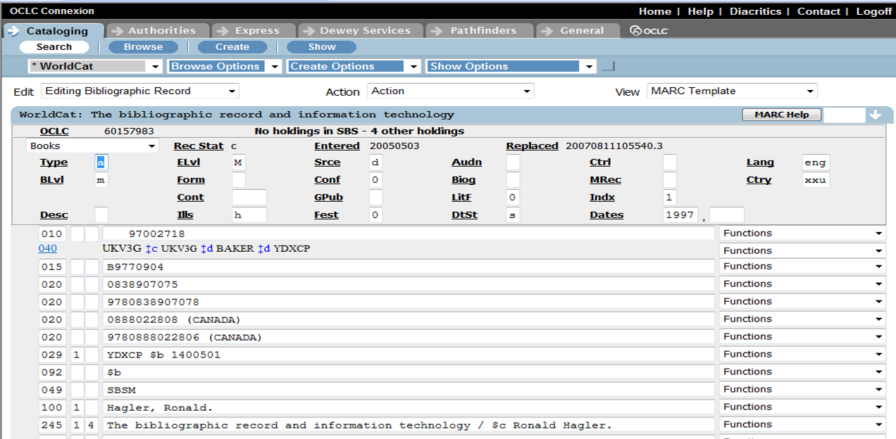{fig-align="center"}

::: notes
And this slide shows the Editing Mode or Template View.

Catalogers can use this view to either edit a record or to develop a
record, using a template, with boxes, rather than the Text View shown on
slide 19.
:::

## New Bibliographic Framework Initiative

-   The Library of Congress has begun development of a new bibliographic
    framework that will replace the MARC record structure.
-   For more information of this effort, go to:
    <https://www.loc.gov/bibframe/>
-   For list of changes to MARC to accommodate RDA, go to:
    <http://www.loc.gov/marc/RDAinMARC.html>

::: notes
Initiated by the Library of Congress, BIBFRAME provides a foundation for
the future of bibliographic description, both on the web, and in the
broader networked world.

Follow the link on the slide to the LoC site which presents general
information about the project, including presentations, FAQs, and links
to working documents.

In addition to being a replacement for MARC, BIBFRAME serves as a
general model for expressing and connecting bibliographic data.

A major focus of the initiative will be to determine a transition path
for the MARC 21 formats while preserving a robust data exchange that has
supported resource sharing and cataloging cost savings in recent
decades. As you will see on the next slide, BIBFRAME uses a basic FRBR
model to represent items.

The second link on this slide will show you a list of changes made to
the MARC record structure to accommodate the new descriptive cataloging
standard, RDA, that we discussed earlier in this module.
:::

## BIBFRAME Model

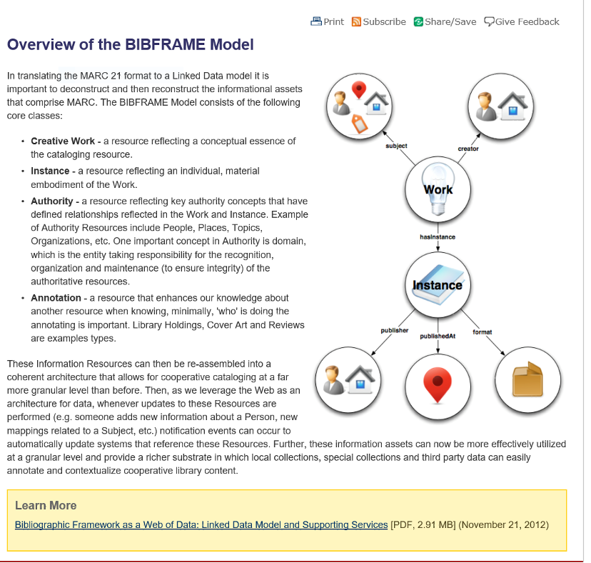{fig-align="center"}

::: notes
This slide shows the BIBFRAME model being developed by the world wide
cataloging community. You can see how the FRBR conceptual model has
influenced its development.

To learn more about the model and BIBFRAME go to:
<http://www.loc.gov/bibframe/docs/model.html> to read about developments
and see early implementation of BIBFRAME. There is also an update at
each ALA conference.

BIBFRAME represents an important change for libraries and the way we
think about and represent data in our catalogs.

As part of linked open data, we will be able to share our data outside
of the library catalog with others, such as vendors, publishers, Amazon,
etc. The inter-connectivity of linked library open data will also enable
our library catalogs to collocate our records in many new ways, as we
saw in the Module 7.1.1 and 7.1.2 lectures.

What do you think about this exciting but very frightening (for some)
change to bibliographic records? Post your thoughts on the Module 10
discussion board.
:::

## Useful Definitions: Authority Control {.smaller}

-   Broad concept for establishing/maintaining consistency in records
    -   maintains consistency of names and other terms occurring in
        selected access points

    -   shows relationships between an “authorized” or “controlled” term
        and variants or related terms

    -   Three forms:

        -   name authority control

        -   title authority control

        -   subject authority control
-   Certain fields may be under authority control, typically the fields
    that serve as access points

::: notes
Let’s leave the discussion about bibliographic records for a while,
though we will come back to it later in this lecture. Now let’s address
Authority Control and the role it plays in developing bibliographic
records.

First let me present some definitions that will be useful to our
discussion:

**Authority control (AC)** – this is a very broad concept that we use to
describe the practice of making choices about what we consider to be the
authorized or preferred form of a name, title, or subject in our
bibliographic system.

Using AC allows us to maintain a consistent form that is used every time
we represent that particular person’s name in our system, or every time
we use that title or subject term.

For example, when we wish to identify an author in our bibliographic
records we consult what we call an authority file to find the authorized
form of that individual’s name.

We then use this form of the name, and only this form of the name in the
1XX and/or 7XX fields of our MARC records. We will discuss AC further in
a few moments.

Typically only certain fields in our bibliographic records are under AC.
These are the fields that we have determined will be searchable or, in
other words, those fields we deem as “access points”.

The next slide presents definitions you might encounter in the readings.
:::

## Authority Control Defined

-   “the process of pulling together into a single authority record all
    the forms of a name that apply to a single name; all the variant
    titles that apply to a single work; all the synonyms, related terms,
    broader terms, and narrow terms that apply to a particular subject
    heading” (Taylor, 1999 p. 20).

-   “the determination of the standardized forms of subject terms and
    names” (Chan, 1996 p. 12).

::: notes
See slide for other definitions of authority control as defined by
Taylor and Chan.
:::

## Useful Definitions: Access Points

-   “almost any word in a record when keyword searching is used.
    However, the term access point is usually applied to a particular
    name, title, or subject” (Taylor, 1999 p. 20).

-   “A name, term, code, etc. under which a bibliographic record may be
    searched and identified. Also called a “heading” (Chan, 1996 p.
    479).

-   database application: any field you designate as a searchable field
    becomes an access point to user

-   “a name, term, code, etc., under which information pertaining to a
    specific entity will be found” (RDA, glossary)

::: notes
In library systems, such as OPACs, the fields that are searchable serve
as access points for your users. Another example of this concept would
be when you use databases to find articles. You are generally given a
dropdown list of fields that are searchable in the system.

In this manner you can tell the system which field or fields you wish to
search within for the terms you enter. When the database was created,
choices had to be made about which fields will be searchable.

Typically the fields that become access points are those that the system
designer thinks will be used more frequently during the search by the
users.

The slide also presents definitions you might encounter in your textbook
or the readings. Depending on the specific application as well as
perspective, we see there is a different definition related to the term.

RDA does not change the meaning or use of this term, but in many ways,
it makes it a central aspect of bibliographic records. RDA allows for
the creation of many more access points than has previously been the
practice using AACR2.
:::

## Useful Definitions—Access Points

-   Authorized access point– “the standardized access point representing
    an entity” (RDA glossary)
-   Variant access point – “an alternative to the authorized access
    point representing an entity” (RDA glossary)
    -   Can be authorized for use or NOT authorized for use

::: notes
RDA also includes the concepts of “authorized access point” and “variant
access point”.

See the slide for the definitions of each.

Authorized access points are the forms of name, title, or subject that
have been established as the form to use in the fields of the
bibliographic record (1XX, 2XX, 490, 6XX, 7XX).
:::

## Useful Definitions: Headings

-   When you use name authority control in bibliographic records, in the
    1XX fields, we use what are called Main Headings, or Authorized
    Name, Authorized Headings.

-   “A name, word, or phrase placed at the head of a catalog entry to
    provide an access point” (Chan, 1996 p. 485: AACR2R, 1998 p. 618).

-   “An access point printed at the top of a surrogate record or at the
    top of a listing of related works in an online resource” (Taylor,
    1999 p. 243).

::: notes
A further related term is Heading. This term is actually a hold over
from print library card catalogs. The “heading” was the entry at the top
of the card that also instructed the cataloger about which section of
the catalog the card should be filed. Usually a card set would have a
card for Author, one for Title, and one card for each Subject term that
was assigned to the object.

So a card set would include at a minimum three cards. At the top of each
card would be the “heading”. It would be either the author’s name, the
title, or the subject. (see next slide for an example).

In MARC records, we use “headings” for personal or corporate names (1XX
fields), for titles and series titles (2XX and 4XX fields), for subject
headings (6XX fields), and for added entries for additional personal or
corporate names (7XX fields).

There are two types of sources we use to determine the authorized
heading: 1) we use what is called an authority file, or 2) we create or
“establish” an authorized heading. We will address authority files,
authority control, and establishing headings later.

So, you can see that headings typically are created for the fields that
we have determined as main access points (name, title, subject). We know
through years of research that these fields are also the fields most
often used by our users to look for objects in our catalogs.

In RDA, the term heading is being phased out. In fact, you will not find
this term in the glossary. I have included it in the lecture because you
will still see it used in the literature and discussions about access
points.

In RDA access point is used to referred to what we used to call the
authorized or variant HEADING or term, name, code, except that we have
decided will represent the name, subject, title, etc. in the
bibliographic record.
:::

## Example of Author Heading

::: notes
This slide shows the example of what a Author Heading would look like on
a paper card catalog card.
:::

## Providing Access to Record

-   Two separate, but related concepts
    -   Searchable Fields
    -   Access Points
-   Distinguishing between
    -   structure in the record that can be searched (e.g., field)
    -   data that is held in that structure

::: notes
So to quickly review, when we talk about authority control in library
systems we also must discuss what we call access points or access
control.

These two concepts are separate but also related, as they are how we
provide collocation and access to the records within our system.

A further distinction between the two is that access points are related
to the structure of the record (e.g. the choices made about which fields
will be searchable) AND using RDA, they are the name, term, code, etc.
that we enter into specific fields in a bibliographic record.

Authority work is the process we use to create the access points (used
to be referred to as headings) we enter within the fields that will
serve as access points in our bibliographic records.

Now let’s talk about authority records and the process we use to create
these records, authority work.
:::

## Authority Work Process

-   Create authority records
-   Gather the records into an authority file
-   Link that file to a bibliographic file
-   Maintain the authority file and system
-   Evaluate the file and system

::: notes
Authority Work is the process we undertake in libraries to create a
system that holds our decisions about authorized access points. The
process includes:

1.  Creating authority records using the information we gathered and
    decisions we made when establishing authorized access points.

2.  Gathering the records into an authority file that we use as the
    source of information for access points in MARC records.

3.  Link that file to a bibliographic file. This part of the process is
    done by the library’s catalog and the algorithms of the integrated
    library system. This linking is also established when the cataloger
    uses a specific authorized name, title, or subject heading in a
    bibliographic record.

4.  Maintain the authority file and system by continually updating
    authority records when changes are required due to name changes.

5.  Evaluate the file and system to make sure it is up to date and
    working properly within the OPAC.
:::

## Elements of an Authority Records

-   Establish the authorized form of the name, title or subject (used to
    be called heading, now is called authorized access point)
-   Once the authorized access point is determined, identify variant
    forms of the name, title, subject
-   Link the variants to the authorized access point
-   Document the decisions and sources used for these activities
-   Record all in an authority record

::: notes
Authority Control Files hold the authority records we create during the
process of authority work. Each record holds the decisions we made when
we established the authorized access point for the names, title, and
subject headings used within our collection.

Many libraries have their own local authority systems that catalogers
have created through the years. *(Many of these are still in card
catalog format)*

Now we also have access to the Library of Congress’ Authority File
(located at: <http://www.authorities.loc.gov>). This system is free to
anyone with an internet connection. It did not used to be freely
accessible.

In fact libraries developed their own authority control files because it
was expensive to use this system in prior years. Members of OCLC also
have access to their Authorities file (located at connexion.oclc.org).
This system is only available to OCLC members and there is a fee for
searching and using the records, similar to their WorldCat cataloging
system.

The structure of the MARC Authority Format is the same as the
Bibliographic Format you have been using up to this point (0XX – 9XX
fields), but the data that fits into each field is different. Go to
<http://loc.gov/marc/authority/> to review the MARC Authorities Format.

The elements within an authority record include:

1)  The authorized form of the name (now referred to as authorized
    access point). This entry is in the 100 field using the MARC
    Authorities Format.

2)  The variant forms of the name you found while researching to
    establish the authorized heading. There are two forms of variants
    you will see in the 4XX and 5XX fields of an authority record:

    a)  authorized variants (these include names for pseudonyms and are
        located in the 5XX fields).
    b)  unauthorized variants (these are other forms of the name that
        are not authorized for use in bibliographic records. These forms
        may include foreign language spellings, alternate spellings,
        shorter or longer forms of the name, etc.). You will find these
        unauthorized variants in the 4XX fields of the authority record.
        NOTE: Variants are often identified when they occur on the
        current item or subsequent items.

3)  The final element of the authority record is your documentation of
    the decisions and sources used to establish the authorized forms of
    the name, as well as any other sources used to find variants. You
    will find decisions and sources documented in the 670, 6XX fields in
    the authority record.

These three elements are essential in a good authority record. You may
not, however, always have variants, so this element may not be included
if not applicable. There are also many new elements included in
authority records due to RDA changes. Authority records now include
information related to gender, geographic location of author, etc.
Review the MARC Authority Format to learn more.

See the next two slides for examples of Authority records.
:::

## Example Authority Record

{fig-align="center"}

::: notes
This is an example of a printed card catalog authority record. Note that
several sources such as the title page (t.p.) and the jacket (jkt.) were
consulted to determine the authorized and variant forms of the name.

Variants are indicated with an X preceding the name.
:::

## Example USMARC Authority Record

{fig-align="center"}

::: notes
This is the same person’s authority record but in a MARC authority
format.

Refer to the MARC Authorities Format to figure out which tags hold the
authorized and variant forms of the name.

Which tag holds the decisions?
:::

## How Does It Work?

-   Search example
-   Author is: Heim, Kathleen
    -   Look at results
    -   Explanation for getting records with the following names listed
        as author
        -   Heim, Kathleen M.
        -   McCook, Kathleen de la Pena
    -   Are these the same person?
-   Search OCLC, *LC’s Name Authority File*

::: notes
Here is one to try using either LC’s Authority File or OCLC’s
Authorities.

This person has had several name changes due to marital status. See if
you can find her authority record and track her history.

Go to: <http://authorities.loc.gov>
:::

## Name Authority Record for Heim

{fig-align="center"}

::: notes
Example of Heim printed card name authority record.
:::

## Name Authority Record for Heim (MARC)

{fig-align="center"}

::: notes
Example of Heim MARC name authority record.
:::

## 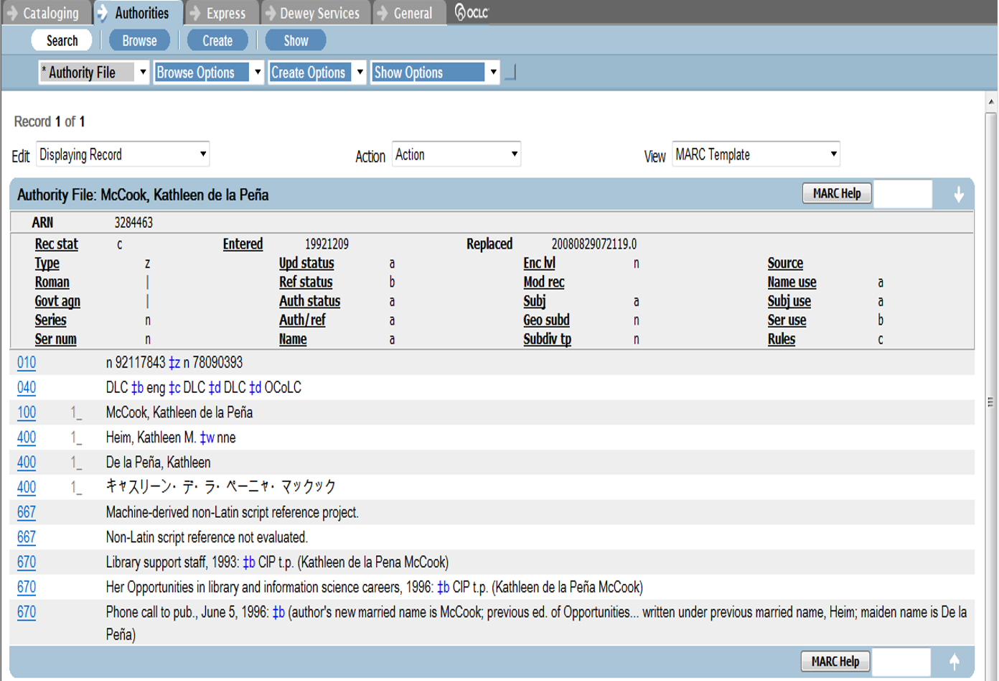

::: notes
This slide shows the authority record for McCook, Kathleen in OCLC’s
Authorities.
:::

## Using Access Points in BiB Records

Once we either construct an authorized access point OR we use an
authority file to determine the authorized access point, we would use
this name, title, or subject term in the appropriate field in our MARC
bibliographic record.

::: notes
Once we either construct an authorized access point OR we use an
authority file to determine the authorized access point, we would use
this name, title, or subject term in the appropriate field in our MARC
bibliographic record.

The next slide shows how this works.
:::

## 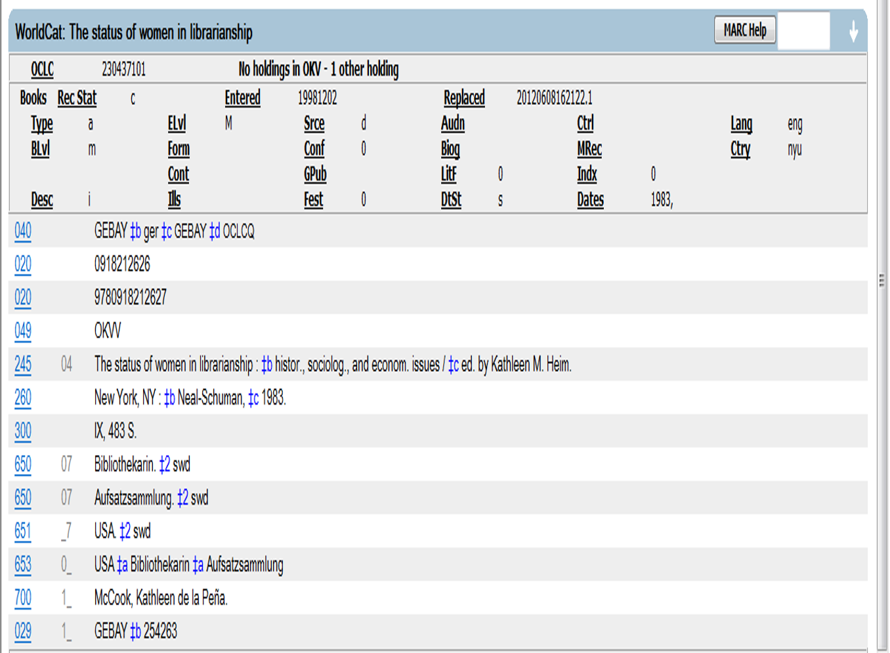{width="1200"}

::: notes
This is the record for McCook, Kathleen’s work entitled “The status of
women in librarianship”.

The authorized form of her name is used in the 700 field of this
bibliographic record. She is an editor on this work so there is no 100
field in this record.

The cataloger has taken the authorized form of her name (authorized
access point for her name) and entered this value into the appropriate
field in the MARC record, in this example, in the 700 field.
:::

## Putting It All Together

-   Descriptive cataloging using AACR2R or RDA
-   Combined with subject analysis and selection of controlled terms
    from controlled vocabularies like: LCSH, MESH, Sears, ERIC
-   Classification added, based on subject of object (LCC, DDC, faceted
    schemes)
-   Implemented in different formats/tools:
    -   In past: manual card catalog
    -   Presently: MARC records (OCLC), metadata schemes (Dublin Core),
        XML Marc

::: notes
In conclusion, in this module you are going to learn more about how bib
records are structured, the standards that guide cataloger/record
creators, and the tools we use to create the descriptive aspects of the
records.

In the next module, we will look at subject authority control and how it
is used in bib records.

I hope you enjoy exploring MARC and other standards used in libraries
and information organizations to develop bibliographic records!
:::
