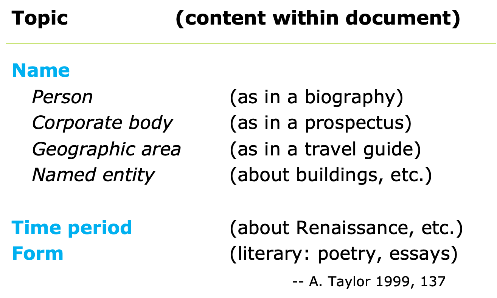
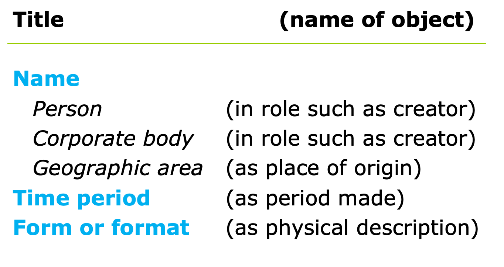
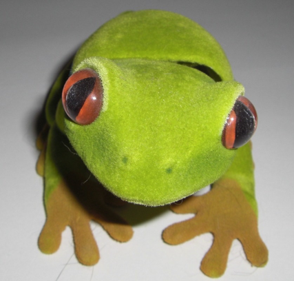
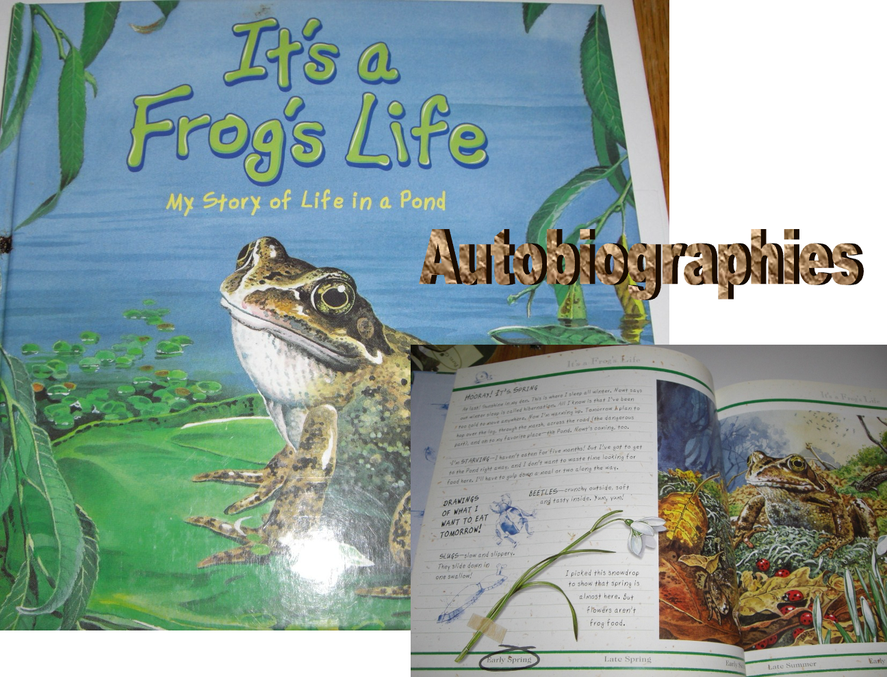
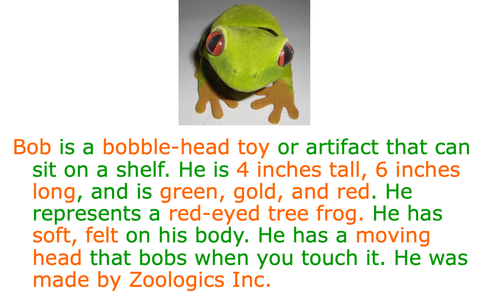
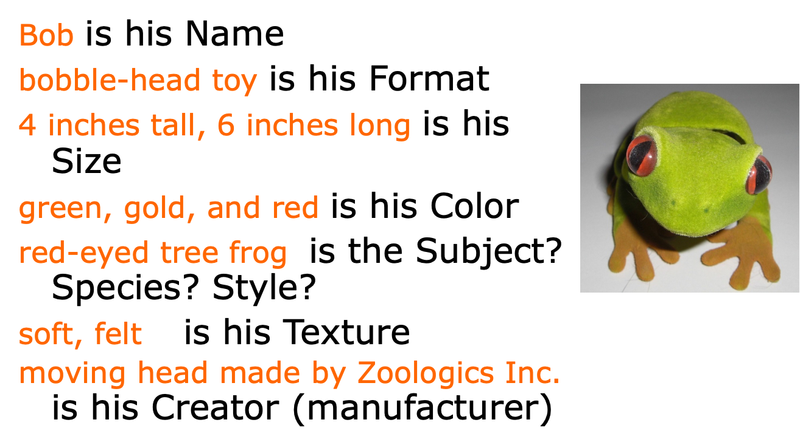
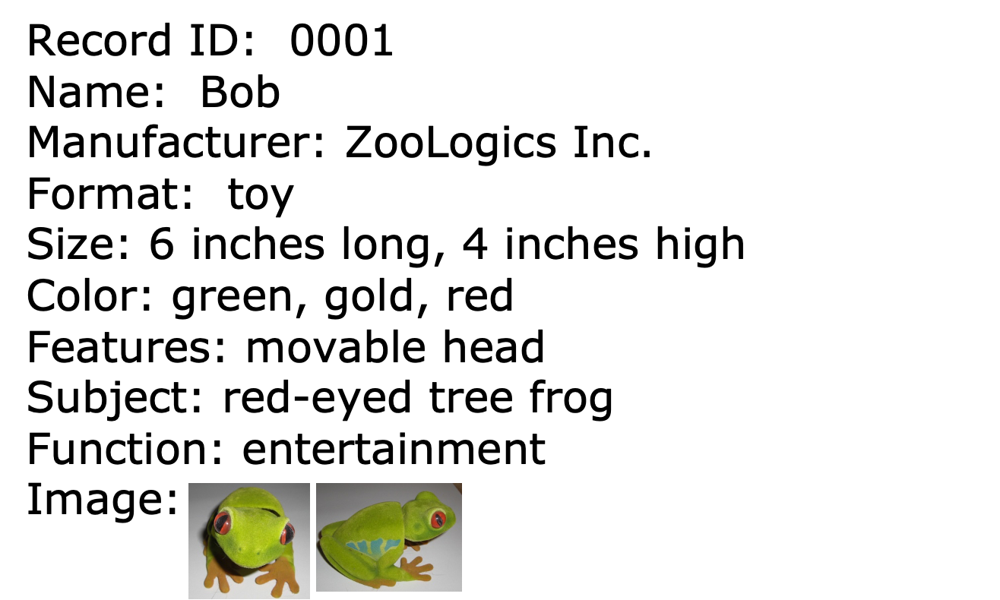
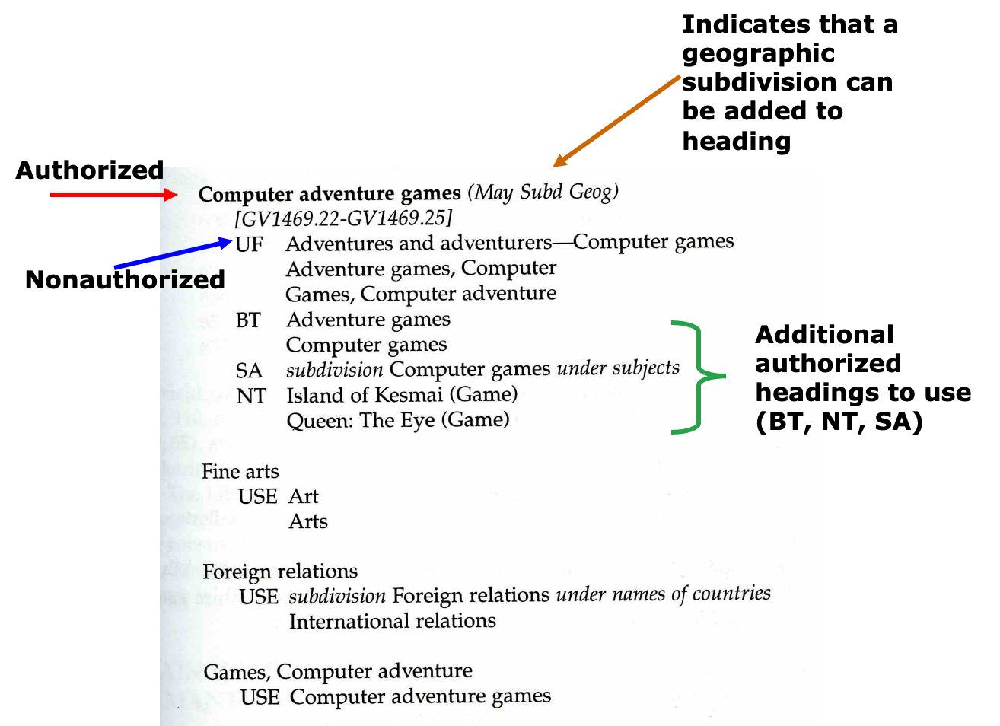

# Introduction

::: notes
With this module, we are going to switch gears. We are now going to begin
to focus on subject access or what is often called providing
“intellectual access” to objects in a collection.

This week we will cover the first dimension of this process, subject
cataloging.

Next week, we will focus on classification, which in libraries is
oftentimes based on the subject of the objects, though there are
classification structures that are based on other aspects of the
collection.

This module will introduce you to the concept of subject access and why
it is important in the representation of collections. We will explore
the questions of

-   “what is a subject?”
-   “how do we represent subjects within systems?”
-   “how do I determine what a subject is in a nontextual object, like a
    cd-rom or a person?”

We will think through the questions of:

-   “Why are we concerned with the subject-related aspects of our
    objects and how do we represent subjects in our records?”
-   “Why distinguish subject from physical description?”
-   “What does subject access add to the representation of objects?”

We will focus on some of the processes we have developed to represent
subjects in systems as well as on the tools we use to enable subject
authority control when we create subject representations, such as
controlled vocabularies. thesauri, etc.

We will look at examples of controlled vocabularies, like the Library of
Congress Subject Headings (LCSH) or the ERIC Thesaurus.
:::

## What is a Subject?

`A subject is . . .`

> a representation of the intellectual content of an information object,

or

> its aboutness, topic, theme, expressed concepts or ideas, area of
> interest or knowledge.

::: notes
So, what is a subject? The literature on subject cataloging and subject
representation discusses subject as:

> a representation of the intellectual content of an information object,

At this point we are interested in representing the content related
aspects of our objects, not the container aspects that we focused on
previously. We want to help connect our users with the intellectual
content of the information objects.

> or its aboutness, topic, theme, expressed concepts or ideas, area of
> interest or knowledge.

We also talk about the “aboutness” of an object when we are representing
subject. We think about subject as related to “theme, topics, expressed
concepts or ideas” of the author/creator of the object.

The difficulty often will lie with determining not just the author’s
intent for the subject of the work, but also what level of granularity
to represent subject within our records.

We will talk later about exhaustivity and specificity in subject
representation and some of the means we have to represent granularity
within our representations.
:::

## Understanding Subjects

`The traditional view of a subject . . .`

> is based on bibliographic conventions for representing textual objects

> distinguishes between what an object is about and what an object is
> (i.e., subject description of intellectual content vs. physical
> description of container or package)

::: notes
Our traditional view of subject is of course based on bibliographic
conventions for representing textual objects, as these objects tend to
comprise the majority of larger collections. However, libraries have
always created representations for non-textual objects.

Representing subject adds another access point into our systems.

We distinguish between what an object is “about” and what an object
“is”.

We are not concerned with the container aspects of name, creator,
physical description, but rather want to provide an access point into
the object’s content or “aboutness”.

We know from information seeking studies that most users conduct what we
call “known item” searches, meaning the user knows something about the
object they want to find.

Generally it is the title or author, but research has shown that subject searches are often predominant. Subject representation enables subject searching/access for our users.
:::

## Understanding Subjects

`The traditional view of a subject . . .`

> assumes an object has identifiable intellectual content

> Yet subjects are difficult or impossible to identify for a few textual
> objects and most nontextual objects

::: notes
The traditional view also assumes that an object has identifiable
intellectual content, which is not always the case.

For example, think about your personal collection of images. You as the
creator can probably determine subject based on your engagement with the
image. You know where it was taken, your motivation for taking the
photo, the subject(s) of the photo, etc. However, others viewing the
image may not have this context to help them determine subject.

Some of earlier research shows that when people describe images, they
tend to assign stories, or associated memories to a work to provide
themselves with context for better understanding the image. Such as,
“That photo reminds me of my grandmother’s kitchen in the 50’s”.

This finding also relates to principles of cognitive science about how
the brain encodes information based on sensory stimuli. Users are more
likely to describe the subject related contents rather than physical
aspects of the image.

Does this encoding schema still hold true in our Web 2.0 world where
users can now put up their images online on photosharing sites like
Flickr (flickr.com) and “tag” (describe them using words and short
phrases) them? How do users describe their own images? Collections?

Another example is music. For classical music we have pre-defined
periods such as Classical, Romantic, etc. We can even represent current
musical works by genre, such as pop, rock, country, folk, etc. But how
do we get at what the music is trying to convey, the emotions it is
trying to evoke? Can we? Should we?
:::

## Problems in Subject Description

-   Subjective interpretation based on ambiguous, emotional content

-   Domain expertise of person doing subject representation

-   How do our choices align with user’s choices of search terms?

-   Materials that don’t lend themselves to simple subject
    representation

::: notes
Another added dimension to subject description is that the person
creating the representation (cataloger, indexer, database developer,
knowledge manager, etc.) brings their own four types/levels of knowledge
to the table.

Subject representation can be very **subjective**, based on a indexer’s
domain expertise or world, task, system knowledge. We have all had
different life experiences. We have lived in different places, read
different books, talked to different people. We grew up in different
cultures and were exposed to different ideas, values, language. We all
learned different concepts and ways to represent an idea.

The issue here is not that subjectivity is a problem, rather the issue
is that our records have to maintain a certain degree of **consistency**
to be effective for retrieval purposes.

**If we use different terms to represent the same concept, are we doing
a disservice to our users OR are we giving them more potential “chances”
at guessing the terms we used to represent the subject?**

What does inconsistency of term selection do to our objectives of the
library catalog, like collocation?

A further issue is whether or not OUR choices are aligned with those of
the users. Are the terms in our controlled vocabularies representative
of the way users think about, talk about, search for objects in our
OPAC’s? We really have conducted little research into this issue.

Drabenstott’s (and later she changed her name back to Markey) work is
one of the few studies we have about our user’s understanding of Library
of Congress Subject Headings (LSCH).

Abilock (2005) conducted a similar study with children (5-6th graders)
and found that they also do not understand our use of or choice of
subject headings. While the Drabenstott study was conducted prior to the
web and was concerned mainly with OPAC’s but it is still quite relevant.
Abilock’s work shows how younger users who are part of the Internet
generation are not completely familiar with how our OPAC’s and other
database systems work.

Users do not understand the subject headings we choose to represent
subjects in our records. **AND how do user’s use of systems like Google
affect their use and expectations of our systems?**

Other studies, called extent of match studies, have also examined how
closely user’s search terms match those of LCSH. Again, there was a low
degree of match between the two sets.

We have also conducted studies that measure the degree of consistency
(or inconsistency) between two or more cataloger’s choice of subject
headings to represent subject content. These studies are referred to as
interindexer consistency (or interindexer inconsistency) studies. At the
high point, we have found no more than a 30% degree of match between
indexers’/catalogers’ choices of subject terms.

Of the four types/levels of knowledge, our research has also shown that
domain knowledge of the cataloger tends to play the central role in the
choices they make while subject cataloging.

So what can we learn from these studies? How can we apply this
information to the process of subject representation?
:::

## Why Distinguish Subject from Physical Description?

-   To distinguish between work and text

-   To clarify representations of various kinds of subjects

-   To provide more access points for searching

-   To provide intellectual access versus bibliographic access

::: notes
So why do we distinguish subject from physical description?

> To distinguish between work and text

To represent not just the descriptive aspects of the work, but the
actual text (representation of author’s ideas)

> To clarify representations of various kinds of subjects

To represent different aspects of subject not necessarily related to
content, but for example, the purpose or function aspects of the object,
the geographic location or setting of the work, the chronological period
in which a work was set, etc.

> To provide more access points for searching

To allow users yet another point or points in which to gain access into
the collection

> To provide intellectual access versus bibliographic access

To provide access/collocation of subject related contents of the works,
not just name or author access
:::

## Representing Intellectual Content

{fig-align="center" width="446"}

::: notes
There are different ways in which we represent intellectual content
including:

-   Topic (content within document) this one is the most straightforward
    in terms of subject representation

> Name

-   Person (as in a biography, autobiography) in these cases the person
    IS the subject

-   Corporate body (as in a prospectus) when the work is ABOUT the
    company, not just produced by the company

-   Geographic area (as in a travel guide) the work is ABOUT a
    geographic location

-   Named entity (about buildings, etc.) for example a work about the
    Vatican or Library of Congress

> Time period (about Renaissance, etc.) representing time period adds
> yet another dimension to subject access (for example a science fiction
> work set in the 23rd century)

> Form (literary: poetry, essays) as in literary form of the object,
> again adds another dimension to subject access

What others have we seen in the new second generation or FRBR catalogs
we have looked at in class?
:::

## Representing Physical Object

{fig-align="center" width="491"}

::: notes
When we represent the physical object we might use some of the same
concepts, but they are representing the container aspects of the
objects, not the subject-related aspects.

For example:

-   Title, the name of the work, not the object as subject of the work

-   Name, again, in descriptive cataloging we are thinking of name as
    the role of creator (author, editor, publisher, etc.)

-   Time in descriptive cataloging represents when the work was created,
    published, etc.

-   Format (form) as representing the physical manifestation of the
    object, the work
:::

## Representing Form

`Usually considered subject description:`

-   **Literary forms:** poetry, essays

-   **Popular genre:** romance (fiction), jazz (music)

-   **Type of info:** correspondence, bibliography, statistics

-   **Organization of info:** calendar, outline, dictionary

-   **Style or technique related to purpose or audience:** comedy,
    drama, persuasion

-   **Style or technique related to time period:** Baroque (music),
    Impressionism (painting)

::: notes
Form and Format can be a little confusing in terms of distinguishing
which is physical description and which is subject-related.

For example, the literary form of an object is related to the subject
content of the object, rather than the format in which it is conveyed
(anthology or collection of works).

We also represent subject using categorization into genres, such as
romance, mystery, adventure, etc.

Type of info.: correspondence, bibliography, statistics is
subject-related, as each of these forms represents information in a
specific format, but contains specific content and arrangement of the
content.

The same can be said for how information is organized within an
information object, such as in an outline or dictionary. The format is
not the subject, but rather the information is presented in a consistent
manner within the format.

Style or technique are means that we can represent the purpose or intent
of the work designed for a specific purpose and/or audience.

For example, a comedy is different from a dramatic work and a user may
chose it based on this preference of style.
:::

## Representing Format

`Usually considered physical description:`

-   **Physical media format:** book, video, photo, map

-   **Artifact format:** sculpture, figurine, vase, shirt

-   **Communication mode:** text, image, video, audio

-   **Technical digital format:** ASCII/text, HTML, .pdf, .gif

-   **Version/part of work:** edition, translation, chapter

::: notes
On the other side, physical description deals with representing the
physical format or physical manifestation of the work/object.

See the list on the slide.
:::

## Functions of Subject Descriptions

`Subject descriptions serve to . . .`

-   Organize document shelving for physical browsing and retrieval
-   Inform searchers about intellectual contents of documents
-   Provide consistency of representations
-   Assist in collection development and acquisitions
-   Assist in collection maintenance

::: notes
Subject descriptions serve many functions beyond providing subject
access into the collection.

Organize documents for shelving for physical browsing and retrieval, via
classification and collocation.

Inform searchers about intellectual contents of documents. Subject terms
in our systems can serve as additional means for users to find objects
on the same subject(s) via links out to other objects of similar/same
subject content.

Provide consistency of representations. Consistency allows the objective
of collocation within our systems.

Assist in collection development and acquisitions and collection
maintenance. Our integrated library systems can run reports based on
subject/classification so that we can review our collections, make
appropriate acquisitions, and weed out sources we don’t see used.
:::

## Remember Bob? A bobble-head toy

{fig-align="center" width="362"}

::: notes
But how do we represent objects that don’t appear to have a discernible
subject? How do we represent non-textual objects such as items in a
retail store? Sculpture in a museum? Music?

Let’s take an example of a non-textual object and work through some
ideas for subject representation. Keep in mind the context of the
collection (a retail store in a strip mall in a mid/upper class
neighborhood in the U.S.). Most of the objects in the collection
represent frogs,ie. toys, art, garden objects, books, etc.

Remember Bob? He is a bobble-head toy frog that children will love to
play with. He depicts a red-eyed tree frog. He is also the owners’
favorite.
:::

## 

{fig-align="center" width="480"}

::: notes
OK, now that you have met Bob, compare/contrast him to this other object
related to the subject of frogs.

How about a book. Can you believe an autobiography? This book contains
the diary of a frog during its life and seasons. The pictures are all in
color, it is hardbound, and 15 inches wide, 10 inches long.

Representing this object in the store’s collection would be very
different from representing Bob.

OR would it? How would you design a system that represents ALL formats
of objects in the store, but also deals with the unique attributes found
in each?

Let’s take a closer look.
:::

## Attributes for Bob?

{fig-align="center" width="400"}

::: notes
I have highlighted the attributes I can identify from the description of
Bob.

The attributes in this description are **Name**, **Physical
Description**, **Creator** and **Subject**.
:::

## Attributes for Bob?

{fig-align="center" width="567"}

::: notes
Just as a reminder of some of the concepts you dealt with in earlier modules:

Here is another way to look at attributes. Most, if not all objects,
will have a Name. For books we think of this as Title. For 3-D objects
we think of this as Name so let’s stick with Name so that we can
generally describe the objects.

For Bob we also have Format. He is a toy. We could also include this
attribute under Physical Description if we like.

Physical Description includes: Color, Texture, Size, etc. For books we
might think of number of pages, dimension, material made of, etc.

He was made by a company called Zoologics. This is a Creator attribute.
We could structure this into a field called Manufacturer later, or
Publisher for books. Creator, again allows us to generally describe the
objects in the collection.

BUT what about Subject?? How do we represent subject in this case?
:::

## Bob’s Record in the System

{fig-align="center" width="434"}

::: notes
Here is what Bob’s record might look like in our store’s organization
system.

I have included an image field so that the “Forever Frogs” customers
could see the object before they go to the trouble of locating the toy
in the store.

HOW useful is our representation of Bob’s subject? Think again about the
context of the collection. The objects are ALL related to frogs, so WHY
don’t we just use the term “FROG”? If we use “FROG” as the subject in
each of our records, what is the impact on retrieval? You guessed it—we
would return ALL of the records in the collection because they all have
the term FROG. BUT if we use “red-eyed tree frog” as our subject, then
what happens to retrieval?

HOW else would you represent SUBJECT of Bob? What else besides TOPIC
could we use? Maybe FUNCTION?
:::

## How Do We Represent Subject About…

{fig-align="center" width="569"}

::: notes
Now that we have thought about representing objects in a retail store,
HOW would we represent SUBJECTS about objects like these?

People—in a human resources database? Knowledge management system? Yes,
we can definitely represent Name, Physical Description, etc. but what
about SUBJECT? OR alternatively, is subject important in this type of
system?

Sculpture—in a museum inventory/provenance database? How would we
represent SUBJECT? Is it important that we do so?
:::

## Processes and Products

{fig-align="center"}

::: notes
We have developed different processes and products to provide subject
access within different contexts.

See chart above.

For example, the process of classification provides physical and
intellectual access, by describing the whole subject of the objects
(rather than more fine level representation. The product then that we
produce is a classification or notation code affixed to the object and
the bibliographic record. The source we use is the Library of Congress
Classification (LCC) system.

Subject cataloging, one part of the creation of a bibliographic record,
provides intellectual access to the collection by describing usually the
whole object (in libraries) but depending on the collection, more fine
grained levels of access are possible.

The product we produce are subject headings (main heading and other
potential subdivisions) which are encoded into a MARC record or used to
be typed on a catalog card. The tool we use is a controlled vocabulary,
either LCSH or other subject headings list, or potentially a subject
specific thesaurus.
:::

## Subject Indexing {.smaller}

`Subject indexing languages`

**Terms or vocabulary used to represent document content; access points
for record retrieval**

-   Varies from one index or system to next
-   May be assigned from authority control list: controlled vocabulary
-   May be extracted or derived from document text: natural language
-   May be free text or determined by the indexer/cataloger

`User-defined/assigned descriptors (social classification, folksonomies, ontologies)`

::: notes
We use what we call subject indexing languages to create subject
indexing. Subject indexing languages are terms or vocabulary used to
represent document content or to create access points for record
retrieval.

The subject indexing language or languages used vary from one index or
system to next. For example in the MARC records and library OPAC’s, we
use a controlled vocabulary like LCSH or we might use natural language
from the document itself.

There are three forms of subject indexing languages a record creator
might use:

-   May be assigned from authority control list: controlled vocabulary

-   May be extracted or derived from document text: natural language

-   May be free text or determined by the indexer/cataloger

We will discuss each of these in the next slides.

A very hot topic in LIS right now is the advent of user-generated or
user-supplied descriptors (TAGS) and how we can use these as additional
subject headings in our representations (catalog records). With the
advent of social sharing sites on the WWW such as Flickr or YouTube,
users are contributing content to sites or tagging. We will talk more
about this issue later and how it impacts cataloging, but we might see a
potential subject indexing language emerging for cataloger’s to use in
subject description.
:::

## Controlled Vocabulary Indexing

-   Based on standardized or controlled vocabulary for describing
    concepts consistently

-   Terms are assigned to documents

-   Terms are in subject or descriptor field only

-   Searcher inputs only controlled vocabulary terms

::: notes
The first form of subject indexing language is **Controlled Vocabulary
Indexing**.

In earlier module, we addressed the concept of **authority control** and how
we use authority control within library catalog records to provide
**consistency**, as well as **uniformity and uniqueness**. We focused
mainly on authorized names and uniform titles but also looked at
subjects as well. Controlled vocabulary indexing is a form of authority
control. We use terms from a predetermined, authorized list of subject
terms as the subject headings to represent subjects in our bibliographic
records.

There are different types of controlled vocabularies such as subject
headings lists, thesauri, and pick lists. We will discuss these in a few
moments.

Controlled vocabularies can be used by both the record creator and the
searcher. When a cataloger chooses terms to represent subjects and
assigns terms within the record, they are using a controlled vocabulary.
When a users chooses terms from an controlled vocabulary like LCSH (or
the Thesaurus feature in a database like Ebsco) and uses these terms as
search terms, they are using controlled vocabulary.
:::

## Controlled Vocabulary Indexing

`Subject Authority Control`

> Vocabulary control of index terms or subject headings

`Subject Authority File or List`

> All terms in any controlled vocabulary

Examples: subject headings list, thesaurus, OCLC subject authority file

::: notes
Using predetermined, authorized terms from a controlled vocabulary
(called “authorized or preferred terms”) allows for consistent subject
use within our records. It also allows the catalog to provide
collocation, or for the system to find all items in the collection
indexed with the same subject term for the user when conducting a
search. Using consistent subject terms makes a system more efficient and
searches more precise.

On the other side of this issue, users do not always use the term we
have chosen as the authorized term. For example, the authorized term may
be AUTOMOBILE and the user enters CAR as their search term. In most
OPACs, if the term in the representation (catalog record) doesn’t
exactly match the term used by the user, the system will not match the
two terms and no results will be returned to the user.

The user may then think your collection does not contain any objects on
their subject. In newer systems (though few of these), the system is
able to map from one term to another related or broader/narrower term.
In the same scenario, if mapping occurs, the user would most likely find
all objects in the collection that contain the term AUTOMOBILE even
though they used CAR as their search term. Some of the newer clustering
and hierarchical browsing OPACs have this functionality included in
their searching features.

There are different types of controlled vocabularies such as subject
headings lists, thesauri, and pick lists. You might also see these tools
referred to as subject authority files.
:::

## Subject Authority Files

`Concepts`

-   Subject authority files are databases or collections of subject
    authority records

-   Subject authority records contain controlled vocabulary representing
    subjects

-   Three kinds of subject authority files are subject headings,
    thesauri, and LC or OCLC’s authority file

::: notes
Subject authority files are databases or collections of subject
authority records.

You might recall that we create authority files to hold
our decisions regarding the creation of authorized headings for names,
titles, and subject terms. Subject authority files are authority files
that hold subject heading records.

Subject authority records contain controlled vocabulary terms that we
can then use when representing subjects. In subject authority records,
we include the authorized term, the variant terms (both authorized and
nonauthorized), as well as the sources we used to make our decision. We
also document the process we went through to determine the authorized
terms.

There are three kinds of subject authority files: subject headings,
thesauri, and LC or OCLC’s authority file. Lets take a closer look at
each and some examples.
:::

## Subject Headings

`Subject Headings Lists . . .`

-   Provide subject headings for cataloging and searching
-   Contain both single-concept and multiple-concept (precoordinated)
    terms
-   Indicate semantic relationships (see, BT, NT...)
-   Are used to assign a few terms to describe whole document

::: notes
Subject headings lists like LCSH or Sears List of Subject Headings are
two popular controlled vocabularies used in libraries in the US but also
around the world. They tend to represent the **entire world of
knowledge**, rather than to focus on a specific domain or discipline,
like a thesaurus might. We use subject heading lists to provide subject
headings for cataloging and searching (as mentioned before they can be
used by cataloger and by users also). They are the authorized list of
terms a cataloger chooses from to represent subject in the bibliographic
record.

A subject heading list will:

-   Contain both **single-concept and multiple-concept**
    (precoordinated) (the terms are combined for the user ahead of time)
    terms, meaning that it contains terms that represent both
    single-concepts (AUTOMOBILE) represented with one word, and those
    that represent multiple-concepts (RADIOISOTOPES IN CARDIOLOGY)
    represented with phrases.

-   Indicate **semantic relationships** (see, BT, NT, RT). Within the
    subject headings list you will see **hierarchical semantic
    relationships** displayed. You will have the authorized term, but
    you will also see broader, narrower, and related terms that are also
    authorized for use. You will also see terms that are not authorized
    for use. We use designators like **USE/UF, BT, NT, RT** to show
    these relationships.

-   Subject heading lists are used to assign a FEW terms to describe the
    WHOLE document. Generally we represent the overall topic of an
    object with between 1-5 subject terms chosen from a subject heading
    list like LCSH.
:::

## Subject Headings List Examples

> [Library of Congress Subject Headings
> (LCSH)](https://www.loc.gov/aba/publications/FreeLCSH/freelcsh.html)

> [Sears List of Subject
> Headings](https://searslistofsubjectheadings.com/page/frontmatter)

> [Medical Subject Headings
> (MeSH)](https://www.nlm.nih.gov/mesh/meshhome.html)

::: notes
These are examples of some subject headings lists. LCSH is available on
Classification Web available via OU Libraries Database page.

Sears List of Subject Headings is a good source for terms that are
useful for describing resources developed with children and youth in
mind. Small and medium sized public libraries, as well as school library
media centers may choose to use Sears as an alternative to LCSH.

Medical Subject Headings or MESH are specifically for use with medical
related resources and would not be used in public library or school
media center settings. Because MESH is a very subject-specific
controlled vocabulary, it is often referred to as a thesaurus instead of
a subject heading list.
:::

## LCSH Example

{fig-align="center" width="573"}

::: notes
This is an example of what an entry in the Library of Congress Subject
Headings list looks like.

The Authorized heading (also referred to as preferred heading in your
readings) is always in bold. Following the heading (Computer adventure
games) is a **parenthetical qualifier** (May Subd Geog) which is an
instruction to the cataloger/indexer that a geographic subject heading
can be added to the main heading (our authorized heading). The bracketed
entry is the Library of Congress Classification Number (LCCN).

You can also see the syndetic structure of the LCSH in this example.
There are indicators for the following semantic relationships:

UF (or Used For) which designates an **equivalence relationship**,
meaning that Computer adventure games is the heading to use in our
records BUT adventures and adventurers—Computer games IS NOT authorized
for use in our records. The same goes for the other entries under the UF
designator.

BT (or broader term) designates the **hierarchical relationship** to the
authorized heading Computer adventure games. The cataloger/indexer can
use these terms also in the record if appropriate.

NT (narrower term) also designates the hierarchical relationship to the
authorized heading. These terms can also be used if appropriate.

SA (or see also) are related terms, representing the **associative
relationship**. These terms can also be used by the cataloger/indexer if
appropriate.

If you look further down this example, you can see another entry (Games,
Computer adventure) that is designated with the USE designator. This
entry is the **mandatory reciprocal** of the authorized heading Computer
adventure games. A controlled vocabulary is essentially an alphabetized
list of terms with all of the semantic relationships illustrated.

So, if we have an entry for Computer adventure games and the controlled
vocabulary lists Games, Computer adventure as a UF relationship under
the authorized heading, then we can expect to see later in our
alphabetized list an entry for the unauthorized term Games, Computer
adventure because it is mandatory to show both sides of the
relationship.

It is also important to note, different controlled vocabularies may
contain similar semantic relationships and designators, but they also
include additional one/fewer ones.
:::

## Library of Congress Subject Heading {.smaller}

-   Syndetic Structure
    -   Relationships
        -   Equivalent (USE/USE FOR)
        -   Hierarchical (BT/NT)
        -   Associative (RT/RT)
        -   See Also (SA) special instructions to use as subdivisions or
            to other groups of related headings
        -   See (works like USE – directs user to other subjects to use,
            but these terms may not be included in the catalog) These
            terms may become authorized later.
-   Scope notes

::: notes
Here are the syndetic relationships again for your review.

You might also see Scope Notes. The example on the previous slide did
not include a scope note entry. What is scope note provides is a
definition of how the term is used in this specific controlled
vocabulary. Try looking up “young adults” in the LCSH to see how this
term is used in the subject headings list.
:::

## LC Subject Headings {.smaller}

-   **Types of LC headings**
    -   Single noun `Skating`
    -   Noun preceded by adjective `Administrative Law`
    -   Noun preceded by another noun used like an adjective
        `Energy industries`
    -   Noun connected with another by a preposition
        `Radioisotopes in cardiology`
    -   Noun connected with another by `*and*  Libraries and society`
    -   Noun followed by parenthetical qualifier
        `Cluttering (speech pathology)`
    -   Phrase or sentence `Show driving of horse-drawn vehicles`
    -   Inverted headings `Education, Bilingual`
    -   Proper names headings (any name)
    -   Geographic names `Argentina`
    -   Genre/Topic terms `Animated films`

::: notes
Within the LCSH there are many different forms of subject headings. This
slide and the next lists the most common ones found and provides an
example of each.
:::

## Thesauri

-   Provide descriptors for indexing and searching

-   Contain mostly single-concept terms

-   Indicate semantic relationships (BT, NT, RT. . .)

-   Are used to assign many terms to describe whole/partial document

::: notes
Thesauri are a second form of controlled vocabulary catalogers/indexers
might use to provide subject description. Thesauri also provide
descriptors for indexing and searching. They **generally represent a
specific discipline or domain’s subject terms**, rather than including
subjects of the entire world of knowledge. For example, the ERIC
Thesaurus is designed to be used to represent education-related
resources.

Thesauri contain mostly single-concept terms, though they can also
include phrases. The terms within a thesauri are referred to as
descriptors or indicators (just to confuse us more, right). Terms are
also usually more specific (or have a higher level of specificity) than
what you might see in a subject heading list, though this will vary
between controlled vocabularies.

Thesauri indicate the same semantic relationships (BT, NT, RT, etc.)
that are present in subject heading lists, but because they are more
subject-specific, thesauri may include more specialized relationships
that you would not see in subject heading lists.

Thesauri are used to assign MANY terms to describe WHOLE/PARTIAL
subjects of the document. Thesauri may be used by indexers to represent
all subjects in a work and the indexer may use multiple terms and
relationships of the terms to represent a concept for a user.
:::

## Thesauri Examples

`Thesauri`

-   The ERIC Thesaurus of Descriptors
-   The Art and Architecture Thesaurus
-   The Medical Subject Headings of the National Library of Medicine

`Other useful resource`

-   Publications on thesaurus construction and use

::: notes
Take some time to look at these example thesauri.
:::

## Natural Language Indexing

-   Based on existing vocabulary of documents

-   Terms are extracted or derived from titles, abstracts, full text

-   Terms are in title, abstract, descriptor, full-text fields

-   Searcher inputs any term likely to occur in free text

::: notes
**Natural Language Indexing** is the second form of indexing language
catalogers use to represent subjects of the object. Natural language
indexing **does not use a controlled vocabulary** as the source for
indexing terms. Instead it is based on the **existing vocabulary of the
object** being represented. Terms are extracted from the body of the
object text or derived from titles or abstracts of the object.

Any term or concept that is present in the object may be deemed
important by the cataloger and therefore can be represented in the
record describing the object. MARC cataloging allows a cataloger to
enter natural language into a record. However, the local practice of the
cataloging agency or department may not allow this practice.

Using the MARC Bibliographic Format, look up the field(s) that includes
entries from natural language.
:::

## Free Text

-   terms added at the discretion of the cataloger
-   do not come from a controlled vocabulary or from the words of the
    document
-   cataloger tries to match user’s terms (user warrant)
-   not a frequent practice
-   can be used in combination with controlled vocabulary or natural
    language indexing

::: notes
The third form of subject indexing language is what is called **free
text indexing**. If a cataloger is providing free text terms, the terms
are not coming from either a controlled vocabulary or from the object’s
text. The cataloger decides to add terms that they believe match the
user’s own search terms or that are closer to the everyday use of the
term.

This is not a frequent practice in cataloging but if a term is very new
to a language, it may not be represented in a controlled vocabulary yet,
or the controlled vocabulary may use an alternate term than the one used
by users or within the literature of the discipline. The cataloger would
then decide to use a more commonly used term instead of one from the
controlled vocabulary or the object.

Free text can also be used in combination with controlled vocabulary
and/or natural language indexing.

Using the MARC Bibliographic Format, look up the field(s) that includes
entries from free text.
:::

## .. and now User-Defined {.smaller}

-   has many labels (user-supplied, folksonomy, tagging, social
    classification)
-   is really not a new practice but one that has recently become the
    buzz on the Web with the emergence of blogs and media sharing sites
    like Blogger, Flickr, YouTube, etc.
    -   researchers in image retrieval have explored this idea
    -   researchers in organization of information, thesauri
        development, indexing, subject representation have also explored
        this idea
-   to date is being used to tag images, web pages, blogs, library
    catalogs, etc.
-   needs to be taken to the next level!!

::: notes
Currently we have seen a large amount of professional and research
literature discussing an emerging form of indexing language,
**User-defined or User-Supplied terms**. While I say it is emerging,
this concept is really not a new idea to LIS. It has recently
become the buzz on the Web with the emergence of blogs and media sharing
sites like Blogger, Flickr, YouTube, etc.

This concept has many labels (user-supplied, folksonomy, tagging, social
classification). It has yet to be decided which term will prevail, or
whether or not LIS and cataloging will use these terms as a source for
additional subject cataloging or not.

Researchers in image retrieval have explored this idea since the 1990s,
and even earlier in specific image-related contexts, such as journalism
or newspaper archives. Researchers in organization of information,
thesauri development, indexing, subject representation have also
explored this idea as a source of more user-centered subject terms or to
learn more about how users naturally organize and describe subjects of
objects.

To date it is being used to “tag” images, web pages, blogs, library
catalogs, etc.

More research needs to be conducted into whether or not we can use these
terms as a source for subject representation, or even as a means to
develop more user-centered controlled vocabularies.
:::

## Considerations When Choosing Terms

-   Attributes of documents and users

-   Record field that will contain the data

    -   out of several potential kinds of subject fields

-   Domain

-   Scope

-   Specificity

-   Exhaustivity

::: notes
There are many considerations catalogers/indexers have to make when
choosing terms to represent subjects. We will discuss each of these in
turn.

For example, the attributes of the documents and the attributes of the
users and their queries can impact the choices we make regarding choice
of subject terms. Knowing about your users types/levels of knowledge
will help you determine age-appropriate, subject-specific terms to use
in subject description.

The field within the record that will contain the data also has bearing
on which term(s) to choose.

Domain, Scope, Specificity and Exhaustivity are also terms we need to
discuss when talking about considerations catalogers make when choosing
subject terms.

**Domain** refers to the specific subject area or discipline of the
subject. It would also include an understanding of how a specific
discipline is organized, what terms are used in the discipline, what
subjects are studied, who the main authors are, etc.

**Scope** refers to the limits of the discipline within the specific
collection. In other words, what is included in the discipline or
collection and what is NOT included.
:::

## Specificity and Exhaustivity {.smaller}

-   `Specificity`: extent to which index terms precisely represent the
    subject of the document. Can be general or more specific.
-   `Exhaustivity`: extent to which indexing represents all concepts in
    a document.
-   `Considerations`
    -   Level and complexity of terms in subject area/discipline
    -   Users’ vocabulary level
    -   Terminology used in documents
-   Example
    -   Specificity is high if detailed math topics covered, e.g., set
        operations
    -   Exhaustivity is high if all math operations in textbook covered

::: notes
Other considerations include specificity and exhaustivity levels that we
represent a subject at within our records.

**Specificity** is the extent to which index terms precisely represent
the subject of the document. Can be general or more specific.

**Exhaustivity** is the extent to which indexing represents all concepts
in a document. The exhaustivity level may vary from one of Summarization
(overall concept represented) to Exhaustive (all concepts represented)

We need to consider:

-   Level and complexity of terms in subject area/discipline
-   Users’ vocabulary level
-   Terminology used in documents

Each of these must be considered so that we can choose age-appropriate,
subject-specific terms to represent the concept or concepts of the
document.

Here is an example. We have a collection in a middle school which
consists of math-related objects. It is limited to only those required
by the state’s curriculum standards, so only subjects on those topics
would be included. Specificity is high if detailed math topics covered,
e.g., set operations, Boolean logic, etc. and exhaustivity is high if
all math operations in textbook covered.
:::

## Specificity and Exhaustivity

`Is really a continuum`

{fig-align="center" width="588"}

:::notes
Specificity and exhaustivity can really be thought of as a continuum. On one side, we have Summarization where we represent ONLY the overall subject of the object with few terms (usually 1-5 subject headings). 

On the other side, we represent the overall subject but also any other subtopics we deem necessary using MANY terms. Usually we are close to the middle ground in subject representation, describing the overall subject and a few subtopics with a moderate amount of terms.
:::

## What About Diversity and Subject Access?

`What are some of the issues of diversity when we discuss subject access?`

- Appropriate level for audience
- Appropriate language to represent subject matter
- Politically correct terms to represent race/ethnic populations
- Assigning incorrect subject terms to prohibit access to collection’s objects

:::notes

There are many issues related to diversity and subject access. Here are a few to think about.

1. What can a cataloger do if the controlled vocabulary used in their library/information organization is NOT appropriate for their user group(s)? Think about children as a population of users OR individuals for whom English is a second language. 

2. One of the primary criticisms of controlled vocabularies is that they do not include the appropriate language to represent subject matter. Can you think of instances of this issue?

3. Also a criticism, specifically of LCSH, is that inappropriate terms are used to represent race/ethnic populations. How are Native Americans represented in LCSH? (Use OU Libraries link to the Classification Web and do a search for Native American to find out.)

4. It is possible for a cataloger/indexer to choose a term that might not really match the subject of the objects. OR would a cataloger deliberately choose the wrong term(s) so that users cannot find the object in the collection. For example, if a library cataloger is for/against abortion or same sex marriage, by adding the incorrect subject terms to the object’s record, they effectively “hide” the object or make it inaccessible to users.

These are just a few issues related to diversity and subject access as we discussed in the ethics module.
:::
