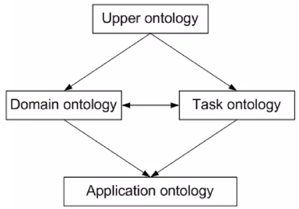
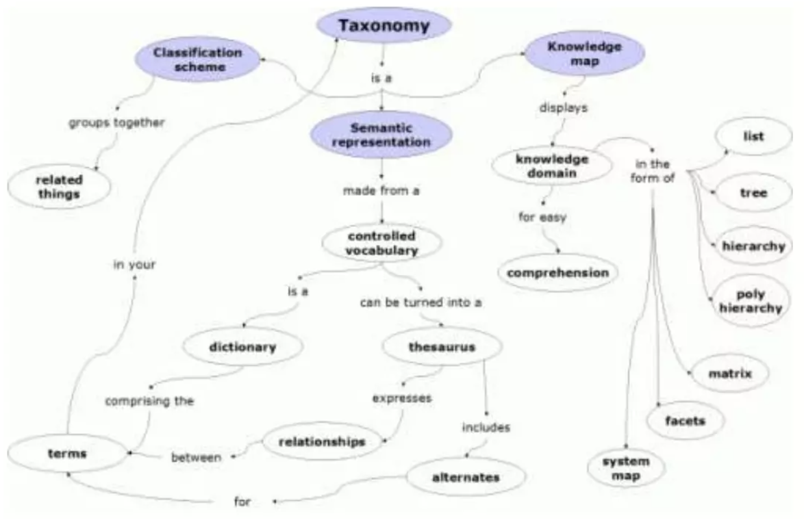
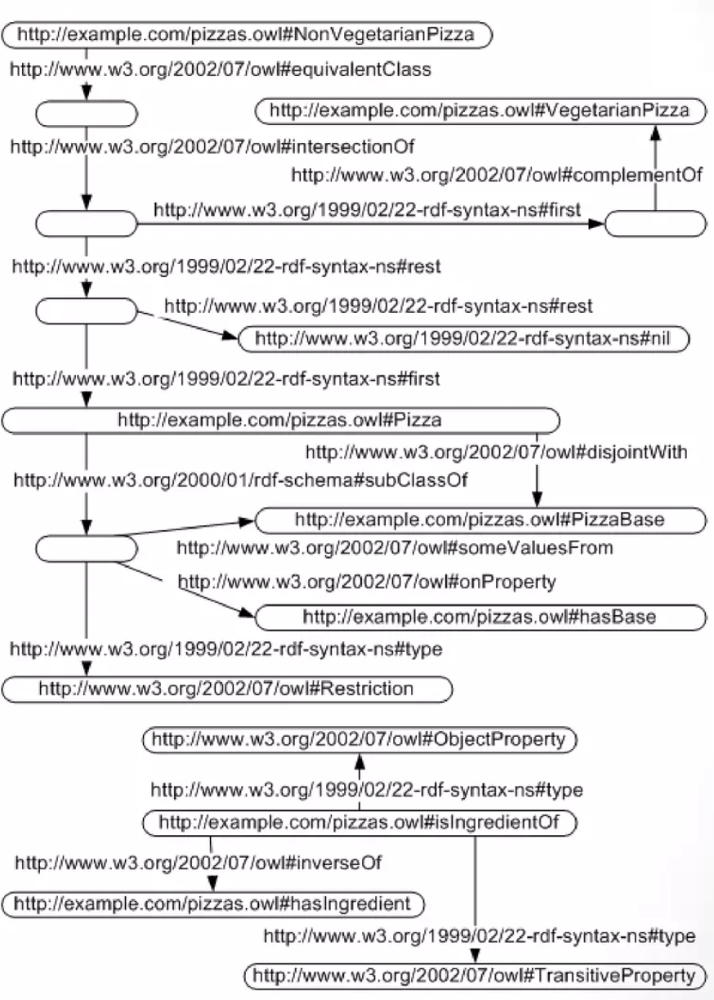
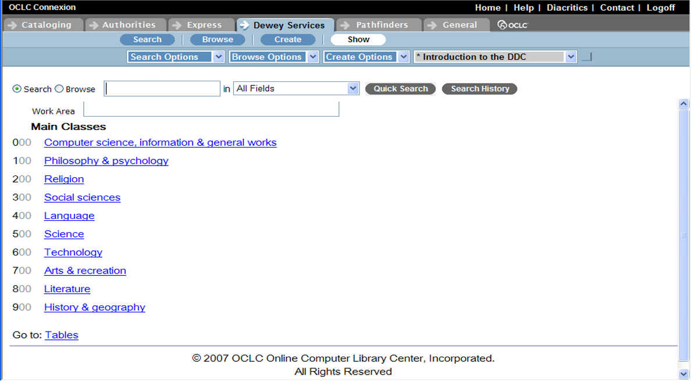
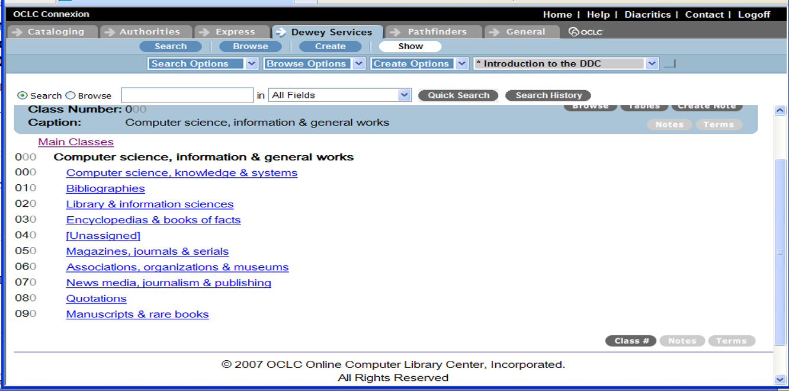
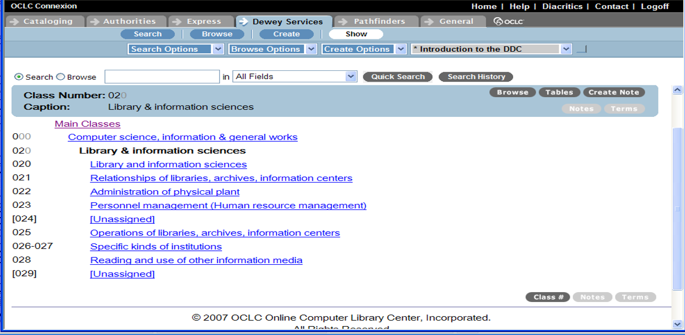
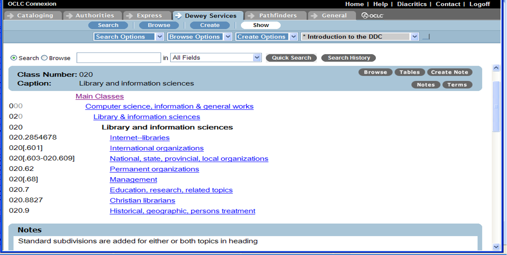
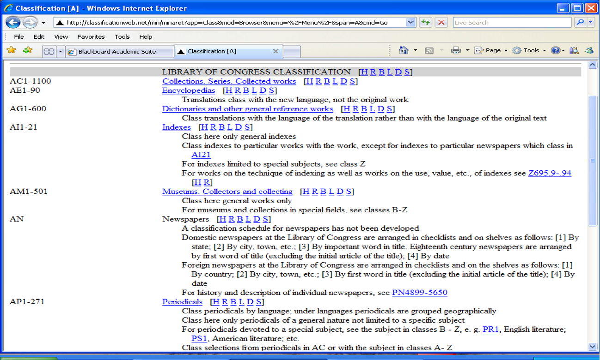
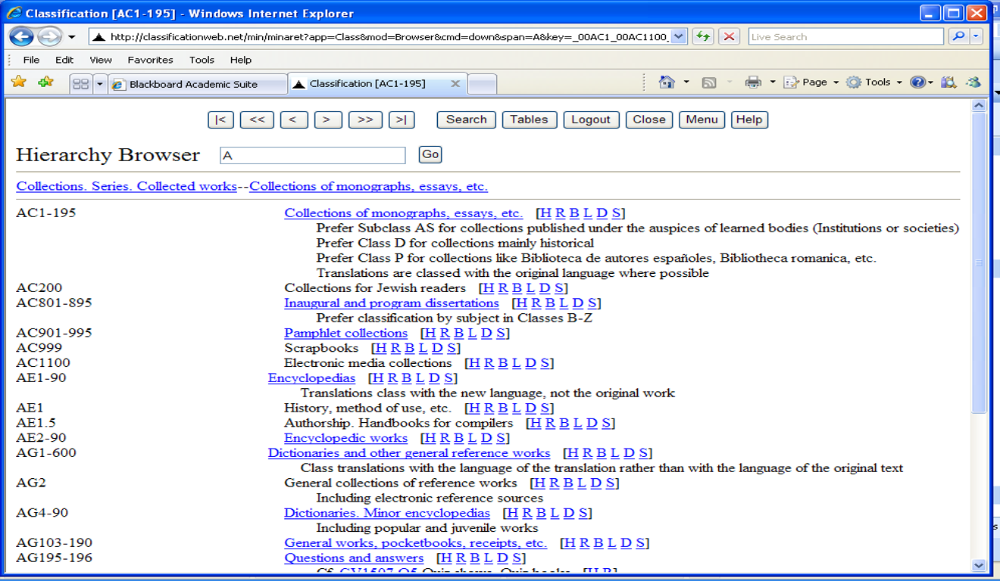
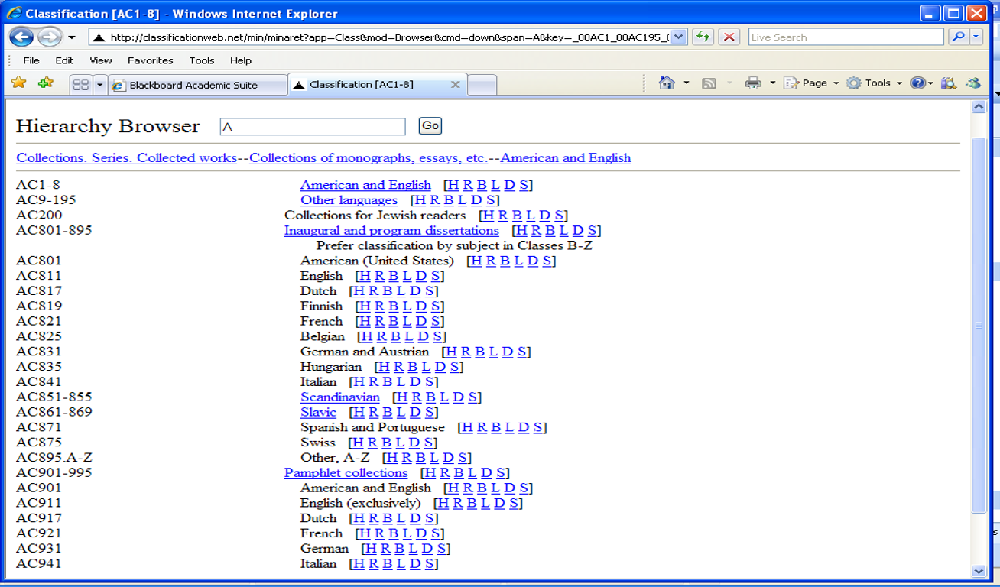

# Introduction

::: notes
This week, we are going to examine another way in which we provide
access to information and knowledge resources that is also related, in
most instances, to the subject(s) of the objects.

There are various structures for organizing knowledge that have been
developed in library and information science, as well as other
disciplines, such as natural sciences (biology, zoology), neuroscience,
cognitive science, etc., as well as in professional and commercial
contexts.

The most common of these structures for organizing knowledge is
classification schemes (ie. Dewey Decimal Classification scheme, Library
of Congress Classification scheme). Other related concepts that we will
explore in this module are taxonomies, and ontologies, which are very
closely related to classification schemes, and are often structured in a
similar manner.

In this week, you will explore classification as a broad concept, but
also use as an example, the bibliographic classification schemes of DDC
and LCC in order to understand the purposes and uses of classification
for subject access.

You will extend your thinking to taxonomies, ontologies, and also
folksonomies, by exploring how classification is used on the web, in
e-commerce, and in other non-LIS contexts, such as in the development of
corporate taxonomies and ontologies.
:::

## Classification: Philosophical Roots

-   “Classical Classification” is based on the Aristotelian idea of
    categories and class membership
-   Is a binary relationship: you either belong to the class or you do
    not belong to the class
-   Membership is based on similarity (having the same characteristics)

::: notes
Classification or the idea of “classing” or grouping concepts or objects
(people, places, things) together based on similarity is based on
Aristotle's "classical theory of classification“. The classical view of
categories is that concepts or things are grouped together into a
category based on some similarities or common properties. As we move
through our lives we automatically categorize people, animals, and
things into categories.

According to George Lakoff, there is nothing more basic to our thought,
perception, action and speech than categorization. Whenever we reason
about a kind of thing, such as a chair or an emotion, or whenever we
intentionally perform any kind of action, for example sorting laundry,
we are employing categories that we have previously developed based on
past experiences and motor actions. Categorization is "central to any
understanding of how we think and how we function, and therefore central
to an understanding of what makes us human" (Lakoff, 1987: 6).

Classical classification is a binary relationship: you either belong to
the category, or you do not. So membership is based on common attributes
and if you do not possess these common attributes, then you do not
belong to the category.

Aristotle's "classical theory of classification” influenced library and
information science classification schemes and is evident in the
definitions from library and information science literature.

Classification, as defined by Taylor and Joudrey, is "a structured
system of categories used to collocate similar ideas or objects." (2009:
383) For Elaine Svenonius, classification "brings like things
together....like things are brought together with respect to one or more
specified attributes" (Svenonius, 2000: 10).

Beginning in the sixteenth century, and also parallel to the growth of
libraries, many different bibliographic classification schemes (those
used for retrieval in bibliographic systems) were developed based on the
classical theory of classification.

Those of significance were based on either the philosopher Francis
Bacon's division of knowledge into three basic "faculties": history
(natural, civil, literary, ecclesiastical); philosophy (including
theology); and works of imagination (poetry, fables, etc.), or on the
classification work of Thomas Jefferson.

Other bibliographic classification schemes based on Aristotle's
classical theory include those still in use today, the Dewey Decimal
Classification (DDC) scheme and the Library of Congress Classification
(LCC) scheme, as well as others mentioned earlier.
:::

## Classification: Philosophical Roots

-   Prototype Theory (Wittgenstein and Rosch)
    -   Wittgenstein disputed the classical category theory around 1953
        (gameness)
        -   Family resemblances
    -   Rosch and other cognitive psychologists further developed what
        is now called the “Prototype theory” of
        categories/categorization
        -   Categories based on human experience, imagination

::: notes
Many systems for organizing knowledge are based on the idea of
categories or classing items together in either branched or hierarchical
structures. The categories in structures for organizing knowledge, for
example thesauri or classification schema, are based on understandings
of the world's knowledge and how each class is related to the other
classes contained in the whole structure. Categories and the formation
of categories are central foci of what cognitive scientists study.

Cognitive science is a relatively new field that brings together many
academic disciplines that focus on developing a greater understanding of
the human mind and how it works. The disciplines include psychology,
linguistics, anthropology, philosophy, and computer science.

According to George Lakoff, cognitive science seeks detailed answers to
questions such as: What is reason? How do humans make sense of their
experiences? What is a conceptual system and how is it organized? Do all
people use the same conceptual system? Are there commonalities in the
way that humans think? (Lakoff, 1987: xi).

The classical view of categories or classical classification remained
the predominant view in organizing knowledge until 1953 when Ludwig
Wittgenstein pointed out that some categories did not fit the classical
mold. He used the category of game as an example of how the boundaries
(the properties the things in the category must have in common in order
to belong to the category) that define gameness are not the same for all
games.

Some games are competitive, such as football or board games, and other
games require skill or strategy, for example chess, yet still others are
purely for amusement, such as ring-around-the rosy. Wittgenstein
proposed, instead, the idea of "family resemblances", in which members
of a category resemble each other in various ways, but may not share a
common set of properties.

While Wittgenstein's "family resemblances" was one of the first
challenges to the classical view of categories, Eleanor Rosch, has been
credited with developing the theory of prototypes and basic-level
categories or "prototype theory". Prototype theory proposes that human
categorization is based on both human experience (of perception, motor
activity, and culture) and imagination (of metaphor, metonymy, and
mental imagery).

Prototype theory challenges the classical view of reason as disembodied
symbol-manipulation and the mind-as-computer (mind as symbol
manipulating machine) metaphors. The prototype theory also calls into
question the idea of “What is a category?”

As noted earlier we develop categories for things, and it is through
these categories that we make sense of the world around us. What happens
to these understandings of the world if we change our definition for
what constitutes a category? (Lakoff, 1987).

These questions continue to be explored by researchers who support
prototype theory and later, the concept of cognitive models.
:::

## Themes of Prototype Theory {.smaller}

Central themes related to prototype theory that might be important or
related to structures for organizing knowledge includes:

1)  `family resemblances`, or the idea that members of a category can be
    related to each other without possessing all of the same properties
    that define the category
2)  `centrality`, or the idea that some members of a category may be
    'better examples' or exemplars of the category than others
3)  `gradience`, or that some categories have degrees of membership or
    no clear boundaries for membership
4)  `basic-level categorization`, the idea that categories are not
    merely organized in a hierarchy from the most general to the most
    specific, but are also organized so that the categories are
    cognitively 'basic' are in the middle

::: notes
Some of the central themes of prototype theory are listed on this slide.

As you begin to look at different ideas related to classification and at
examples of classification schemes, keep in mind that most
classification schemes in predominant use today are based on the
“classical theory” of classification, not on the prototype theory.

Also, envision:

-   How schemes built around prototype theory might work in information
    retrieval systems?
-   Would they be more effective than those based on classical
    classification?
-   What would some of the benefits be?
-   What issues would be present for developers of classification
    systems?
-   How do folksonomies and ontologies reflect the prototype theory of
    classification?
:::

## Definitions {.smaller}

`Category(ies)`

> a group of objects, concepts, etc. that are related in some manner; by
> similarity, sharing some attribute or characteristic

`Classification`

> arrangement of entities or concepts in logical order according to
> their similarities

`Taxonomy(ies)`

> sets of categories with hierarchical and other semantic relationships
> between categories shown; support classification

`Ontology(ies)`

> a formal, explicit representation of a domain’s knowledge; a map of
> the knowledge of a domain or specialization, containing terminologies
> as well as semantic relationships

::: notes
Now that we have learned the “roots” of classical classification or the
basis for many classification schemes, let’s look at a few definitions
you will encounter in your readings for this module.

Taxonomies, ontologies, classification are three of the most difficult
terms to differentiate when we discuss the organization of information
and knowledge resources. Be sure that you read Taylor and Joudrey’s
definitions and examples of how each are related and used.

One important distinction to make between taxonomy, ontologies, and
bibliographic classification is that bibliographic classification is
concerned with classifying and representing the entire world of
knowledge.

Taxonomies and ontologies, generally are representing a specific domain
or context. For example, a corporate ontology, is usually developed to
be used in a specific corporation. It contains terminology used by the
people of the corporation, their specific field, and is related to a
specific set of problems, products, etc.

It’s structure is based on a set of relationships, nodes, etc. that make
sense in that specific context. It also may be so highly customized that
it is not useful beyond the context in which it was developed, but can
be extended to other problems, products, etc. of similar nature.

In this module you will be taking a closer look at the concepts of
classification, taxonomies, and ontologies.
:::

## Definitions {.smaller}

`Classifying`

1.  Arranging collection according to classification system
2.  Assigning notation or class number to each item

`Class`

> group of entities or concepts possessing common attributes or
> characteristics

`Facet`

> component of a complex subject based on a particular characteristic,
> e.g., geographic facet, language facet, literary form facet

`Scheme`

> formal system for arrangement of entities according to subject or form

::: notes
Some more definitions to consider.

A facet is also a related concept that you will be introduced to in this
module. A facet is “a component (or part of) a complex subject based on
a specific characteristic”. In LCSH you reviewed subdivisions related to
topic, geographic location, chronological aspect, or form. These can be
viewed as facets. We will look at what is called “faceted
classification” later in this Introduction.

Scheme is also an important term to learn. It is the formal system of
recording the classification structure.
:::

## Definitions {.smaller}

`Schedule`

> published description of classification scheme showing overall
> structure and relationships among subjects or concepts

`Index`

-   alphabetical list of subject terms and concepts with locations in
    scheme
-   cross-references for subjects scattered by scheme

`Notation`

-   symbols representing classes and subclasses in scheme
-   applied as a mark on an item identifying item with its class

`Notation characters`

Pure: Only numerals or only letters

Mixed: Letters plus numerals; alphanumeric

::: notes
More definitions to keep in mind.

Classification’s end product, is a notation that shows how the object is
classified, or which class it fits into. There are several forms of
notation, as described here.

For example, the DDC uses a pure numerical system of notation. LCC uses
mixed alphanumeric system.
:::

## Taxonomy vs Ontology vs Folksonomy {.smaller}

+--------------------+-------------------+--------------------+
| Taxonomy           | Ontology          | Folksonomy         |
+====================+===================+====================+
| Subject-based      | Ontology is the   | Folksonomy is      |
| classification     | study of the      | user-driven        |
| that arranges the  | categories of     | approach. Users    |
| terms in a         | things that exist | can add "tags" to  |
| controlled         | or may exist in   | information and    |
| vocabulary. It     | some domain. It's | create             |
| allows related     | the exact         | navigational links |
| terms to be        | description of    | out of those tags  |
| grouped together   | things and their  | to help users find |
| and categorized in | relationships.    | and organize that  |
| ways that make it  |                   | information later. |
| easier to find the |                   |                    |
| correct term to    |                   |                    |
| use                |                   |                    |
+--------------------+-------------------+--------------------+
| Taxonomy is useful | Ontology is a     | Folksonomy does    |
| when searching     | formal            | not have           |
| for, or            | specification of  | structured         |
| describing, an     | a shared          | hierarchical       |
| object             | c                 | organization.      |
|                    | onceptualization. |                    |
+--------------------+-------------------+--------------------+
| Taxonomy =         | Ontology are      |                    |
| Knowledge Map      | considered one of |                    |
|                    | the pillars of    |                    |
|                    | Semantic Web      |                    |
+--------------------+-------------------+--------------------+

:::notes

Now, lets compare taxonomy, ontology, and folksonomy. Each represents a different approach to structuring and describing information, with varying levels of control, formalism, and user participation. 

Let’s begin with taxonomy. A taxonomy is a subject-based classification system that arranges concepts or terms within a controlled vocabulary. It typically follows a hierarchical structure, moving from broader categories to narrower, more specific ones. Taxonomies allow related terms to be grouped together logically, making it easier to navigate collections and retrieve relevant information. For instance, in a library or digital repository, a taxonomy might classify resources under domains such as “Science → Biology → Genetics.”

The main strength of a taxonomy lies in its consistency and predictability. Because it is curated and maintained by experts, users benefit from a structured, standardized way of finding or describing objects. In this sense, a taxonomy serves as a knowledge map, guiding users toward relevant resources and ensuring that similar items are described using the same terminology.

In contrast, ontology goes beyond hierarchical categorization to model the relationships between concepts within a domain. Ontologies aim to provide an exact, formal specification of a shared conceptualization—in other words, a precise description of the things that exist in a particular field and how they relate to one another. For example, an ontology in the biomedical domain might not only define entities such as “gene”, “protein”, and “disease”, but also encode their relationships such as “a gene expresses a protein” or “a protein is associated with a disease.”

Ontologies are thus richer and more expressive than taxonomies. They form the foundation for semantic interoperability, enabling machines to reason about data rather than simply retrieve it. This is why ontologies are considered one of the pillars of the Semantic Web, they support intelligent search, automated inference, and knowledge integration across systems.

Folksonomy represents a more user-driven and collaborative approach to organizing information.
Unlike taxonomies or ontologies, which are structured and expert-controlled, folksonomies emerge from social tagging—the process by which users assign freely chosen keywords or “tags” to digital resources. For example, in platforms like Flickr, YouTube, or academic repositories with tagging features, users might label content with terms that make sense to them personally, such as “machine learning,” “AI ethics,” or “research methods.” Over time, these user-generated tags form a navigational structure that helps both the individual and the community locate and organize information.

Folksonomies are flexible and democratic, but they lack the hierarchical or relational structure found in taxonomies and ontologies. As a result, while they promote user engagement and reflect evolving language, they can also introduce ambiguity and inconsistency.
:::

## Taxonomy vs Ontology vs Folksnomy {.smaller}

+--------------------+-------------------+--------------------+
| Taxonomy           | Ontology          | Folksonomy         |
+====================+===================+====================+
| We start with a    | Upper, generic,   | Utilizes a         |
| generalized term,  | top-level         | decentralized,     |
| and keep getting   | ontology          | collaborative      |
| more and more      | describes general | view.              |
| specific. Almost   | knowledge such as |                    |
| anything may be    | what is time and  |  |
| according to some  |                   |                    |
| taxonomic scheme   | Domain ontology   |                    |
| as long as there   | describes a       |                    |
| is a logical       | domain such as    |                    |
| hierarchy          | archives. Task    |                    |
|                    | ontology is       |                    |
|                    | suitable for      |                    |
|                    | particular task   |                    |
|                    | such as creating  |                    |
|                    | a DC record for   |                    |
|                    | XML. Application  |                    |
|                    | ontology is       |                    |
|                    | developed for a   |                    |
|                    | specific          |                    |
|                    | application such  |                    |
|                    | as assembling     |                    |
|                    | personal          |                    |
|                    | computers         |                    |
|                    |                   |                    |
|                    |  |                    |
+--------------------+-------------------+--------------------+

:::notes
On this slide, you see the principle of taxonomic hierarchy -- the idea that we start with a generalized term and progressively move toward more specific subcategories. This top-down organization allows us to represent knowledge in a logical, systematic manner. For example, consider a classification in the biological sciences:
Organism → Animal → Mammal → Primate → Human.
Each step introduces greater specificity while maintaining its relationship to the broader categories above it.

The same logic applies in library and information systems. A taxonomy for digital collections might begin with “Information Resources,” then narrow down to “Text Documents,” followed by “Research Articles,” and finally “Open Access Publications.” This hierarchical structure ensures logical coherence -- almost any concept or object can be classified within such a framework as long as it follows a consistent, rule-based hierarchy.

While taxonomies primarily organize concepts hierarchically, ontologies represent not only categories but also relationships and dependencies between them. Ontologies can exist at multiple levels of abstraction ie. Upper vs. domain vs. task, and application. Together, these layers demonstrate how ontology design scales from abstract universals to concrete, task-oriented applications—each serving different roles in knowledge representation and interoperability.

Folksonomy utilizes a decentralized and collaborative model of knowledge organization, where users collectively contribute to the creation and evolution of classification through tagging and shared vocabulary.
:::

## Taxonomy vs Ontology vs Folksnomy {.smaller}

+--------------------+-------------------+--------------------+
| Taxonomy           | Ontology          | Folksonomy         |
+====================+===================+====================+
|   |  |  |
+--------------------+-------------------+--------------------+

:::notes
Finally, this slide shows the illustrative comparison of all three. Zoom in the HTML version of the presentation to see the figures clearly. 
:::

## Unique Identification

Document classification codes are control devices that serve several
purposes…

-   Uniquely identify physical items in collection
-   Link physical items with records describing them
-   Facilitate intellectual access
-   Facilitate physical access
-   Facilitate inventory control

::: notes
In bibliographic classification, one of the goals/purposes is to
uniquely identify the object within the collection so that the user can
locate/access the object.

The notation helps to provide a mechanism not just for unique
identification, but also for physical location of the object. Classing
an object also provides for intellectual access, based on similarity,
usually similar subject matter.
:::

## Unique Identification

Examples

-   `Notation`: Describes item; reflects classification

-   `Call number`: Notation + unique book number

-   `Accession number`: Unique identification by order acquired;
    arbitrary

::: notes
Libraries use several forms of notations such as classification codes,
but also accession numbers which are written on the physical object but
also noted in the library bibliographic record.

Barcodes that you see on library materials also provide this same
function.

-   What about UPC codes on products in stores?
-   Do they uniquely identify items in the store’s inventory?
-   Does a UPC serve the same function as a classification notation?
:::

## Major Approaches

`Enumerative`

> subjects and their relationships are prearranged in classes and
> subclasses

`Faceted`

> Potential facets for subject classes are predetermined, but classes
> and subclasses are not prearranged

::: notes
In bibliographic classification, there are two major approaches, the
**enumerative** approach where all subjects of the entire world of
knowledge and their semantic relationships (BT, NT, RT, etc.) are
*prearranged* in classes and subclasses and the **faceted** approach,
where potential facets are predetermined, but classes and subclasses are
not *prearranged*.

Enumerative schemes tend to be hierarchical in nature so often they are
referred as hierarchical schemes. The two most predominant schemes in
use worldwide are the Dewey Decimal Classification (DDC) scheme or its
derivative Universal Decimal Classification (UDC) and the Library of
Congress Classification (LCC) scheme. These two schemes are enumerative,
hierarchical schemes.

We will look at some examples of faceted schemes in the module, but the
most well known of these is Ranganathan’s Colon Classification scheme,
which is gaining popularity in the web community.
:::

## Enumerative Approaches

-   Subjects and their relationships are prearranged in hierarchical
    classes and subclasses

-   Classification consists of identifying location of each item in
    scheme.

-   Notation for each class is predetermined.

::: notes
These next few slides summarize both major approaches and give some
examples of each. Read the slides for a brief introduction to each. This
module will help you explore each in more depth.
:::

## Dewey Decimal Classification (DDC)

{fig-align="center" width="280"}

::: notes
DDC is an example of an enumerative scheme. It was first published by
Melvil Dewey in 1876 and continues to be developed and edited. It is
used in many small and medium sized libraries.
:::

## Dewey Decimal Classification (DDC)

{fig-align="center" width="298"}

::: notes
There are advantages and disadvantages to every system of
classification. DDC is often seen as too restrictive and arbitrary, and
also too Anglocentric.
:::

## DDC: Ten Main Classes

::: notes
Here is an example of the DDC main classes. DDC in effect, carves up the
world of knowledge into 10 classes or groups of subjects related in some
manner, or under some common heading.

Where do you think Library and Information Science falls? Knowledge
Management?
:::

## DDC: Ten Divisions within 000

{fig-align="center" width="302"}

::: notes
The ten classes are further subdivided into ten divisions. LIS is
classed in the 020 division of the main class of Computer science,
information, and general works.

Does this seem the logical place for LIS?
:::

## DDC: Ten Sections within 000 Division

{fig-align="center"}

::: notes
Each division is further subdivided into ten sections. LIS breaks down
as shown above.
:::

## DDC: Subsections within 020

{fig-align="center"}

::: notes
The sections are then further subdivided into subsections. Again, LIS
subsections are shown on the slide.

There are of course, additional ways that notations can be developed and
classes determined in DDC. These slides do not show the somewhat faceted
approaches that are possible using the DDC. The readings explain these
options more in depth.
:::

## Library of Congress Classification (LCC)

{fig-align="center"}

::: notes
The second predominant enumerative scheme is the LCC. It was developed
and published by Herbert Putnam in 1898 and continues to be revised and
developed. It is primarily used in medium to large academic libraries,
though some public libraries use it also.
:::

## Library of Congress Classification (LCC)

{fig-align="center"}

::: notes
It uses a mixed notation. The main disadvantage of this scheme is that
it is quite large and can be a bit complex when trying to classify
objects with complex subjects.
:::

## LCC Example: AC Class

{fig-align="center"}

::: notes
Here is an example of how LCC is structured. This slide shows the AC-AP
basic class structure.
:::

## LCC Example: Class AC

{fig-align="center"}

::: notes
The AC class is also further subdivided.
:::

## LCC Example: Class AC

{fig-align="center"}

::: notes
AC further subdivided. Again, these slides illustrate the basic
structure of the LCC. Refer to the readings to learn more about how LCC
is structured and applied.
:::

## Faceted Approaches

`Faceted Classification`

-   Potential facets for subject classes are predetermined, but classes
    and subclasses are not prearranged

-   Classification consists of identifying each facet applicable to an
    item

-   Notation is synthesized by drawing together notation from different
    facets

::: notes
The second major approach of classification is the Faceted Approach.

Using this approach, it is the facets or attributes of the objects that
are first identified, but classes and subclasses are not prearranged.
When classifying, the facets contained in the object are first
identified, and then matched to the facets or foci of the scheme.
:::

## Faceted Approaches

{fig-align="center"}

::: notes
Here is a basic example of a faceted scheme for a literature collection.
The faceted approach can be used for any collection. Often you will see
it used in e-commerce.

Let’s look at how it works.

Each column represents a potential facet of the objects in this
collection. Under each facet are the subfacets or what we call foci.
Under the Language facet, foci include: American, English, etc.

The facets are not prearranged and the facets and foci can easily be
expanded to add on new facets/foci as needed.
:::

## Faceted Approaches: Exercise

{fig-align="center"}

::: notes
Here are few examples of how a faceted scheme notation is built. Flip
back to the previous slide to see how the scheme was applied to each
example.
:::

## Colon Classification

{fig-align="center"}

::: notes
Colon Classification in an example of faceted classification.

This system of classification, and really the idea of faceting, was
developed by Ranganathan and published in 1933. It has never really been
used in a library setting but remains the basis for the development of
all faceted schemes in use currently. The web community “discovered”
Ranganathan about 13 years ago and have been developing faceted schemes
within many e-commerce sites, and within digital libraries.
:::

## Colon Classification

`PMEST`

-   Personality (primary characteristics, "essence") -Matter (physical
    characteristics)
-   Energy (operations, problems, processes)
-   Space (geographical, topological)
-   Time (date, period)

Index - Included in single volume

Notation - Mixed;Noted for use of punctuation (colon); Includes Roman
and Greek characters

::: notes
The facets of Colon Classification include:

PMEST, as described on the slide.

It includes a very complicated notation with a mixture of characters
including colons, dashes, slashes, etc and both Roman and Greek
characters.
:::

## Colon Classification

{fig-align="center"}

::: notes
The primary disadvantage of Colon Classification is the long notations
that result from its application.
:::

## Art and Architecture Thesaurus {.smaller}

-   AAT provides controlled vocabulary for the visual arts and functions
    as a classification scheme

-   History -- Created by many people through Getty program

-   Current use -- by archivists, slide/photo librarians, museum
    curators, indexing services, architecture/design firms, art
    dictionaries and encyclopedias

> For:
>
> -   Physical description of museum objects, slides, photos, archival
>     materials, etc.
>
> -   Subject cataloging and keyword indexing of books, images,
>     periodical literature
>
> -   Database searching by scholars, researchers, students,
>     practitioners, librarians

-   Schedule: [available
    online](https://www.getty.edu/research/tools/vocabularies/aat/)

-   Index: Thesaurus in an index

-   Notation: Mixed;Each descriptor (controlled term) has unique
    notation code

::: notes
The AAT, which is a controlled vocabulary you learned about in the 7.1
module, can also function as a classification scheme. The next few
slides discuss it use as a faceted scheme.

If you have not already reviewed this controlled vocabulary, here is a
link to it . Take a look! It is a very good example of a faceted scheme
that is currently in use.
:::

## AAT

{fig-align="center"}

::: notes
There are of course advantages and disadvantages to its use. One
disadvantage is that it is not designed for shelving or physical
location of objects within a collection. In the electronic environment,
however, this is not a disadvantage and this scheme is actually very
useful in helping users precisely locate objects in information
retrieval systems.

As you complete the activities for this module, and also just surf the
web, look for examples of faceted classification schemes.
:::

## Limitations to Classification

1.  Knowledge never remains static
2.  Physical placement distorts cross-relationships
3.  Systematic organization produces artificial symmetries
4.  Non-logical ordering is sometimes preferable
5.  Classifiers have psychological tendency to skew system
6.  No collection ever precisely reflects universe of knowledge

::: notes
As with any structure for organizing knowledge, there are limitations to
consider, as noted on this slide.

Because knowledge never remains static, classification schemes,
taxonomies, and ontologies, also have to be continually reviewed and
revised to remain relevant and useful.

In schemes that are used for physical placement, there can be issues
related to classing complex subjects, or where to class an object that
is about more than one subject? Or does classing an object in a specific
class produce an artificial symmetry that may be inaccurate? Or could it
in turn lead to a new way of thinking?

Classifiers also have a psychological tendency to skew the system, as
they will class items based on their own understandings of the world, a
discipline, etc.
:::

## Careers related to Classification, Taxonomy, Ontology

-   Cataloging and classification
-   Ontologists
-   Taxonomists
-   Information Architect
-   Semantic Web

::: notes
Careers related to the development and application of classification
schemes in libraries of course include becoming a cataloger, but have
you thought about a career as a classificationist or someone who
develops or edits existing classification schemes?

Or as an ontologist or taxonomist who develops specialized ontologies or
taxonomies within corporations or for e-commerce, such as an information
architect? How do knowledge managers apply the theories of
classification/categories within their specific contexts?

Take a look also at the Semantic Web and Knowledge Organizing Structures
(KOS) being developed there.
:::
