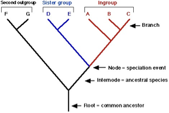
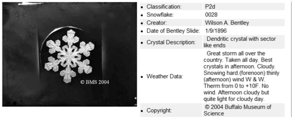
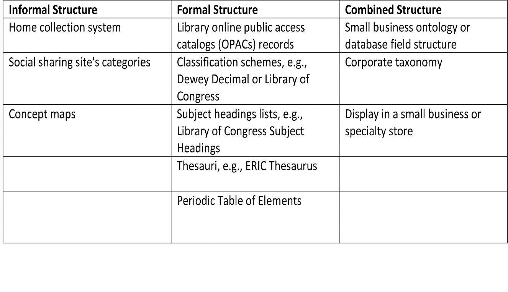
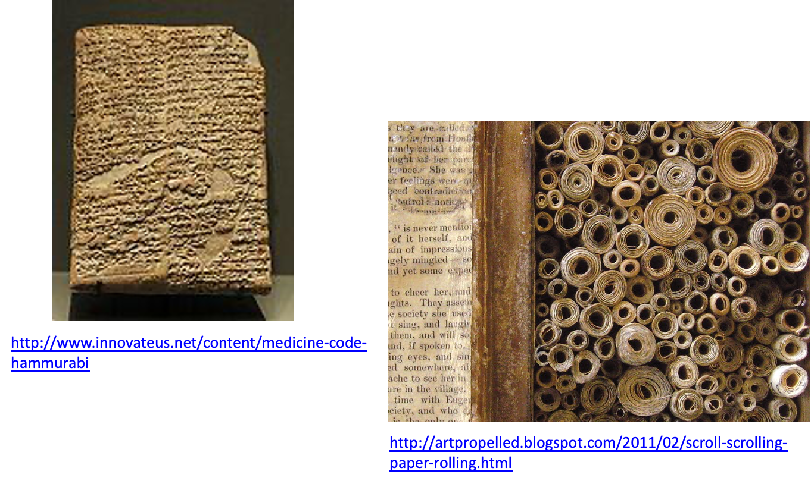
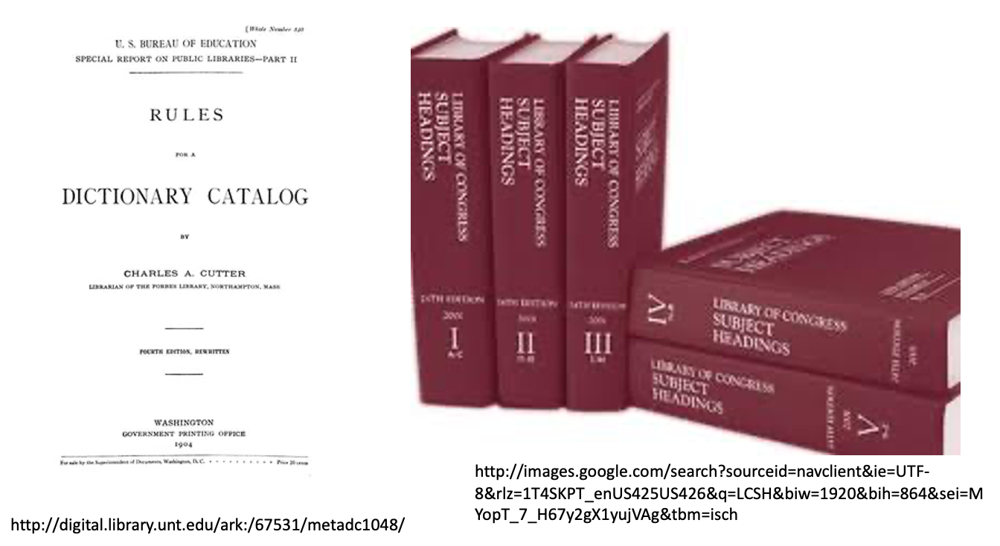
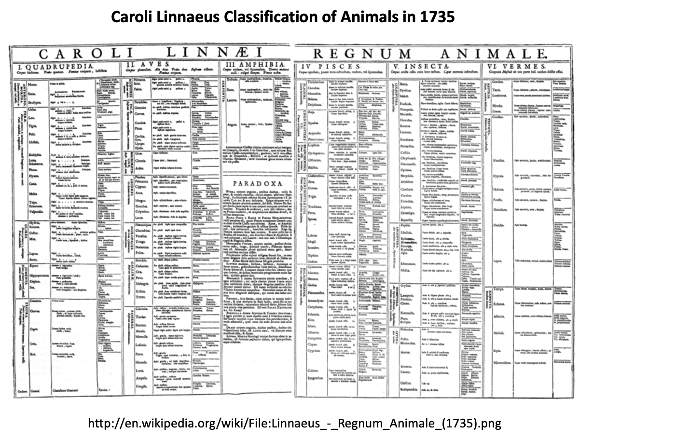
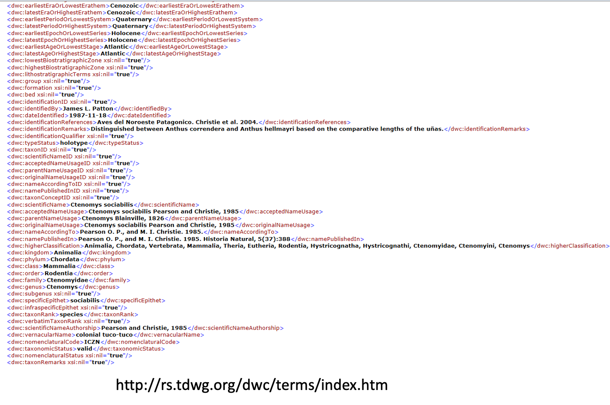
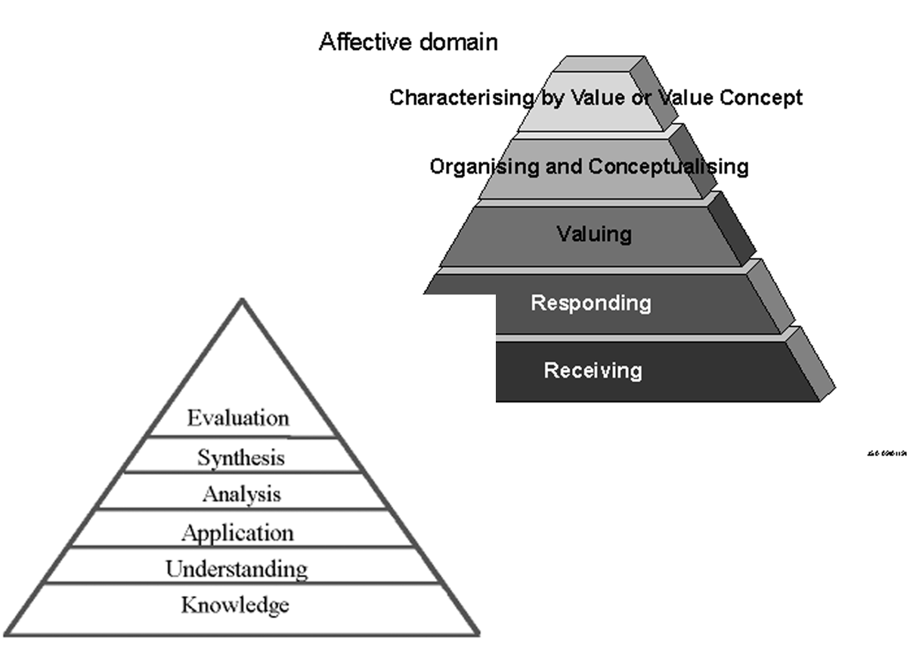
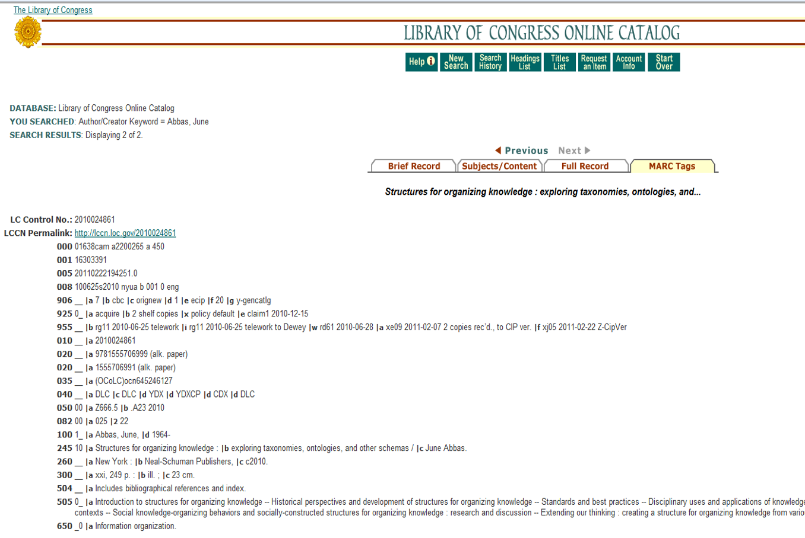

# Introduction

::: notes
In this lecture, we’re going to begin our discussion about
non-bibliographic structures for organizing knowledge.

We’re going to talk about personal and professional contexts. The
professional context will include also disciplinary views or also
discipline specific views for how information can be organized in the
domains of say, education or biology.

It will also look at some structures within LIS we’ve talked about in
previous modules but think about them from a different perspective.
:::

## Envisioning Exercise #1

`Describe how YOU organize information`

-   In home spaces
-   In work spaces
-   In digital spaces

::: notes
Now that we’ve thought in depth about our users and how
those characterizations and expectations affect our libraries and our
library services as well as other information contexts, let’s shift
gears, and I’m going to have you envision a different aspect of
information organization–that of what we call ‘personal information
management.’

So, I want you to describe how you organize information in your home
spaces, in your work spaces, and in digital spaces. Take a few minutes
to think through or write down some thoughts about each of these as we
continue our discussion.
:::

## Envisioning Exercise #1

-   What devices (all types) do you use to organize your information?
-   How do/can you share info between these spaces?
-   Are your systems efficient? Effective?
    -   Do they enable findability?
    -   Do they help you get work (in any of the contexts) done?

::: notes
Also in this envisioning exercise, I want you to make a list or think
through the different devices that you use to organize your information
– not to access information necessarily, but to organize your
information.

Think back to one of the group discussions you did earlier and how you
use different devices for organizing information. Also try to apply the
technology in different contexts. Also think about how you do or can
share information in these three different spaces.

As you continue this envisioning exercise, think about your systems for
organizing your personal information.

-   Are they efficient?
-   Are they effective?
-   Do they enable what’s called ‘findability’ so that you can go back
    and find something again later?
-   Do they help you get work done whether it’s at home, whether it’s on
    your job, or whether it is in a digital environment?
:::

## It Used to Be ....

::: columns
::: {.column width="50%"}
-   We “knew” who our users were and how they looked for information
-   We knew what a “collection” was and its boundaries
-   We knew, well sort of, what constituted data, information,
    knowledge, wisdom
:::

::: {.column width="50%"}
{fig-align="center" width="500"}
:::
:::

::: notes
Alright, so keeping those two envisioning exercises in mind, let’s talk
more about our users, but also about what we understand about how people
organize information today.

It used to be that we knew who our users were – that we could
characterize them based on their types and levels of knowledge, based on
demographic factors, based on watching them in libraries or other
information contexts. Can we still do that today? Our users are much
more complex today than they used to be.

Also, we used to know what a collection was, and there were very
distinct boundaries for a collection. Those of you that are creating
organization systems for your big projects this semester are getting a
taste of that. You have to characterize what a collection is and what’s
included in that collection.

In today’s world collections do not necessarily have the same kinds of
boundaries that they did previously. A collection can be extended onto
the web. Many libraries have links out to ebooks that they’ve purchased.
Also libraries’ catalog websites that they feel are important enough to
include for their users.

We knew, well sort of, what constituted ‘data’, ‘information,’
‘knowledge’, ‘wisdom.’ And I say ‘sort of’ because there’s still an
ongoing debate about how we define each of these concepts. What is data?
What is information? What is knowledge, and what is wisdom?

In 5033 course, you encountered this discussion, and I’m sure you’ve
encountered it in other courses as well. We’re not going to try to solve
this problem, we’re just going to acknowledge that there are differences
of opinion about what constitutes each of these different concepts.

But how does that relate to today’s world and the organization of
information. Think about the term now that’s so popular, ‘big data”.
What does that actually mean? And libraries and information
organizations in all contexts are grappling with how to deal with this
concept of ‘big data.’

Even in the business community, it’s a large business now, there are new
companies springing up that are developing software and providing tools,
visualization capabilities to deal with big data.

But again, what is data? Is data just mainly metadata as we’ve thought
about in the past? Is it unstructured data? Or is it data in a large
data set? There’s lots of ways to think about it.

What is information? What are we actually organizing in our collections.
At the bottom of the screen is what is called a ‘taxonomy.’ There are
different nodes and branches. This taxonomy comes out of biology, of
course, but it is another way of looking at taxonomic relationships
within a collection or within an object itself, and how it relates to
other objects.

So, there are more than just traditional ways of thinking about how
information is organized and how we can make it meaningful in different
contexts to different users.
:::

## Focus Points

-   How do people, professions and organizations naturally organize
    information?

-   How does this fit into the LIS/IS view of structuring information
    and knowledge?

-   What can be learned about structuring meaning by examining the use
    of personal, social sharing, cataloging, and networking systems?

-   What do information seeking activities reveal about structures for
    organizing information and knowledge?

::: notes
So, for the rest of this discussion let’s use as focus points those
highlighted on the screen here.

-   How do people, professions, and organizations naturally organize
    information?

And I highlight ‘naturally’ here for you because I want you to think
about how you yourself organize information.

-   And how applicable is that outside of your own home context or your
    own work context or even in the digital environment?

-   We all have innate thoughts or processes for how we think things
    should be organized, but is that actually reflected in the systems
    we’ve developed?

-   How does this fit into the LIS or IS view of structuring information
    and knowledge?

-   Do our classification schemes and our subject headings really
    represent the way people organize information?

-   What can be learned about structuring meaning by examining the use
    of personal, social sharing, cataloging, and networking systems?

-   And what do information seeking activities reveal about structures
    for organizing information and knowledge?
:::

## Structures, Structures Everywhere {.smaller}

::: columns
::: {.column width="50%"}
Definition:

> "a fundamental and sometimes intangible notion covering the
> recognition, observation, nature, and stability of patterns and
> relationships of entities. From a child’s verbal description of a
> snowflake, to the detailed scientific analysis of the properties of
> magnetic fields, the concept of structure is an essential foundation
> of nearly every mode of inquiry and discovery in science, philosophy,
> and art.” (Pullen, 2000)
:::

::: {.column width="50%"}

:::
:::

::: notes
Let’s start by defining ‘structures.’ You can think about structures in
lots of different ways. One definition, by Pullen, who is an artist and
philosopher of art, thinks about structures as “a fundamental and
sometimes intangible notion covering the recognition, observation,
nature, and stability of patterns and relationships of entities.” That’s
a mouthful.

“From a child’s verbal description of a snowflake, to the detailed
scientific analysis of the properties of magnetic fields, the concept of
structure is an essential foundation of nearly every mode of inquiry and
discovery in science, philosophy, and art.”

That is a very thoughtful, provocative way to think about structures,
but it also speaks to the discussions we’ve been having this semester as
you’ve learned more about how to organize information within various
different contexts.

I really like how she talks about a child’s verbal description of a
snowflake.

-   Where did a child learn the language to describe a snowflake?

-   Where did they learn about the properties of a snowflake or that
    every snowflake is different in some way?

We learned about Witttgenstein in the last lecture on classification.
His theory of “language games” explains how children learn language in
their everyday contexts and interactions.

If we look at a scientific analysis of the properties of snowflakes, we
are no doubt going to have a different perspective than the child
describing the snowflake, but is one perspective more relevant or
appropriate than the other?

Again, context really comes into play when you think about how we
describe a snowflake or a collection of snowflakes for our users.
:::

## Structures

-   Does the Pullen definition work completely?
-   Does it include the:
    -   Life experiences
    -   Understandings
    -   Applications of the organizer or person creating either the
        structure or the values within the structure?

What do YOU think is missing from the definition? How do you define
structure(s)?

::: notes
As you ponder that definition, I want you to also think about whether or
not it includes the life experiences of different individuals, the
understandings of different individuals and how they make meaning out of
their own understandings of a concept or a phenomenon, and the different
applications that we might apply when we’re representing a concept such
as a snowflake.

-   Does it include the life experiences of the organizer or the person
    creating either the structure itself or the values within the
    structure?
-   Does it include the life experiences or understandings of the
    cataloger or the indexer who is creating a back of the book index
    for a children’s book about snowflakes?
-   Would there be differences in how someone who lived in Buffalo NY
    describes a snowflake versus someone who lives in Mexico who may
    never have seen a snowflake?
-   And lastly, what do you think is missing from the definition and how
    do you define ‘structures’?

Structures really do underlie everything in our world in one way or
another. Your library catalog has a very specific field structure
associated with the records. The organization system you might use in
your home has a structure behind it as well.
:::

## 

[{fig-align="center"}](http://emu.arsusda.gov/snowsite/Magono_and_Lee/Magono_and_Lee_Classification1.html)

-   How do you think about a snowflake?
-   Why would your representation change if you were:

1)  conducting research?

2)  designing a holiday card

3)  looking for an example of crystal structures?

::: notes
Let’s think about this a little bit more.

-   Why would you think about a snowflake in a particular way?

-   Is it something you learned about as a child?

-   Did you live in a part of the country that has a lot of snow in the
    winter versus living in a part of our country that has no snow?

Your definition or your representation might be very different as a
result. Those types and levels of knowledge really come into play when
we think about representing information for our different users.

I’m thinking of the types and levels of knowledge of the cataloger and
the indexer, not necessarily the users.

What you see on the slide here is an actual representation of a digital
library at the University of Buffalo created for a collection in a
natural history museum, The Bentley Snow Crystal collection.

The metadata you see on the slide are the ‘classification,’ ‘snowflake,’
‘creator,’ ‘date of Bentley’s journal,’ ‘crystal description,’ ‘weather
data,’ ‘copyright,’ etc. Each of these were copied from Bentley’s
journals.

The best way to represent this collection for this particular set of
structures was to use Bentley’s own representation of each snowflake as
written in his journals. The collection is fascinating from a historic
perspective, from a scientific perspective, and from an aesthetic
perspective.

This collection was created back in 2004, and that collection is still
available online.

Think about how you would represent a snowflake if you were conducting
research, if you were a scientist, or if you were designing a holiday
card or looking for an example of crystal structures to show to a class.

You may have very different ideas of how that snowflake should be
represented, and what’s on the slide is probably just one way of doing
so.
:::

## 

::: notes
Again, this is just another representation of a snowflake. It’s with a
very high-magnified microscope that blew it up to really large
proportions so you could see it down at these levels, and it’s just a
beautiful, beautiful image.
:::

## Types of Structures

::: notes
We can also think about structures in various different ways and how
they help us to organize information. And on this slide I have three
different categories for thinking about structures. People have
developed informal structures, formal structures, and combined
structures.

Informal structures, for example, are those you use in your home–how you
have your home collections organized.

Are they alphabetized, are they by genre, how is your spice cabinet
organized?

Also, social sharing sites have different organization schemes in place.
Concept maps can be considered informal structures. Those of you that
have education as a background or have used concept maps in different
courses are probably aware of concept maps and their structuring.
Concept maps are a way to represent terminology or ideas in a connective
visual display.

Formal structures are what we’ve learned a lot about in this class and
that you’ve probably encountered throughout your daily lives, especially
in your use of libraries. These are structures like our online library
catalogs, or OPACs, and the MARC record structures within them;
classification schemes, such as Dewey Decimal and Library of Congress;
subject heading lists, such as Library of Congress Subject Headings; or
thesauri–ERIC thesaurus is one of the examples we looked at in an
earlier module; and even the Period Table of Elements is a formal
structure for organizing the information of that discipline.

We also have what are considered ‘combined structures.’ These might be
what you see in a very specialized context, such as small business
ontology or database field structure, designed specifically for that
environment and users.

An ontology generally represents the terminology that is meaningful to
the individuals in that environment. A corporate taxonomy is very
similar to an ontology, in that it’s at a more granular level of
representing terms as well as different terms that are used in that
context. And generally, these two types of structures are really only
useful within the context for which they were created.

We also looked quite a bit in our first exercise on different types of
displays of information in different retail or non-library contexts,
such as art museums or nurseries or large department stores or
electronics sections for electronic stores.

Each context had, as you found out, different ways of organizing
information, but also there are some similarities across the different
environments that you visited.

So, think about these different types of structures–the similarities,
the differences, and how useful they are to our users.
:::

## Traditional (Formal) Structures

::: notes
On this slide are some different examples of traditional formal
structures that you have read about in the readings for this course,
such as the Medical Code of Hammurabi, which was developed many years
ago.

It was one of the very first ways of codifying the medical code within
the medical profession in ancient times.

And then also scrolls. Scrolls were the way that information was
captured years ago, and they were stored the same way.

The organization systems related to scrolls were pretty haphazard,
though the person who curated the scrolls could generally find what they
were looking for. There’s not a lot of information that we know about
scrolls and how they’re organized, but your Taylor and Joudrey reading
talks a little bit about the history of organization of different types
of ancient materials.
:::

## Traditional (Formal) Structures

::: notes
Other traditional formal structures that we’ve talked about this
semester are things like Cutter’s Rules for a Dictionary Catalog, rules
for how to file cards in a card catalog. Its’s a very interesting
treatise to read at some time. This is an example of the cover page at
this link.

Also, on the other side of the screen is what we fondly used to call
‘the five big, red books’, which, unfortunately, we no longer see in our
libraries.

We oftentimes would make these available to our users so they would have
a source for search terms within our library catalogs, whether it was a
print catalog or an electronic catalog.

And so we would lovingly call them our ‘five big, red book,’ but we know
them also as the Library of Congress Subject Headings.

Now, we do not see these in libraries as often as we used to, and
oftentimes catalogers are using electronic tools to find subject
headings.
:::

## 

::: notes
A very early example of a discipline-specific classification scheme is
the one on the screen here by Caroli Linnaeus that was developed in
1735, and it still remains the way that we classify animals and plants
within biology today.

So, whenever we’re talking about different types of either humans or
homo sapiens, or plants or animals, we would use Linnaeus’ basic scheme.

Of course, this has changed and been expanded through the years, but it
still remains our idea of classification of animals, of kingdom, phylum,
class, order, genus, and species.

But it is very inclusive of this collection, if you will, that he was
developing it for at the time.

It was developed in an era when natural history collection development
was prevalent, and natural history collections were being developed in
homes, in scientific institutions, in museums, and there needed to be a
way to organize this information and the types of objects in these
collections.

Linnaeus is a fascinating individual to study if you are interested in
the history of the organization of information or the history of
science.
:::

## 

::: notes
Jumping ahead to the twenty-first century, we have very
discipline-specific metadata schemes within the community of biology.
The Abbas reading in Chapter 4 provides more examples of disciplinary
uses and applications of knowledge structures within biology and other
contexts as well. What’s on the screen is not Dublin Core, but you’ll
see it’s very similar to it; however, this is a very specialized scheme
for representing the biological world called the Darwin Core that was
developed by the TDWG, which stands for the Taxonomic Database Working
Group, which is now called the Biodiversity Information Standards Group.

So, there’s a large undertaking at a global scale to develop metadata
schemas for representing biological collections in various different
contexts.
:::

## Disciplinary -- Education

{fig-align="center"}

::: notes
You’ve probably encountered this taxonomy before. This is a knowledge
structure within the social sciences, and more specifically within
education. It’s called Bloom’s Taxonomy of Educational Objectives, or
for short Bloom’s Taxonomy, developed by Bloom in 1956.

This taxonomy has a hierarchical structure representing six levels of
thinking and learning skills that range from basic learning objectives,
such as knowledge of content, to higher order learning, such as
synthesis, evaluation, creativity. Bloom’s Taxonomy formed the basis for
early work on the development of structural objectives for classes and
curricula.

The other model on the slide is a revised version of Bloom’s Taxonomy
which includes effective aspects of learning and making meaning within
learning environments. This one was developed by Krathwohl, Bloom, and
Masia in 1964 and incorporates the effective domain into the original
taxonomy.
:::

## Disciplinary – One more

::: notes
And, of course, we can’t leave this discussion of disciplinary
taxonomies, or ways of organizing information, without also looking at
one developed by library and information studies.

This, of course, is the MARC catalog structure, the Machine Readable
Cataloging Structure that you have been reviewing over the last few
weeks.

This record is from Dr. Abbas' book, Structures for Organizing
Knowledge. Libraries have used MARC since the seventies for representing
the objects in our collections, and it’s also used in other contexts for
different purposes.
:::

## What Do We Know About How People Organize Their Stuff?

-   Not very much!!

-   Personal Information Management

    -   In home spaces
    -   In professional spaces
    -   In digital spaces

(Jones 2007; Marshall, 2007; Abbas, 2010)

::: notes
Okay, so let’s talk about some of our personal informal structures.

Researchers do not know a lot about how people organize their ‘stuff’
because it’s really difficult to study people in their home
environments. We do know a lot more about how people organize their
stuff in professional spaces, and also we’re becoming more aware of how
people organize ‘stuff’ in digital environments. The citations on this
slide are for three of your readings that are applicable to this idea of
personal information management or PIM.

PIM is becoming more important in our world and in our discipline
because of social environments, which we’ll address in the next lecture,
but we are learning more about how people organize their ‘stuff’ in
these environments, and that’s helping us improve the organization
systems we’ve developed in libraries.

In home spaces we’ve looked at various different aspects, but there’s
not a lot of research in our field in this area.

Most of the PIM research comes from environmental sciences, or in
sciences that are interested in developing tools, such as computer
science or what’s called ‘human computer interaction’ studies that look
at developing tools to help us better organize our ‘stuff’ in numerous
contexts.
:::

## Home Spaces

{fig-align="center"}

::: notes
In the Abbas chapter and also in the Marshall chapters, you can review
the research related to home spaces, but the majority of our research
has examined how people organize their lives in home environments--not
necessarily how you organize your spice cabinet–though that is, of
course, very illuminating.

We’ve looked at how people organize their lives through using different
mechanisms, such as calendars or the “to do list” that we might
keep–whether it’s a print list or one on your phone now–and other types
of devices or tools that your family uses to organize ‘stuff’ and to
organize your lives.

We also have looked quite a bit at the role of the main caregiver in the
household–whether it’s a male or a female–and what they do in order to
organize their family lives. It is fascinating research, and the result
of this research is always to develop some type of technology to make
their lives easier (we think), but this research also has implications
for our own practice in libraries and other information organizations.

Learning how people may naturally organize their ‘stuff’ can help us
design more user-centered spaces.
:::

## Office Spaces

{fig-align="center"}

:::notes
Research called CSCW, Computer Supported Collaborative Work, from the HCI communities, examines how people organize their office spaces. 

One particular area that I find particularly fascinating is the characterization of organization strategies of users as ‘filers’ versus ‘pilers’. 

Think about your own way of organizing your home office or your space at home or your office in a work environment. 

- Do you pile stuff on your desk? 
- Do you pile it on the floor or on chairs? 
- Or do you file everything right away so that you have instant access to it? 

We characterize people as either ‘pilers’ or ‘filers’. I think I’m a hybrid; I think I do both. This research has shown us that people that are pilers can actually find what they’re looking for very quickly as opposed to those that file. They have their own system of organizing. They can find it, but others in their group or in the collaboration or work environments may not be able to find it. 

CSCW work, of course, is designed to help us do our work more efficiently and also develop systems for helping us do so, but this research also has given us a good understanding about people and how they categorize information or how a group thinks about those categories, or even how to label group files labels. 

In a digital environment, the folder names that you develop for your personal work may differ from those you assign when working on a project as part of a group. Labels would be assigned that are the most meaningful to the group, not the individual. This research has implications for us in terms of organizing information in libraries and information environments.
:::

## Implications for Practice {.smaller}

`Models of Information Organization . . .` 

- Guide development of user-centered services
  - Reference
  - Searching
  - Indexing/cataloging
  - IR systems design

- Information professionals improve organization of resources to accommodate users' searching and personal/group organization styles 
- Understand users’
  - Organization schemes (categories, labels, methods)
  - Expectations of search process
  - Decision-making criteria
  - Process strategies
  - Attitudes and feelings

:::notes
In summary, I hope you will read the readings for this module because they’ll give you so much more than I’m able to provide in this short lecture, but this area of our field, in HCI, and CSCW, is really fascinating. 

Learning more about people and how they organize their ‘stuff’ in non-bibliographic contexts will really help you as an information professional, whether you’re in a library, an archive, in a corporate library, or some other information organization context outside of libraries. 

Even in a retail environment, it can give ideas for better organization at a user-centered perspective. 

Some of the implications for practice are listed on this slide. I am sure you can think of others as well. Understanding our users really helps us make decisions about how we organize collections in libraries, for example; how we categorize information objects; how we classify information objects; the subject terms that we apply when we’re cataloging or indexing something in our collections. 

It also speaks volumes to the expectations of the search process that our users have. You know, they want quick, ubiquitous, 24/7 access to information, and they want to be able to find information with just a few terms, just like a search engine, whether it’s returning appropriate materials or not. 

PIM also helps us understand their decision making criteria and the types of information we need to have in our representations. 
:::

## Implications for Practice {.smaller}
- Help us
  - choose elements for system design
      - fields to include in system
      - fields to make searchable (indexed)
      - creation of input rules
- Interface design/retrieval functionality
- Choose appropriate controlled or other vocabulary to use (natural language, free text)
- Choose appropriate level of indexing
    - exhaustivity
    - specificity
    - number of subject terms to include

:::notes
From a practical, user-centered perspective, it helps us choose elements for system design; for example, what fields to include in the system. What fields to index or make searchable. 

Or even the creation of input rules so that the person creating those representations will know exactly how to create them. 

It also has implications for interface design and retrieval in terms of different functions that we want to make available to our users in our web interfaces or other environments.  

It also helps us choose appropriate controlled vocabulary or other vocabularies to use, whether it’s user tags or natural language taken from the resource itself or terms the cataloger or indexer adds that are more current-use than what we see in subject headings. 

It also helps us choose appropriate level of indexing in terms of exhaustivity and specificity that we discussed earlier or even the basic idea of how many subject terms to include in our representations. 

So, again, understanding more about our users in various different contexts really has a lot of important implications for practice. 
:::

## IR System Design {.smaller}

`“Why are online catalogs still  hard to use?” (Borgman 1996)`

- System design models
    - Query design
    - Online card catalog model
    - Representations have to fit into “cookie cutter” systems that were developed many years ago and do not necessarily benefit from what we now know about users and their information seeking processes
    - What are Second Generation catalogs incorporating? How are they more user-centered? Social?

- Oftentimes specialized knowledge is required
    - Semantic
    - Syntactic

:::notes
I wanted to look again at Borgman’s thoughts on online catalogs. Borgman was one of the original LIS researchers who wrote about catalogs and online catalogs and why they are still hard to use. 

Her work posed the question about why our library catalogs had not changed much throughout the years. We still access our catalogs in pretty much the same way–by fielded searches for author, title, and subject. 

Newer catalogs have expanded to include more attributes of our collections that could be represented to our users. 
Our representations in the era of card catalogs had to fit into a cookie cutter system. They were really very small cards that we could use to represent each item in the collection. 

When we moved into the MARC environment, originally we stayed pretty much with that model, but we have significantly expanded since that point. 

Also, with our second generation catalogs, we can incorporate a lot of new search functionalities, such as faceted searching and different types of browsing that are more user-centered. 

Also, some systems are allowing us to tag or users to add tags to different resources that may be more appropriate than the subject terms we are using. And we have begun to include features that make our catalogs more social, or allow for crowdsourcing. 

Of course we should think about the implications of doing so. For example, 

- do we really want to have user tags floating around in our libraries? 

- Are they appropriate? 

We have to think about vetting and the whole process as a cataloger tasked with incorporating tags. 

So, it’s not just a straightforward idea of just “Yes, that’s great because they are users’ tags and they are more common language, more meaningful to the user.” There are several issues that have to be resolved. 

And again, our systems still use very specialized knowledge that requires us to understand the semantic representations, or how we have strung together subject headings in our catalogs and how our system works with those–if it parses them apart or if requires exact match. 

Also, our users have to understand the syntactic aspects of using our catalogs–how to enter a query into the catalog, or can they use a dropdown box? 

All of this is really still pretty much the same as it has been for years with the exception of the newer browsing capabilities in second generation catalogs. 

As you progress through this module, keep this discussion in mind. 

In Part 2 of this week's lecture, you’re going to think about representation of information in different ways, but also within social sharing environments, or socially constructed environments, of social media or social cataloging
:::