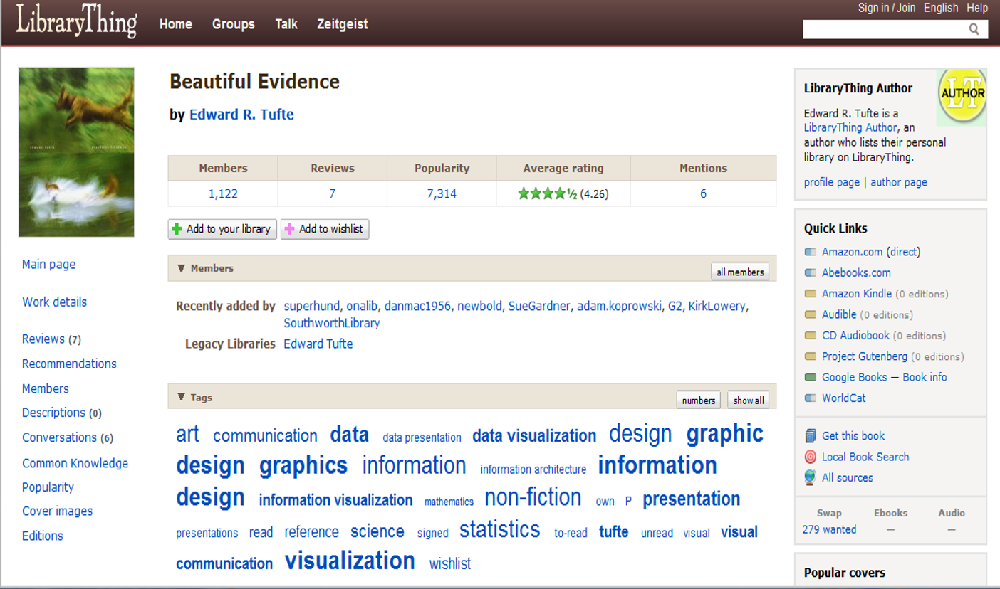
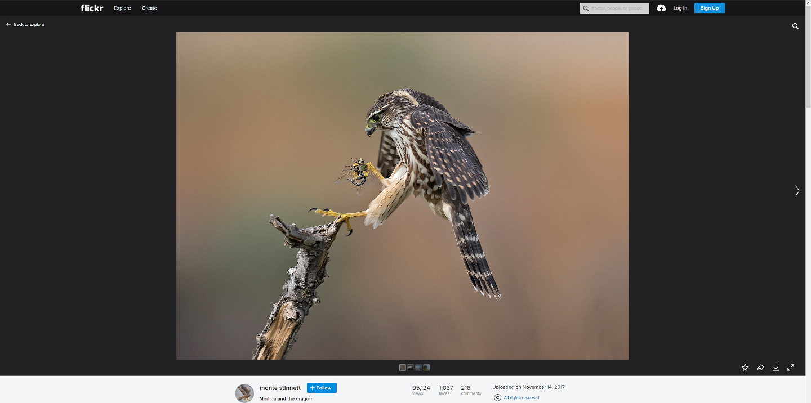
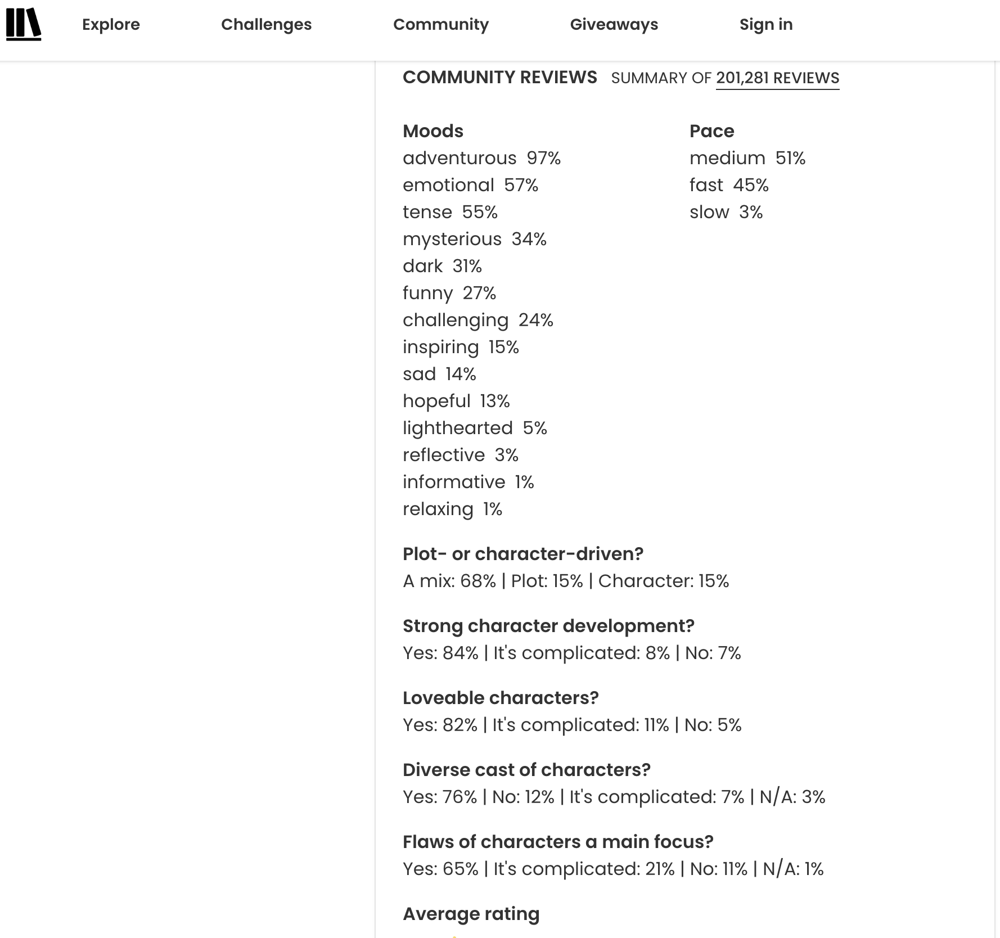
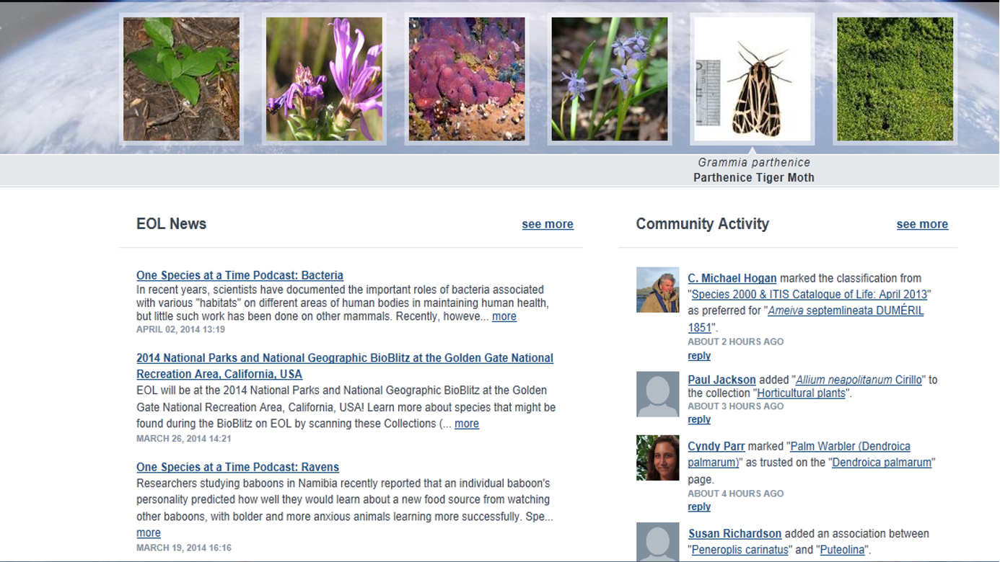
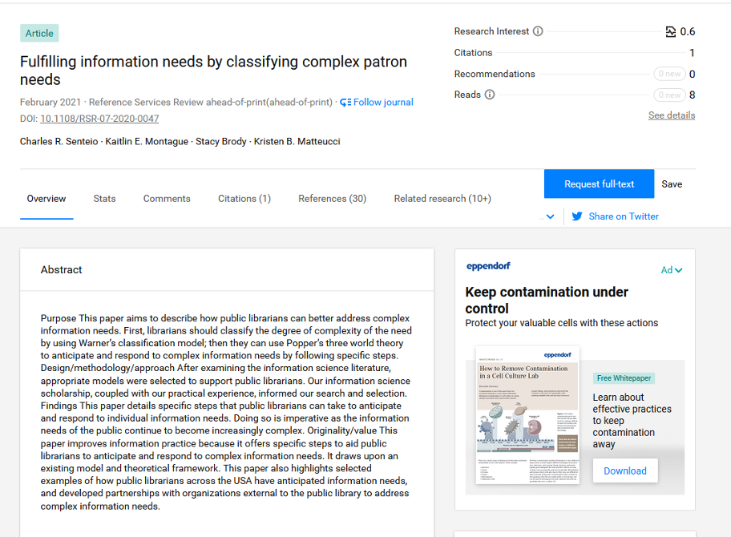
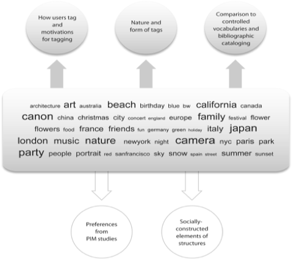
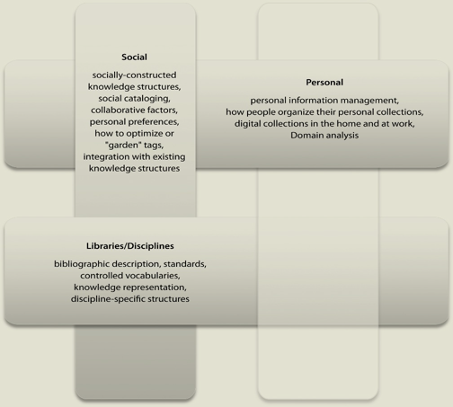
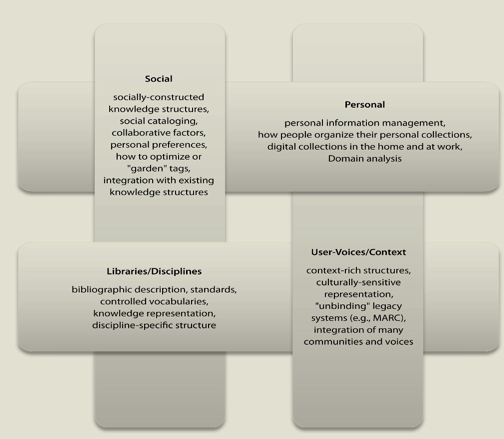
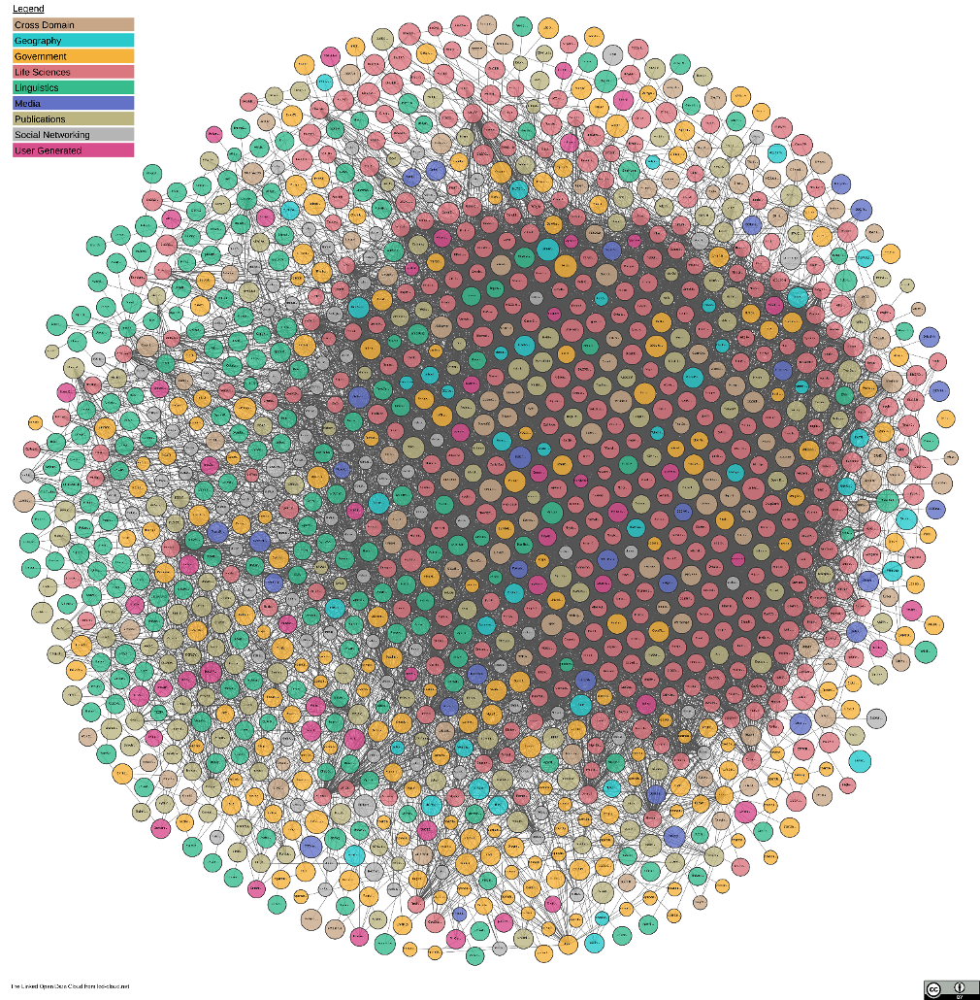
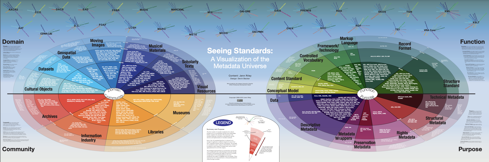

# Introduction

::: notes
In the previous weeks we talked about bibliographic structures, tools,
and standards that have been developed in LIS. For example, we
deconstructed the MARC record structure, which is used to create
bibliographic catalog records in OPACs.

We also looked at controlled vocabularies such as Library of Congress
Subject Headings as well as descriptive cataloging standards like AACR2
and RDA.

In Part 1 of this week's lecture, we stepped away from the library context and examined
what we can learn about users and how they organize their information
objects through a type of research called “personal information
management” or PIM.

PIM studies have explored how people organize the “stuff” in their home,
work, and digital environments. Through the envisioning exercises we
revisited who we think a user is today and what we need to know about
them to design useful information systems.

In Part 2 of this week's lecture, we will explore another non-bibliographic context – the
socially constructed spaces developed by communities of users online —
and the structures being developed in this context.
:::

## Socially-Constructed Organizing Structures

[{fig-align="center"}](http://www.librarything.com/work/832084)

::: notes
There are a whole host of different socially-constructed sites online.

In 1996 the first online bookmarking site was developed, soon followed
by many others, some that still exist today, like Flickr, and
LibraryThing.

In 2005 and 2006 some of the first social cataloging sites were
available. LibraryThing is a popular social cataloging site that
includes a space where the community of users can organize and describe
their collections, mostly books, add tags, read and share with others in
the community, participate in book clubs, etc.

The slide on this screen is an example of a record for the book
“Beautiful Evidence” by Edward Tufte, a guru on presentation and data
visualization design. You can see that 1,122 members also have added
this book to their collection, there are 7 reviews, and many users have
added tags to describe the subject or use of the book.

LibraryThing is a unique environment because the structure that is used
to describe the objects in a user’s collection was developed by the
community, not the developers of the site.

Through the Common Knowledge project, users collaborated in a wiki
“conversation” for about 6 months during which time they suggested
possible fields to add to a standard bibliographic record. These
suggestions were gathered and voted on and resulted in the structure
used today to describe objects in LibraryThing. Take a look online at
the entire field (metadata) structure that can be used:
<http://www.librarything.com/commonknowledge/>

LibraryThing also provides a widget that can be integrated into library
catalogs, called LibraryThing for Libraries (LTFL). This widget allows
the library OPAC to incorporate user-generated features into their OPAC.
For example, it adds a feature to the catalog that allows users to add
tags and reviews. There are many other additional features that are now
available in this LTFL service. To find out more, go to
<http://www.librarything.com/forlibraries> and check out some of
LibraryThingforLibraries latest enhancements.
:::

## Socially-Constructed: Flickr

::: notes
A popular site, among many photo sharing sites, and one of the first
developed in 2005, is Flickr.

What I really want you to look at is the organization structure. Flickr
originally designed the site as a place for individuals to post and
share photos with family and friends.

It has grown into one of the most well used photo sharing sites
available online and has “morphed” into a very social environment where
people form groups, develop their own rules for describing images in
their group using “tags”, and basic protocols for how to interact in the
group.

The metadata includes elements that are generated by the digital camera
automatically and user-generated elements of name, collection name,
tags, additional info, geographic info, photostream info., etc. You can
set the permissions to friends, family, both, public so that you decide
who can view, comment, and tag your photos.

Flickr was one of the first environments that researchers began looking
at the issues with “tags” and “tagging” to provide subject access.

The tags once contributed and compiled form what is called a folksonomy.
This folksonomy is also called an “uncontrolled, controlled vocabulary”
because it is a list of tags that can be used to describe subjects and
descriptive elements of the photos but it is not controlled in the same
way as a controlled vocabulary like LCSH.

Folksonomies have been highly researched over the last 15 years or so
and many are in favor of their use. Others see them as messy,
inconsistent, “me-centric”, ambiguous, etc.

A few researches in LIS have actually compared their use to controlled
vocabularies like LCSH and have posited using them in library catalogs
in combination with controlled vocabularies. Of course this idea is not
without issues.

For example:

-   who will vet the tags?
-   who will determine what to include and exclude? - will there be
    “standards” or rules for users creating tags?

Catalogers are not keen on this idea and think it degrades the library
catalog and their work as catalogers.

What do you think? What are the advantages/disadvantages of
incorporating tags into the OPAC?
:::

## Socially-Constructed

{fig-align="center"}

::: notes
Another example for floksonomy is The StoryGraph which was founded in
2019 and where readers contribute to mood add content/target warning
tags. It builds recommendations based on analyses of readers' reading
habits.

This flexibility allows for personalization, such as tagging based on
pace (e.g., "fast-paced" vs. "slow-burn"), emotional impact, or unique
themes.
:::

## Socially-Constructed and Disciplinary - EOL

::: notes
There are also socially-constructed sites that are discipline specific,
such as the Encyclopedia of Life.

This site is considered a “citizen science” site as it allows users to
post pictures of biological specimens they have found, classify them,
tag them, and converse with scientists.

Their About Us page states “Our knowledge of the many life-forms on
Earth - of animals, plants, fungi, protists and bacteria - is scattered
around the world in books, journals, databases, websites, specimen
collections, and in the minds of people everywhere.

Imagine what it would mean if this information could be gathered
together and made available to everyone – anywhere – at a moment’s
notice.”

Check it out for another perspective of how scientists think about and
organize information, as well as how “citizen scientists” can contribute
to what we understand about the world around us. It is also a great site
to use with middle and high school students.

We reviewed a few other discipline specific sites last week so take a
look at those also as you explore more about socially constructed sites.
:::

## Socially-Constructed and Disciplinary

::: notes
One of the newer sites used by academics and researchers is
"ResearchGate". On this site I can upload publications to share, view
who is citing my work, view pubs of researchers I have cited and that I
follow, and review other researchers and their research in areas of
interest to me. I can also join communities and follow other researchers
that I want to learn more about. I have found it useful to my research
work.

There are other sites academics use like Academia.com and CiteULike
which provide similar information and some info visualization/data
analysis tools that care useful to academics.
:::

## Topic Modeling -- Machine Generated Tagging {.smaller}

`Alternate to User-Generated Tagging`

-   Topic modeling is a machine learning technique to identify
    *topics/concepts/themes* for given collection of text documents

`When to Use Topic Modeling`

-   when you have a **vast collection** of text documents \[which cannot be
    tagged manually by human\]

-   when the collection belongs to a **specific subject** \[such as a
    collection of cooking themed magazines\]

-   when the collection has a similar type of documents, such as when
    all files in the collection are newspaper articles

::: footer
[More About Topic
Modeling](https://link.springer.com/chapter/10.1007/978-3-030-85085-2_4)
:::

::: notes
Topic modeling is an advanced machine learning technique that identifies
hidden themes, topics, or concepts in large collections of text
documents. Unlike traditional manual tagging systems such as
folksonomies, it uses algorithms to automatically group text into
meaningful clusters.

It is a good alternative to user-generated tagging if you have 'big
data' or large collection of digital text for which you want to generate
tags.

**Why Topic Modeling is Important**

-   **Scalability**: It is particularly beneficial for large-scale
    document collections where manual tagging by humans becomes
    impractical or resource-intensive. For example, consider processing
    millions of academic papers or online reviews.

-   **Consistency**: Human-generated tags, often seen in folksonomy, can
    suffer from inconsistencies, personal biases, or redundancy. Topic
    modeling eliminates this by applying uniform algorithms across all
    documents.

**When to Use Topic Modeling**

1.  **Large Document Collections**: Topic modeling thrives in
    environments with a vast amount of data, such as archives of news
    articles, customer feedback, or historical records. It reduces
    reliance on human effort and enables faster processing.

2.  **Subject-Specific Collections**: If the dataset revolves around a
    specific domain (e.g., medical journals, legal case studies, or
    cooking-themed magazines), topic modeling can uncover
    domain-specific topics that might not be immediately obvious through
    folksonomy or manual tagging.

3.  **Homogeneous Document Types**: For collections where documents are
    similar in type or structure (e.g., all being newspaper articles),
    topic modeling ensures that common themes across the set are
    identified and clustered cohesively.
:::

## Developing Meaning?

{fig-align="center"}

::: notes
As I noted earlier, tags, tagging, and folksonomies are heavily
researched areas in our field and computer science.

Primarily of interest is how tags are useful to users and how users are
using tags to organize their stuff online but also for retrieval
purposes.

Researchers are looking at how tags help users find/refind pages,
photos, and files. They are also examining how folksonomies develop, the
issues with these organizing structures, and how they compare to more
traditional structures like controlled vocabularies.

Combining what we know about how users use library structures, how they
organize their personal info, and what they do in socially-constructed
spaces may help us better understand what attributes are useful to users
in organization schemes, metadata fields, and interface design.
:::

## Weaving Meaning

{fig-align="center"}

::: notes
So, is it possible to “weave meaning” out of these three perspectives?

Can we combine the socially-constructed structures and what we have
learned about how people organize bookmarks, photos, books, etc. in
online environments with PIM study findings, AND traditional structures
like MARC record structures?

What else should we consider? What might be missing?
:::

## Weaving Meaning

{fig-align="center"}

::: notes
Is there way to also include the user-voices or context specific
information into this new structure?

How do we represent cultures and cultural interests?

How can multiple voices be included in our representations?

Does context of use define or change the structure or should we continue
to think more generically about how objects are represented in our
collections?

Just something to think about as you learn more about our field and how
we provide access to many diverse communities.
:::

## Envisioning Exercise \# 2

`Develop a structure for organizing knowledge that incorporates the traditional, personal, socially-constructed structures together`

::: notes
So, just for fun, complete the envisioning exercise on your own.

What might this new structure look like?

Should we start from scratch or rework an existing structure like MARC
or Dublin Core?
:::

## 

[{fig-align="center"
width="700"}](https://lod-cloud.net/)

::: footer
[https://lod-cloud.net/](https://lod-cloud.net/)
:::

::: notes
These next few slides are just for fun. Take a look at The Linking Open
Data cloud diagram project for more info on the wide variety of
structures being developed online using linked open data.

The link is on the slide \[click on the image\].

“This web page is the home of the *LOD cloud diagram*. This image shows
datasets that have been published in Linked Data format, by contributors
to the Linking Open Data community project and other individuals and
organizations. It is based on metadata collected and curated by
contributors to the Data Hub. Clicking the image will take you to an
image map, where each dataset is a hyperlink to its homepage.”

There is definitely something for everyone on this page.
:::

## 

::: notes
This slide provides you with the “Seeing Standards” graphic which shows
a view of metadata schemes and vocabularies used by libraries and
cultural heritage communities in 2009.

I have also added this graphic and a glossary of the project to the
Canvas site.
:::

## … or Maybe We Just Move Everything to the Cloud?

::: notes
Or perhaps the cloud is the solution?

Many people and some libraries are adopting cloud storage as a place to
store their stuff. Programs like Dropbox or iCloud are examples of cloud
services.

-   What are the potential issues with storing our stuff in the cloud??
-   What are the advantages?
-   What impact will this have on sharing information with others? Other
    libraries? With finding/refinding information?
:::

## Implications for Practice {.smaller}

`Models of Information seeking . . .`

-   Guide development of user-centered services

    -   reference
    -   searching
    -   indexing/cataloging
    -   IR systems design

-   Information professionals improve organization of resources to
    accommodate users' searching and personal/group organization styles

-   Understand users’

    -   decision-making criteria
    -   process strategies
    -   expectations of search process
    -   attitudes and feelings
    -   organization schemes (categories, labels, methods)

::: notes
This slide summarizes what we have discussed throughout this module what
we learn from examining users in non-bibliographic contexts can have
real implications on practice AND expectations users have of our
libraries and library systems.

This slide lists a few of the most prevalent implications. Can you think
of others?
:::

## Implications for Practice {.smaller}

-   Help us
    -   choose elements for system design
        -   fields to include in system
        -   fields to make searchable (indexed)
        -   creation of input rules
-   Interface design/retrieval functionality
-   Choose appropriate controlled or other vocabulary to use (natural
    language, free text)
-   Choose appropriate level of indexing
    -   exhaustivity
    -   specificity
    -   number of subject terms to include

::: notes
Others to also consider. As you are designing your Organization System
projects you have worked through many of these issues.
:::

## IR System Design {.smaller}

`“Why are online catalogs still  hard to use?” (Borgman 1996)`

-   System design models
    -   query design
    -   online card catalog model
    -   representations have to fit into “cookie cutter” systems that
        were developed many years ago and do not necessarily benefit
        from what we now know about users and their information seeking
        processes
    -   what are Second Generation catalogs incorporating? How are they
        more user-centered? Social?
-   Oftentimes specialized knowledge is required
    -   semantic
    -   syntactic

::: notes
And it never hurts to be reminded about the legacy of OPAC design. Our
current catalogs have evolved a bit since the days of the card catalog,
but have they really changed enough to accommodate the needs, habits,
and expectations of today’s users?

Throughout this semester we have examined several perspectives on how to
organize information for our users, from traditional models and systems
to nonbibliographic socially-constructed systems. But it all comes back
to how to provide users with the most effective and efficient access to
our collections.

Please post your thoughts on the ideas presented in this lecture and
your envisioning exercise if you like. Enjoy thinking through these
important issues facing our profession.
:::
