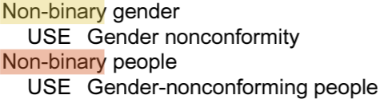
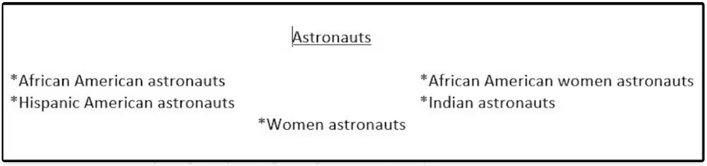
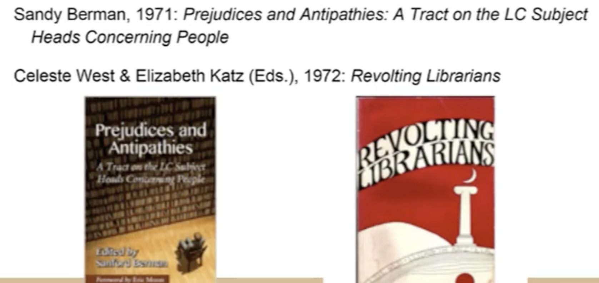
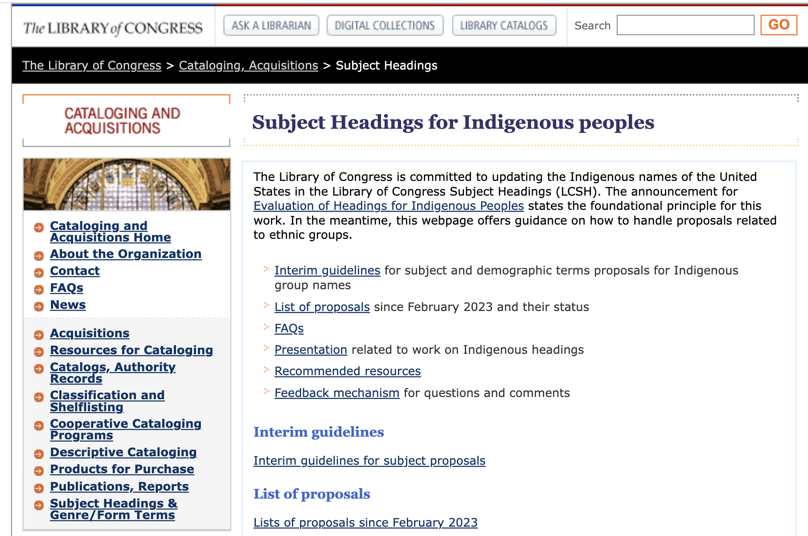
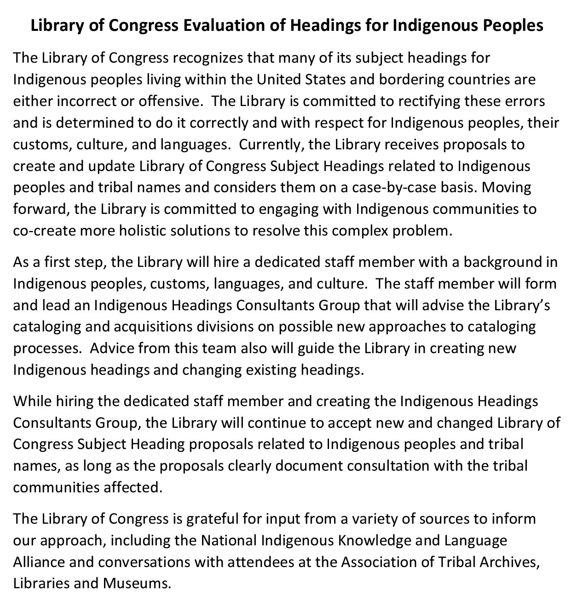
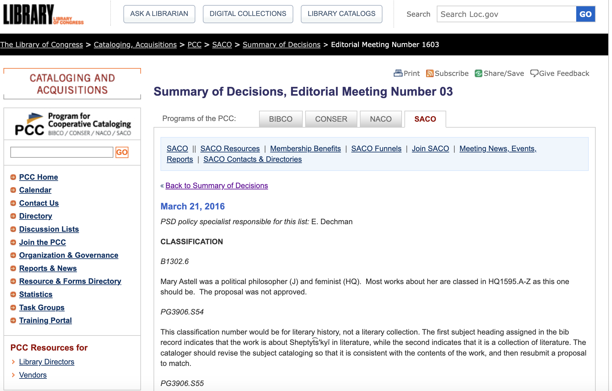
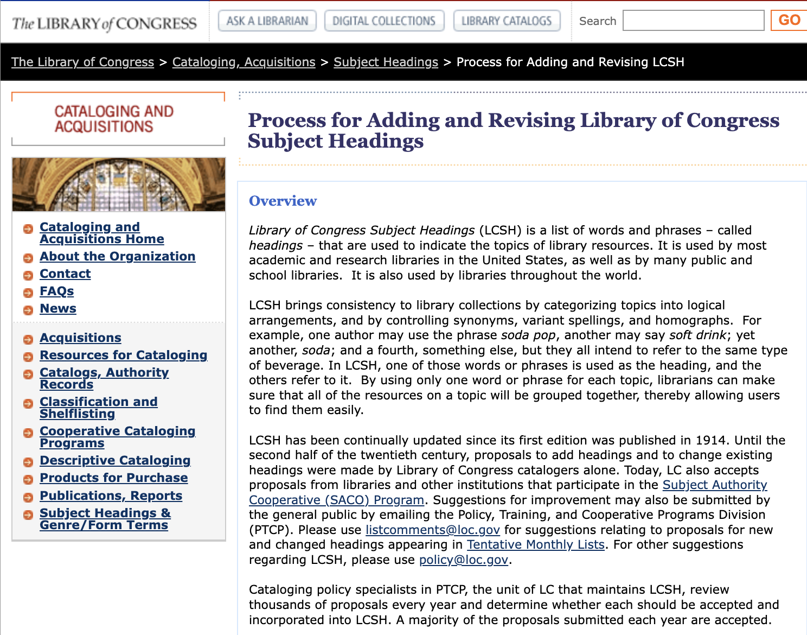
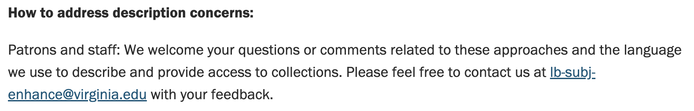
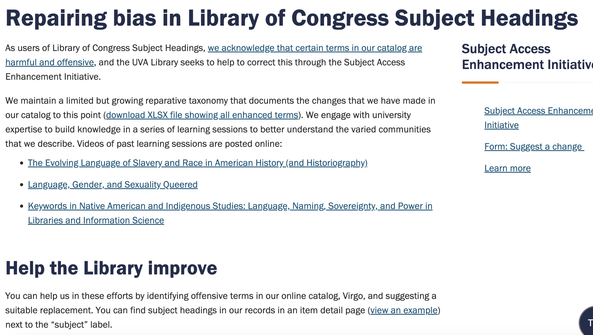
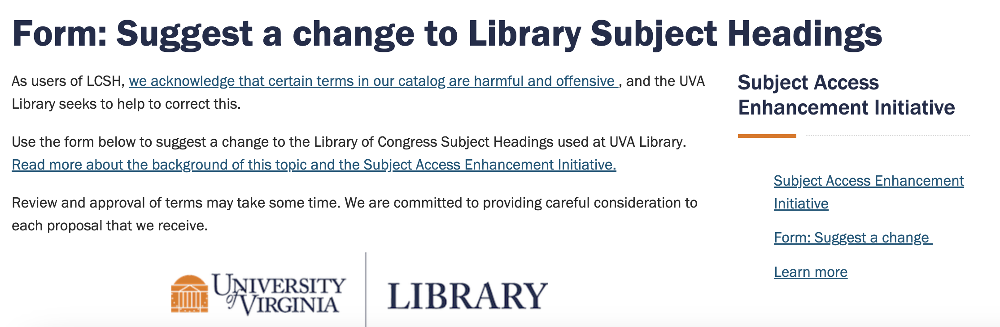

# Introduction

::: notes
As you have no doubt determined at this point, the topic of “information
organization” is very broad based and contains multiple, complex, but
interrelated facets. To this point we have been looking specifically at
users, systems, and bibliographic and subject representation of objects.
We have also stretched our thinking some to include the role that
artifacts might play in how we organize our own knowledge spaces, such
as the use of lists, the hierarchies we have on our cell phones or
computers, calendars, etc. We have even thought through whether or not
we are a “lumper” or a “splitter”.

An essential aspect of information organization that we have not
specifically addressed is that when we design systems, when we create
representations, we should always strive to provide ethical access to
everyone. Providing ethical access is more than making information
available to a wide audience. It is concerned with designing systems
that can be used and are useful to everyone, regardless of age, gender,
ethnicity, race, or ability. It is also concerned with representing
information and knowledge in a sensitive and all inclusive manner.

This week, we are going to learn more about some of the underlying
topics of both designing systems that are accessible to everyone and the
issues of ethical representation.
:::

## Overview

-   Universal Design
    -   Designing systems that can be used and are useful for everyone
-   Ethical Representation
    -   Choices catalogers make
    -   Ethical subject representation
    -   Standards that are based on understanding of users and how users
        interact with library catalog and catalog records

::: notes
We are going to break this module down into two broad topic areas:

`Universal Design`

and

`Ethical Representation`
:::

## Excerpts from ALA Code of Ethics {.smaller}

**Adopted June 28, 1997, by the ALA Council; amended January 22, 2008**

-   `Ethical dilemmas occur when values are in conflict`. The American
    Library Association Code of Ethics states the values to which we are
    committed, and embodies the ethical responsibilities of the
    profession in this changing information environment.

-   `We significantly influence or control the selection, organization, preservation, and dissemination of information`.
    In a political system grounded in an informed citizenry, we are
    members of a profession explicitly committed to intellectual freedom
    and the freedom of access to information.
    `We have a special obligation to ensure the free flow of information and ideas to present and future generations`.

-   We provide the highest level of service to all library users
    `through appropriate and usefully organized resources; equitable service policies; equitable access; and accurate, unbiased, and courteous responses to all requests`.

-   `We uphold the principles of intellectual freedom and resist all efforts to censor library resources`.

::: notes
First, if we take a look at these excerpts from the ALA Code of Ethics,
the principles that guide us as organizers and providers of information
can be distilled to:

1.  We should consult the Code of Ethics and its principles if ethical
    dilemmas occur that conflict with our values

2.  Because we have significant control or influence on the resources we
    provide access to, it is our obligation to ensure equitable,
    unbiased, and accurate access to those materials

3.  We should guard against all forms of censorship, including our own
    (intentional or non-intentional)

When designing systems (web pages, digital libraries, OPACs, interfaces,
etc.) we need to be aware of good design, but also design that makes it
possible for all users to usefully access our systems. Universal design
uses not just principles of good design, but also understanding of how
disabled individuals interact with and use systems. Equitable access can
also mean providing resources and signage that can be useful by people
with disabilities, the aged, or the youngest of our users.

When we create representations of information and knowledge resources,
we have to always keep the user in mind. Choosing appropriate attributes
to represent for our audience is only one aspect of ethical
representation. We also have to be mindful and sensitive to users’ age,
gender, ethnicity, and race when creating records that help users access
our collections.
:::

## ALCTS Supplement {.smaller}

**Developed by the ALCTS Task Force on Professional Ethics; adopted by
the ALCTS Board of Directors, Midwinter Meeting, February 7, 1994**

-   Guidelines for ALCTS Members to Supplement the American Library
    Association Code of Ethics, 1994
-   The following guidelines are to assist ALCTS members in the
    interpretation and application of the ALA Code of Ethics as it
    applies to issues of concern to ALCTS.
-   Within the context of the institution's missions and programs and
    the needs of the user populations served by the library an ALCTS
    member:
    -   strives to develop a collection of materials within collection
        policies and priorities;
    -   `strives to provide broad and unbiased access to information`;
    -   `strives to preserve and conserve the materials in the library in accordance with established priorities and programs`;
-   develops resource sharing programs to extend and enhance the
    information sources available to library users;

::: notes
The ALA ALCTS (Association of Library Cataloging and Technical Services,
the division whose focus is on cataloging and representation issues)
also provides the above guidelines, published in 2004. Catalogers are
currently working on an updated version of the above supplement that can
be applied in day to day situations, but at this point there is little
guidance beyond ALA’s Code of Ethics and the Supplement.
:::

## ALCTS Supplement (Cont.) {.smaller}

-   `promotes the development and application of standards and professional guidelines`;
-   establishes a secure and safe environment for staff and users;
-   fosters and promotes fair, ethical and legal trade and business
    practices; maintains equitable treatment and confidentiality in
    competitive relations and manuscript and grant reviews;
-   `supports and abides by any contractual agreements made by the library or its home institution in regard to the provision of or access to information resources, acquisition of services, and financial arrangements`.

::: notes
I have highlighted a few that are of specific importance when we
organize information.

Also check out the IFLA (International Federal of Library Associations)
webpage for Code of Ethics for Librarians but also the links to other
countries’ codes.
https://www.ifla.org/faife/professional-codes-of-ethics-for-librarians
:::

## Section 508 {.smaller}

**Summary of Section 508 Standards**

- General 
- Technical Standards 
- Software applications and operating
systems 
- Web-based intranet and internet information and systems 
- Telecommunication products 
- Video and multimedia products 
- Self
contained, closed products 
- Desktop and portable computers 
- Functional
Performance Criteria 
- Information, Documentation, and Support

::: notes
Section 508 of the US Code includes provisions
related to developing resources that provide equitable access to
resources for disabled individuals.

This slide shows an outline of the sub-parts included in Section 508.
Click on the link “Summary of ….” to view the summary of Section 508 and
to link out to each sub-part. Other links on your Readings list are also
very helpful and will take you to the WC3’s site on Accessibility tools
and hints for designing websites that are accessible to those
individuals with disabilities.

The next few slides provides a brief summary of Appendixes A, B, and C.
Be sure to link to the entire appendix for more details and the
provisions of each subpart.
:::

## Appendix A

-   E101.1 Purpose. These Revised 508 Standards, which consist of 508
    Chapters 1 and 2 (Appendix A), along with Chapters 3 through 7
    (Appendix C), contain scoping and technical requirements for
    information and communication technology (ICT) to ensure
    accessibility and usability by individuals with disabilities.
    Compliance with these standards is mandatory for Federal agencies
    subject to Section 508 of the Rehabilitation Act of 1973, as amended
    (29 U.S.C. 794d)

::: notes
Appendix A defines the types of technology that are covered in Section
508 and more importantly establishes a minimum level of accessibility
that must be developed into websites and other technologies that are
provided by Federal or State agencies.
:::

## Appendixes B and C

-   C101.1 Purpose. These Revised 255 Guidelines, which consist of 255
    Chapters 1 and 2 (Appendix B), along with Chapters 3 through 7
    (Appendix C), contain scoping and technical requirements for the
    design, development, and fabrication of telecommunications equipment
    and customer premises equipment, content, and support documentation
    and services, to ensure accessibility and usability by individuals
    with disabilities. These Revised 255 Guidelines are to be applied to
    the extent required by regulations issued by the Federal
    Communications Commission under Section 255 of the Communications
    Act of 1934, as amended (47 U.S.C. 255).

::: notes
Appendixes B and C include technical standards and the criteria for
specific types of technologies (such as those listed above) to be in
compliance with Section 508 provisions.
:::

## Appendix C (Cont.) {.smaller}

-   **601.1 Scope**. The technical requirements in Chapter 6 shall apply
    to ICT support documentation and services where required by 508
    Chapter 2 (Scoping Requirements), 255 Chapter 2 (Scoping
    Requirements), and where otherwise referenced in any other chapter
    of the Revised 508 Standards or Revised 255 Guidelines.
-   **602 Support Documentation**
    -   602.1 General. Documentation that supports the use of ICT shall
        conform to 602.
    -   602.2 Accessibility and Compatibility Features. Documentation
        shall list and explain how to use the accessibility and
        compatibility features required by Chapters 4 and 5.
        Documentation shall include accessibility features that are
        built-in and accessibility features that provide compatibility
        with assistive technology.
    -   602.3 Electronic Support Documentation. Documentation in
        electronic format, including Web-based self-service support,
        shall conform to Level A and Level AA Success Criteria and
        Conformance Requirements in WCAG 2.0 (incorporated by reference,
        see 702.10.1).
    -   602.4 Alternate Formats for Non-Electronic Support
        Documentation. Where support documentation is only provided in
        non-electronic formats, alternate formats usable by individuals
        with disabilities shall be provided upon request.

::: notes
Appendix C also addresses access issues to information sources provided
by Federal and State agencies and what is required for compliance with
Section 508.

While Section 508 is only applicable to Federal and State agencies
provision of materials and technologies, this standard is one that all
should emulate when providing access through webpages or other
technologies. Some organizations have developed their own standards or
guidelines that are followed, at least in website design, while others
have none. The links of your Readings list will help you learn more
about this important aspect of information organization.
:::

## Ethical Representation

-   Choices catalogers make
-   Ethical subject representation
-   Standards that are based on understanding of users and how users
    interact with library catalog and catalog records

::: notes
The other broad topic related to Ethics, Diversity, and Access in
Information Organization is related to ethical representation.
Catalogers, or those who create representations, should be mindful and
sensitive to the information uses of all users, regardless of age,
gender, ethnicity, race, and ability. However, our systems, standards,
and representation tools are not always developed with this principle in
mind.

Many of the choices catalogers make can enable or hinder access to
information. Here are a few issues you will learn more about in the
Readings:

1.  Designing representation or metadata schema that are user
    appropriate

-   FRBR studies you explored earlier and how we are reconstructing
    bibliographic cataloging code (AACR2) into RDA
-   Digital libraries designed for specific user groups, specific
    disciplines, etc. and how these can be designed for access by all
    users

2.  Subject headings that are ethical using appropriate terms for
    ethnicity and culture; - age-appropriate subject terms;

-   headings that encompass all gender choices; - headings that are
    sensitive to individuals with disabilities
:::

## Biases in LoC Subject Headings {.smaller}

-   Language vocabularies do not include every langauge
-   LOC does not represent marginalized groups of people
-   Descriptive practices have been based on systems and standards
    ingrained with white supremacy, misogyny, and homophobia
-   Much of this descriptive work contains insensitive, outdated, or
    inappropriate language that reflects the harmful biases built into
    descriptive systems
-   From POV - *white, male, christian, heterosexual, cisgender*
-   Historical bias, unconscious bias, combination of purposeful and
    unpurposeful bias
-   Homosaurus term

{fig-align="center" width="384"}

::: footer
[More Info](https://www.youtube.com/watch?v=X0PVYgwHhVo)
:::

::: notes
One of the core challenges in library and information science is that
existing language vocabularies and classification systems fail to
encompass all languages, particularly those of marginalized or
underrepresented communities. These vocabularies often exclude the
languages, terminologies, and experiences of many groups, resulting in
incomplete and inaccurate representation of knowledge and culture. For
instance, the Library of Congress (LOC), a dominant classification
system, has historically failed to adequately represent marginalized
groups, such as the LGBTQ+ community, Indigenous cultures, and other
minority experiences. This omission perpetuates structural exclusion in
how knowledge is categorized and accessed.

The root of this problem lies in the fact that cataloging and
descriptive practices have long been based on systems and standards
ingrained with white supremacy, misogyny, and homophobia. These systems
were created from a narrow, exclusionary perspective, which means that
many cataloging practices still carry forward these harmful biases. As a
result, much of the language used in cataloging is outdated,
insensitive, and inappropriate. It reflects the harmful biases built
into the system, including terms and categorizations that may have been
acceptable at the time but are now recognized as offensive, particularly
in relation to race, gender, and sexuality.

Furthermore, these classification systems were created from the dominant
perspective of white, male, Christian, heterosexual, and cisgender
individuals, leading to the privileging of certain viewpoints while
others are marginalized or erased. This results in a combination of both
intentional and unintentional bias, where some exclusions or
misrepresentations were consciously designed, while others occurred out
of ignorance or lack of awareness. Recognizing this combination of
purposeful and unconscious bias is key to understanding how deeply
entrenched these issues are.

In response to these limitations, alternative vocabularies such as the
Homosaurus (https://homosaurus.org/) have been developed. The Homosaurus
is an LGBTQ+ focused vocabulary tool designed to offer more inclusive
and appropriate terminology for describing LGBTQ+ topics. It counters
the historical biases found in traditional systems, offering a path
forward for more inclusive cataloging practices. Ultimately, addressing
these biases and adopting more inclusive tools is essential for creating
a more equitable and accurate system of knowledge classification in
libraries and archives.
:::

## Bias Hiding in Your Library {.smaller}

`The ‘straight white American man’ assumption`

*Without gender, race or geographic qualifications, “Astronauts” can be
assumed to mean white American men in terms of library subjects*

{fig-align="center" width="518"}

::: footer
<https://theconversation.com/the-bias-hiding-in-your-library-111951>
:::

::: notes
In library classification and subject cataloging, there is often an
implicit assumption of the "straight white American man" as the default
or normative identity. This bias is especially evident when library
subjects or categories lack specific qualifications related to gender,
race, or geography.

For example, when the subject "Astronauts" is used without further
clarification, the assumption may be that it refers primarily to white
American men, despite the fact that astronauts come from a variety of
racial, gender, and national backgrounds. This reflects a broader issue
in library systems where the dominant identity is assumed unless
otherwise specified, which erases the diversity and contributions of
individuals who do not fit that narrow mold.

Recognizing and addressing these hidden biases is crucial for creating
more accurate and inclusive library descriptions and classifications
that reflect the diversity of human experience.
:::

## Bias Hiding in Your Library {.smaller}

-   Nurses were divided equitably for both Male and Female

-   Under Prostitutes, there was only “Male prostitute” SH, revealing
    the generic assumption that most prostitutes are female

{fig-align="center" width="562"}

::: footer
<https://theconversation.com/the-bias-hiding-in-your-library-111951>
:::

::: notes
In library classification systems, biases can often be hidden in the
ways professions and identities are categorized. For example, while
nurses are divided equitably by gender into male and female categories,
there is a glaring disparity when it comes to the subject heading for
"Prostitutes." The Library of Congress only includes a specific subject
heading for “Male prostitute,” which reveals the underlying assumption
that most prostitutes are female. This type of bias reinforces gender
stereotypes and contributes to the invisibility of marginalized groups
within certain professions.
:::

## Beginning of Change

{fig-align="center" width="568"}

::: notes
Two influential works that played a significant role in addressing bias
in library classification systems are shown on this slide. The first is
**Sandy Berman’s 1971 work, "Prejudices and Antipathies: A Tract on the
LC Subject Heads Concerning People,"** which critically examines the
Library of Congress subject headings, pointing out their inherent biases
and the marginalization of certain groups. Berman’s analysis was a
pivotal moment in recognizing how subject headings reflected societal
prejudices, including racism, sexism, and other forms of discrimination,
and it advocated for more inclusive and accurate cataloging practices.

The second work featured is the 1972 anthology **"Revolting
Librarians,"** edited by **Celeste West and Elizabeth Katz.** This
collection of essays was part of the larger radical librarianship
movement that called for transformative change in libraries,
particularly around issues of social justice and representation. The
book challenges traditional library practices, including the role of
librarians as gatekeepers of knowledge and the perpetuation of biases
within cataloging systems.

These works represent the early stages of change in library science,
where critical theory, feminist theory, and other movements began to
question and push back against the biased systems that shaped library
classification. They laid the groundwork for ongoing efforts to make
library systems more inclusive and to reflect diverse identities and
experiences, ultimately influencing subsequent scholars and movements,
such as Critical Race Theory and Queer Theory, in the field of library
science.
:::

## Critical Theory

-   Feminist Theory; Social Influences - Hope Olson (1990s-present)
-   Critical Race Theory - Jonathan Furner (2000s)
-   "Three Decades Since *Prejudice and Antipathies*: A Study of Changes
    in the Library of Congress Subject Headings" - Steven Knowlton
    (2005) 
-   [Queer
    Theory](https://academicworks.cuny.edu/gc_pubs/577/#:~:text=Queer%20theory%20invites%20a%20shift,just%20as%20critical%20catalogers%20do) -
    Emily Drabinski (2010s) \[*Currently President of the American
    Library Association (ALA)*\]

::: footer
[Engaging an Author in a Critical Reading of Subject
Headings](https://doi.org/10.24242/jclis.v1i1.20)

[Advancing the Relationship between Critical Cataloging and Critical
Race Theory](https://doi.org/10.1080/01639374.2022.2089936)
:::

::: notes
There has been a growing movement toward addressing these biases in
cataloging practices. The integration of critical theory into library
science has led to important changes in how subjects are classified.
Feminist theory, driven by scholars like Hope Olson since the 1990s, has
brought attention to social influences on classification, while Critical
Race Theory, advanced by Jonathan Furner in the 2000s, has examined how
race is represented in these systems. Steven Knowlton's study, *“Three
Decades Since Prejudice and Antipathies: A Study of Changes in the
Library of Congress Subject Headings,”* also reflects on the progress
made in removing prejudiced language.

More recently, Emily Drabinski, an advocate of Queer Theory and past
president of the American Library Association (ALA), has pushed for
changes to ensure the LGBTQ+ community is represented fairly and
accurately. These shifts in theory and practice demonstrate the ongoing
effort to address and correct biases hidden in library classification
systems.
:::

## Representation in LOC {.smaller}

**`Absence/Incomplete`**

-   LQBTIQA+
-   Gender
-   Racial categories
    -   races have been named by dominant group (white)
-   Indigenous People
    -   broad and inaccurate subject term
-   Western bias

::: notes
We have now seen that how the **representation in the Library of
Congress (LOC) subject headings** for various groups are either absent
or incompletely represented in these systems. For example, subject
headings related to **LGBTQIA+ communities** are often limited or
missing, failing to reflect the full spectrum of sexual and gender
diversity. Similarly, gender categories themselves are often inadequate,
lacking the nuance needed to represent non-binary, transgender, and
other gender-diverse identities.

In terms of **racial categories**, the LOC subject headings have
historically been created and named by the dominant group—typically
white, Western classifiers—which results in biased and reductive
representations of race. Categories for racial and ethnic groups are
often shaped by these external perspectives rather than the groups
themselves. This is particularly problematic for **Indigenous peoples**,
where subject terms are often overly broad or inaccurate, homogenizing a
vast diversity of cultures, languages, and histories under a single,
Western-biased term.

The slide emphasizes that these gaps and inaccuracies perpetuate a
**Western bias** in library cataloging systems, privileging Western
norms and viewpoints while erasing or misrepresenting the experiences
and knowledge of marginalized groups. This lack of comprehensive
representation highlights the need for ongoing efforts to update and
revise these classification systems to be more inclusive and accurate.
:::

## Some Positive Changes in LOC SH {.smaller}

::: {style="font-size: 91%;"}
[**Ethnicity**]{.underline}

-   In late 1970s, “`Afro-Americans`” replaced *“Negroes”*

-   This was in turn replaced by “`African Americans`” or “`Blacks`” in
    2000

[**Medical Condition**]{.underline}

-   In 2001, “`People with mental disabilities`” replaced “*Mentally
    handicapped”* and *“Retarded persons”*

[**Gender**]{.underline}

-   Gender identity is also an area where positive changes have been
    made

-   LGBT subjects have been distinguished and classed under
    `“Sexual minorities”` since 1972, rather than being under the
    subject *“Sexual deviations”*. *“Sexual deviations”* does not even
    exist as a subject heading anymore

-   In December, the Library of Congress changed the broader term from
    *“sexual minorities”* to simply “`persons`"
:::

::: footer
<https://theconversation.com/the-bias-hiding-in-your-library-111951>
:::

::: notes
There have been some **positive changes** made in the **Library of
Congress (LOC) subject headings** over time, particularly in the areas
of ethnicity, medical conditions, and gender identity. These changes
reflect evolving societal understanding and a move towards more
inclusive and respectful language.

In terms of **ethnicity**, a significant shift occurred in the late
1970s when the term "Afro-Americans" replaced the outdated and offensive
term "Negroes." This was further updated in 2000 to "African Americans"
or "Blacks".

Regarding **medical conditions**, in 2001, LOC replaced the terms
"Mentally handicapped" and "Retarded persons" with the more respectful
and person-first language, "People with mental disabilities." This
change was important in reducing the stigma associated with outdated and
pejorative language around disabilities.

The **gender identity** category has also seen positive changes. One of
the earliest improvements was made in 1972 when LGBT subjects were
reclassified under "Sexual minorities" instead of the derogatory "Sexual
deviations," a term that no longer exists in the LOC subject headings.
More recently, in December, the Library of Congress made a further
change by updating the broader term from "Sexual minorities" to the more
neutral and inclusive "persons," reflecting a continued effort to
respect and affirm diverse identities.

These changes demonstrate that while the LOC classification system has
had its flaws, it is gradually evolving to better reflect the diversity
of our society.
:::

## Efforts by Library of Congress {.smaller}

{fig-align="center" width="572"}

::: footer
<https://www.loc.gov/aba/cataloging/subject/indigenous.html#in-process>
:::

::: notes
The **Library of Congress (LOC)** has been making efforts to address and
update the subject headings related to different terms. This slide
demonstrates the LOC's ongoing efforts to improve representation and
accuracy in its cataloging system for Indigenous peoples, ensuring that
these changes reflect both contemporary standards and the preferences of
Indigenous communities themselves.

The LOC is committed to ensuring that Indigenous group names and
classifications are accurately and respectfully represented in its
subject heading system. This commitment is part of a broader initiative,
titled **"Evaluation of Headings for Indigenous Peoples,"** which seeks
to revise and improve how Indigenous groups are categorized, moving away
from outdated, inaccurate, or broad terms that have historically
dominated library systems.

As part of this effort, the LOC provides **interim guidelines** on how
to handle subject and demographic term proposals for Indigenous groups.
These guidelines aim to support more accurate and culturally sensitive
classifications.

The LOC encourages feedback from the community through a **feedback
mechanism**, enabling a participatory approach to updating subject
headings.
:::

## Efforts by Library of Congress {.smaller}

{fig-align="center" width="581"}

::: footer
<https://www.loc.gov/aba/cataloging/subject/Evaluation-Headings-Indigenous-Peoples.pdf>
:::

::: notes
This slide shows the screenshot of the guideline follows by LOC for
evaluating the subject heading for the indigenous people.
:::

## Efforts by Library of Congress {.smaller}

{fig-align="center" width="586"}

::: footer
<https://www.loc.gov/aba/pcc/saco/cpsoed/psd-160321.html>
:::

::: notes
In this slide, I am showing the LOC procedure of inclusion and exclusion
of the different terms proposed by the community. Once the term is
proposed by you, it goes through an internal meeting discussion (&
voting) and is decided to be either included in the LOC or not.
:::

## Efforts by Library of Congress {.smaller}

{fig-align="center" width="514"}

::: footer
<https://www.loc.gov/aba/cataloging/subject/lcsh-process.html>
:::

::: notes
Follow the link in the footnote to know the overall process followed by
LOC to submit the proposal to include or exclude a LOC subject term.
:::

## Efforts by Libraries {.smaller}

> Libraries are making efforts to redress this problematic history

`Statement on Harmful Language in Cataloging and Archival Description by University of Virginia Library`

-   They are actively removing the harmful language in their legacy
    records

-   They acknowledge that many LCSH headings are biased and harmful

-   They are supporting efforts underway throughout the profession to
    change these terms, and are also taking a localized approach to
    replacing some harmful and racist terms with acceptable local
    headings in their own catalog

-   When describing some archival collections, they include a brief note
    to patrons alerting them to harmful or pejorative language

{fig-align="center" width="555"}

::: footer
<https://www.library.virginia.edu/policies/statement-on-harmful-language>
:::

::: notes
Libraries are increasingly recognizing and addressing the problematic
history embedded in cataloging and archival systems, particularly with
respect to biased and harmful language. There are many libraries that
are trying remove such subject terms in their local catalog.

A prime example of this is the **University of Virginia Library's**
**Statement on Harmful Language in Cataloging and Archival
Description**, where they actively acknowledge the presence of biased
and offensive terms in Library of Congress Subject Headings (LCSH) and
legacy records. In response, they have committed to removing such
harmful language from their records, working to replace outdated,
racist, and pejorative terms with more respectful and inclusive
alternatives.

The University of Virginia Library, along with other institutions, is
supporting broader efforts within the library profession to advocate for
changes in LCSH terms. Simultaneously, they are taking a **localized
approach**, adapting their own cataloging practices to replace harmful
language with more acceptable local subject headings, ensuring that
their catalog is more inclusive and reflective of modern standards.

In the case of archival collections, libraries are also taking care to
alert patrons to potentially harmful or outdated language. They provide
brief notes alongside some descriptions to inform users about the
presence of such language, thereby acknowledging the historical context
and fostering transparency. These efforts by libraries represent a
critical step toward addressing past biases and creating more equitable
and inclusive cataloging practices moving forward.
:::

## Efforts by Libraries {.smaller}

::: r-stack
{width="579"}
{width="474"}
:::

::: footer
-   <https://library.virginia.edu/about-uva-library/subject-headings>

-   [Growing Reparative
    Taxonomy](https://myuva-my.sharepoint.com/:x:/g/personal/jtb4t_virginia_edu/EeGfxdWzdE1GoCjRBo4-W_YBbGhzdqWcxBdNrHf_ePbTng?rtime=KGDpdNo83Eg)

-   [Form
    Link](https://www.lib.virginia.edu/about-uva-library/subject-headings/form)
:::

::: notes
Taking the example of University of Virginia (UVA), you can also
initiate the practice of making your library catalog more inclusive.

UVA is actively working to correct these issues through their Subject
Access Enhancement Initiative. As part of this initiative, they are
developing a reparative taxonomy that documents changes made to the
catalog so far, making these revisions publicly available for
transparency (with downloadable resources like the enhanced terms list).

To build understanding, the library engages with experts across various
disciplines through a series of learning sessions. These sessions cover
topics like the evolving language of slavery and race in American
history, gender and sexuality, and Native American and Indigenous
studies. This collaborative and educational approach helps to better
inform the cataloging community and promotes a more inclusive and
accurate representation of diverse subjects.

Additionally, the library encourages public participation in its efforts
to improve cataloging practices. Patrons are invited to identify
offensive terms in the online catalog, Virgo, and suggest more
appropriate replacements. This crowdsourcing approach enables the
library to continuously update and refine its subject headings,
fostering a more inclusive and responsive catalog.
:::
