# Introduction

::: notes
This week, we are going to begin talking about the conceptual
models, FRBR, FRAD, and FRSAD that underlie the new cataloging standard,
RDA, but also will be incorporated into the new bibliographic framework
once it is ready to replace the MARC record structure.

There are three lectures in this topic (Part 1, Part 2, and
Part 3). So, let’s begin with an overview of what we’re going to cover
and how these conceptual models will lead into our discussion for RDA.
:::

## Starting the Conversation

-   What are FRBR, FRAD, FRSAD, and RDA and what do I need to know about
    each?
-   A look “under the hood” FRBR/RDA and library catalogs/cataloging
    -   FRBR conceptual model and user tasks
    -   “FRBRized” systems
    -   Realistic/unrealistic expectations
-   Challenges/Concerns about RDA and implementation

::: notes
We’re going to begin this conversation by talking about each of these
conceptual models individually. We’ll first address FRBR then FRAD and
FRSAD, and we’ll talk about how they relate to RDA and what we need to
know about each of these models to understand their implementation and
application within the systems we use in libraries but also systems that
may be used outside of the library boundaries.

We will ‘take a look under the hood’ and explore some systems that have
been FRBRized or have included those FRBR elements within the system,
and how they relate to libraries and library cataloging. We’ll talk
about the FRBR conceptual model and user tasks. We’ll explore some
FRBRized systems, and we’ll even address some realistic and unrealistic
expectations that we might have for FRBR and its element sets and how we
can incorporate them into library catalogs.
:::

## FRBR {.smaller}

-   A report prepared by a study group of IFLA, the International
    Federation of Library Associations and Institutions, and published
    in 1998
-   FRBR is a `conceptual model`, and not a set of cataloging rules, a
    data format, nor a specific system design.
    -   FRBR report enumerates `user tasks`,
    -   develops an `entity-relationship model`,
    -   `maps the user tasks to the entity attributes and relationships`,
        and
    -   `enumerates basic requirements` for bibliographic records.

::: notes
FRBR, or as you’ve probably read in your readings already, stands for
the Functional Requirements of Bibliographic Records. FRBR was a study
began by IFLA, the International Federation of Library Associations and
Institutions. The study itself was designed to explore how users
actually use library catalogs and their expectations for doing so. It
was a groundbreaking study, it was published in 1998. And yes, I know,
that is a very long time ago now, but we are just starting to see how
FRBR can be implemented within different systems.

It was published in 1998, but the real work of FRBR did not begin until
we started revising the Anglo-American Cataloging Rules, which began
sometime in 2003. During the process of revising AACR2, it came to the
awareness of everyone on the various committees that we were taking,
again, a Band-Aid approach to the standard, where we were trying, again,
to shoehorn AACR2 into use with the new types of formats of the digital
environment, and we were not doing so successfully. We also became aware
that we really needed to re-conceptualize the whole idea of cataloging
and cataloging in the cataloging standard based upon the FRBR conceptual
model.

Your readings for this chapter are going to give you quite a bit of
history of FRBR and why it became necessary, and then, hopefully, you
can make the link between the FRBR elements in its conceptual model as
well as the user tasks that the FRBR report enumerates.

So, FRBR itself, as I mentioned before, is a conceptual model. It’s not
a database model. It’s not an implementation model. It is a conceptual
model, and it’s not a set of cataloging rules. It’s not a data format,
and it’s not specific to any type of system design.

So, it’s important to keep that in mind. It’s a conceptual model that
enumerates user tasks so that we know our users’ expectations and what
they want to do when they come to our library catalog. What that tells
use as catalogers and indexers as well as system designers is that we
have to align those user tasks with the metadata structure within our
records, with the metadata itself that we are using to describe the
objects in collections.

The FRBR report not only enumerates the user tasks for us and explains
them in more depth, it also develops an entity-relationship model, so
you can see how this could play out in a database environment. But also,
it brings to light some of the relationships between the entities that
we’re not currently taking advantage of in our information retrieval
systems. It maps the user tasks to the entity attributes and
relationships, and it enumerates basic requirements that should be part
of our bibliographic records.

I really hope you do take some time to look at the FRBR report in more
depth. We’re not going to cover all of it, but we will look quite a bit
at these conceptual models throughout the semester. We will also look at
how they fit within the MARC record structure, which is what we have in
place to date.
:::

## FRBR: User Tasks {.smaller}

*FRBR report, pp. 8–9*

-   using the data to `find` materials that correspond to the user’s
    stated search criteria (e.g., in the context of a search for all
    documents on a given subject, or a search for a recording issued
    under a particular title)
-   using the data retrieved to `identify` an entity (e.g., to confirm
    that the document described in a record corresponds to the document
    sought by the user, or to distinguish between two texts or
    recordings that have the same title)
-   using the data to `select` an entity that is appropriate to the
    user’s needs (e.g., to select a text in a language the user
    understands, or to choose a version of a computer program that is
    compatible with the hardware and operating system available to the
    user) using the data in order to `acquire or obtain access` to the
    entity described (e.g., to place a purchase order for a publication,
    to submit a request for the loan of a copy of a book in a library’s
    collection, or to access online an electronic document stored on a
    remote computer)

::: notes
Let’s begin by looking at the user tasks that the FRBR study uncovered.
Now, you can also think of these in terms of Cutter’s Object of the
Catalog, because there’s definitely some overlap.

The first task is that our records should be, or the metadata in our
records, should be used to find materials that correspond to the user’s
stated search criteria. For example, in the context of a search for all
documents on a given subject or a search for a recording issued under a
particular title, we should be able to find materials that match that
search criteria. Now, we’ve conducted many studies through the years
that have looked at how people actually use our library catalogs and
what fields they use and the types of searches they conduct within our
catalogs. So, we do know that there are specific criteria that people
like to search for. We do know that there are what are called ‘known
item searches’, meaning that the user knows something about the item
they’re searching for; usually, it’s the title or the author, and also,
they may know a subject, but the subject may be either too broad or too
specific for that type of search.

The second user task is using the data retrieved to identify an entity,
in other words to confirm that the document presented in a record
corresponds to the document sought by the user or to distinguish between
two texts or recordings that have the same title. So, there should be
metadata in your records to support the identification function, meaning
that if I want a particular edition of a work, I should have that
information in the record to enable identification.

The third user task is to Select. The user should be able to use the
data in a record to select an entity that is appropriate to the user’s
needs. For example, I need to select text in a language that I can
actually understand and read, or if it’s an audio work, that I can
listen to and I have the language ability to understand the work itself,
or to choose a version of a computer program that’s compatible with the
hardware and operating system that’s available to me. So, if I only work
with a PC, I want to know that the software package will actually work
on my computer. So, the metadata needs to be present in the record that
gives me this selection opportunity.

The fourth user task is to use the data in order to acquire or to obtain
access to the entity described. So, for example, if I find something
that I want to check out in the library, I need to have information that
tells me where to find that object and acquire it within the library.
So, I need to know a classification number, for example, or I need to
know where it is within the library’s collection–if it’s on the third
floor. Or if it’s an online document, I need to have an access point so
that I know how I can access that information object.

The FRBR user tasks, as you are probably thinking at this point, are not
that different than Cutter’s Objects for the Catalog. His are just a
little bit more specific to the types of metadata that were created in
records at that point and continue to be included in records today.
However, the last function–the acquire function–is something that is new
to the FRBR findings even though to us it seems common sense.
:::

## FRBR: Entity-Relationship Model

-   Entities are divided into `three groups` in the FRBR model:
    -   `Group 1`, which contains entities that are “products of
        intellectual or artistic endeavor”
    -   `Group 2`, which contains entities that are potential creators,
        producers, or owners of Group 1 entities
    -   `Group 3`, which could be called “other,” and contains entities
        that fall into the categories or concept, place, object, or
        event—entities that could be the subject of Group 1 entities but
        that are not considered to be either Group 1 or Group 2 entities

::: notes
Another value of the FRBR report was the conceptual model itself and the
entity-relationship model that it lays out for us. This model allows us
to think beyond the 1:1 relationship that we have present in library
catalogs today. Think back about the history of library catalogs as we
discuss this conceptual model.

Library catalogs in the beginning were basically a list and a location
device. The catalog would tell you the name or the title or the author
of the object and where to find it in the library. When we moved to the
card catalog environment, this environment allowed us to add additional
metadata that the list format did not and it allowed us to update our
records a bit easier. However, it was still a very flat file-based
system. You had one object, one record. You might have had multiple
cards or access points within your catalog that allowed you to find it
by author, title, and subject or series title or other authors’
information. But again, it was still basically one record describing one
object in a catalog without linking it to other works by that same
individual or some of these other relationships we’re going to look at
in the FRBR conceptual model.

When we moved into the automated MARC environment, we started in a flat
file system in a homegrown database created by the Library of Congress.
And not until the nineties did we really move beyond that system into a
proprietary database system that allowed some of these relationships to
be built into our records. And then we also have to rely on our
integrated library systems to create those functions and provide that
functionality to our users.

The newer clustering systems, or some of the next generation catalogs,
where they work on tag clouds searching and some of those additional
functionalities, are moving in this direction; however, there are very
few ILS databases to date that have actually implemented FRBR, but we
will look at a couple of systems at the end of this lecture.

With that in mind, let’s look at the FRBR entity relationship model and
how it established first, entities for us to think about as we describe
or represent objects in our collections, but then it also builds in
those relationships that are present and have always been present but
are not in place or are not functional within current systems.

The entities with the FRBR entity relationship model are divided into
three groups. There’s Group 1, which contains entities that are products
of intellectual or artistic endeavors ; Group 2, which are entities that
are potential creators, producers, or owners of Group 1 entities; and
Group 3, which are still being called the “other” and contain entities
that fall into the categories of concept, place, object, and event.
These are entities that could be the subject of Group 1 entities but
that are also not considered in either Group 1 or Group 2 entities.
Group 3 has not been fully developed within the RDA structure; I just
want to tell you that right now. And the last conversation that
standards developers have been having about Group 3 is that it may not
be developed within RDA. RDA at this point is for bibliographic
description or descriptive elements or cataloging, where Group 3 would
move it into the subject cataloging realm.

So, with that in mind, let’s take a look at these different entities and
relationships.
:::

## GROUP 1

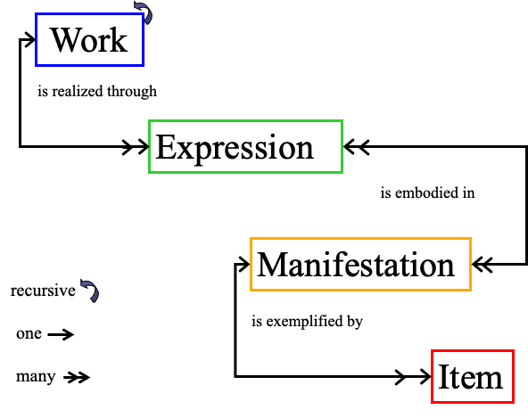{fig-align="center" width="552"}

::: notes
On this slide we see what’s called the ‘WEMI model’, the work,
expression, manifestation, and item of the Group 1 entities. We also see
the relationships. The relationships inherent among the Group 1 entities
are shown here, such as work is expressed through an expression–that’s a
relationship. An expression is embodied in an actual manifestation of an
item –that’s another relationship. A manifestation is then exemplified
by an item–that, again, is yet another relationship. These entities and
this set of relationships are all present when we hold an item in our
hand.

Like we have a copy of Shakespeare’s Hamlet, which is an item. It’s one
copy of a manifestation–this book,– and that embodies, captures, and
records an expression in the English language of a work called Hamlet
that was created by Shakespeare. This is a bibliographic resource and it
embodies the English language expression of the work, Hamlet.

Now, if I have another item in my hand that’s a DVD, yet a manifestation
of one version or movie version of Hamlet, a work–remember Hamlet is the
main work,–we’ve got two different items and they are different
manifestations of the work of Hamlet expressed in different ways.

Now, let’s take a look at the attributes of identifying elements for
these different entities. I also want to mention here that I’m using
some of the slides from Barbara Tillet’s wonderful webinar and some of
the pre-conference presentation that she did at ALA a few years ago.

But what’s important in this particular slide is that we see this model,
WEMI, in place. Work is realized through the expression. Work is the
idea that someone comes up with. It’s the story that you have in your
mind that you then express in some way by writing it out or recording
it. That is embodied in what is considered a manifestation of that work.
It could be the published work itself.

And then the item that you have in your library or on your library shelf
is the manifestation of that work itself. You can see also there are
different relationships in play here. There is a recursive relationship,
meaning that the item is expressing the work, and the work is eventually
expressed as an item. There are 1:1 relationships, but there are also
one to many relationships. Okay, let’s take a look at a different way of
approaching this model.
:::

## FRBR’s Entity-Relationship Model

-   Entites
-   Relationships
-   Attributes (data elements)

{fig-align="center" width="191"}

::: notes
We can diagram the model using boxes for the entities that are then
connected through a relationship by arrows (and that shows those
relationships) with other entities.

So, we have one entity that is connected to another entity through a
relationship.

We also can talk about attributes or data elements.
:::

## FRBR’s Entity-Relationship Model

{fig-align="center" width="227"}

::: notes
For example, we can say one entity,a person named Shakespeare is the
creator of the play Hamlet (another entity) – or we can say the
relationship goes both directions – Shakespeare created Hamlet and also
the other way, Hamlet <click> was created by Shakespeare.

Actually in our model we’d move this to a more abstract level to say a
person created a work and a work was created by a person – the entities
are person and work and the relationship between them is the
created/created by relationship. We use the model to help design systems
so any individual can be plugged into the model.

So we have entities and relationships.

The FRBR entities are sorted into 3 groups for the convenience of
talking about them.
:::

## FRBR Entities

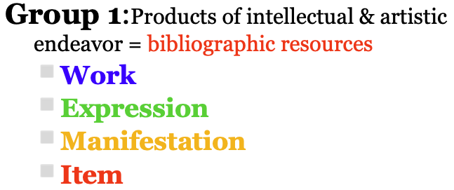{fig-align="center" width="10%"}

::: notes
Group 1 entities are the products of intellectual and artistic endeavor,
the content and the packages that contain that content.

All of the bibliographic resources that we want to make available to our
users, the things we collect in libraries.

The model calls these ‘work’, ‘expression’, ‘manifestation’, and ‘item’.
:::

## 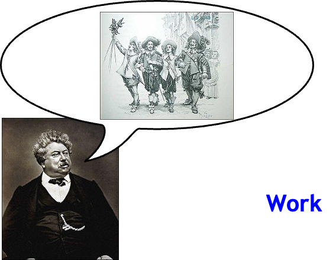{width="574"}

::: notes
‘Work’ according to FRBR is a distinct intellectual or artistic
creation. As I mentioned a few minutes ago, it’s the idea that someone
comes up with. It’s an abstract entity. And I like to think of it as the
ideas that a person has in their head.

A work is realized through one or more expressions in the form of some
notation, like alphanumeric notation, musical notation, choreographic
notation, or it can be sound, an image, an object, movement, etc. Or any
combination of these things.

An ‘expression’ can be a performance or a translation or a version of a
particular work. It’s useful to identify works and expressions because
we can use the names of works and expressions as a device to organize
displays of information, and I’ll show you more about this in a minute.

Alexandre Dumas, the individual you see here, was the creator of the
work The Three Musketeers. All of these aspects are related, and by
making those relationships known within our systems, within our records,
we can show our users pathways to get to the information they need. So,
our users can find Alexandre Dumas, they can find the work The Three
Musketeers, but if we build in these additional relationships, we can
also link to other works by Dumas, but we can also link to derivations
of the work, The Three Musketeers.

(These two images are taken from a slide called “What We Talk and What
We Talk About FRBR,” a presentation by William Denton and also by Jody
Snider.)
:::

## 

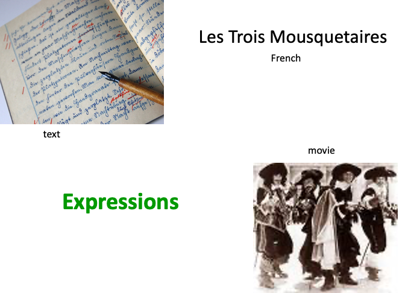{fig-align="center"}

::: notes
That content is characterized by how it is expressed – here as text or
as a moving image.
:::

## 

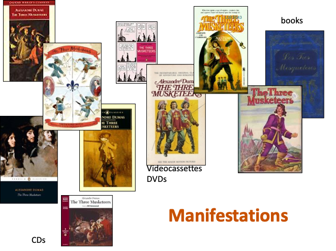{fig-align="center" width="641"}

::: notes
Slide from What we talk about when we talk about FRBR – presentation by
William Denton, York University and Jodi Schneider, UIUC (at Code4Lib
2009 (http://code4lib.org/files/frbr_code4lib09.pdf)

Manifestations can come in many types of packages. They can be books,
they can be CDs, they can be DVDs, videocassettes, and so on. These are
the containers or carriers of the content that they hold. So, these are
all different versions of the work, The Three Musketeers by Alex\[sic\]
Dumas. But they are manifestations or physical representations of that
work.
:::

## 

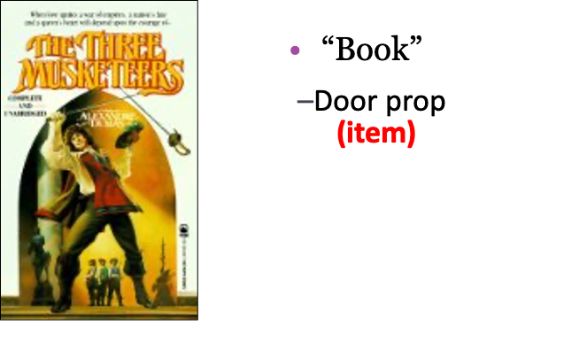{fig-align="center"}

::: notes
The vocabulary is really very important. Let me give you an analogy from
Patrick LeBoeuf, who was formerly the chair of the IFLA FRBR Review
Group. Our English language, like most languages, can be very fuzzy.

-   When we say ‘book,’ what we have in mind may be a distinct, physical
    object that consists of paper and a binding and can sometimes serve
    to prop open a door or hold up a table leg – FRBR calls this an
    item.

-   When we say ‘book’ we also may mean “publication” as when we go to a
    bookstore to ask for a book identified by an ISBN – the particular
    copy does not usually matter to us, provided it has the content we
    want in a form we want and no pages are missing – FRBR calls this
    manifestation.
:::

## 

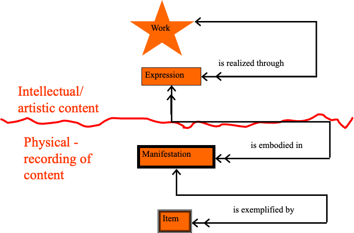{fig-align="center"}

::: notes
Once we capture a particular expression of a work in some container or
we record that content on some carrier, we have a manifestation of a
particular expression of a work.

When we record the intellectual or artistic content, we move from the
abstract “work/expression” to some physical entity. As FRBR puts it, a
manifestation is the physical embodiment of an expression of a work. In
order to record something you have to put it on or in some container or
carrier. So, manifestations appear in various “carriers,” such as books,
periodicals, maps, sound recordings, films, CD-ROMs, DVDs, multimedia
games, Web pages, and so on.

A manifestation represents all the physical objects that have the same
characteristics of intellectual content and physical form. In actuality,
a manifestation is itself an abstract entity, but describes and
represents physical entities, that is all the items that have the same
content and carrier. When we create a bibliographic record, it typically
represents a manifestation – that is, it can serve to represent any copy
of that manifestation held in any library anywhere.

One example or copy of a manifestation is called an item. Usually it is
a single object, but sometimes it consists of more than one physical
object, e.g., a book issued in 2 separately bound volumes – the 2
volumes represent 1 item; or a sound recording on 3 separate CD’s. With
an item entity, we are able to identify an individual copy of a
manifestation and to describe its unique characteristics - that may be
information relevant for circulation - checking a particular copy out to
borrow it from the library or for tracking its preservation.
:::

## Elements to Describe Resources

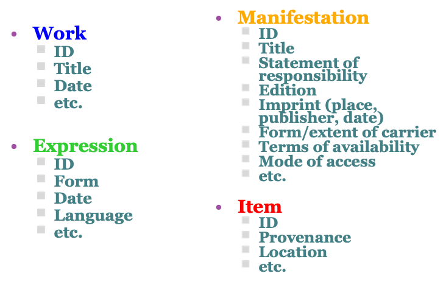{fig-align="center" width="563"}

::: notes
There are essential characteristics or elements that we associate with
each of the entities in FRBR. FRBR calls them attributes. RDA calls them
elements.

For a work, the main elements are its title, a date it was created if we
know it, possibly its identifier (if it has one, e.g., for rights
management), etc. For an expression – which remember can be things like
a translation or version or a performance -- we have characteristics
like the type of content – what form it took: like text, sound, image,
and so on, or its language or information about a performance – on what
date did it happen and so on.

Once we record a performance, or publish a translation, or package that
content in any way, we produce a manifestation – an entity that is of
interest to a library – something for which we would provide a
bibliographic description. And a manifestation often brings some
information about itself in the form of a title page or a main screen or
a label that includes the characteristics of that manifestation – like
who published it, where, and on what date, what are its dimensions and
extent.

Then for an item, when we have one particular copy of a manifestation,
we have other elements or information that characterizes or identifies
that particular item, like its physical location when we shelve it – a
call number, information about its owner, or perhaps some information
about the color and type of binding on that special copy or a barcode–
information we can use for inventory control, so we can know where our
materials are – so we can make them available for our users.
:::

## Examples

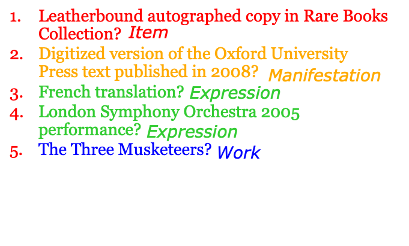{fig-align="center" width="549"}

::: notes
Let’s look at some examples to see if we can tell which type of entity
we have when we have these identifying characteristics – these elements:

1.  For the first example, we have the identifying characteristic of it
    being a leatherbound autographed copy in the Rare books collections
    – which entity do we have? **An Item – one particular copy**

2.  Digitized…. -\*\* Manifestation – the carrier or package that holds
    some content

3.  \*\* French translation – Expression – language in which expressed

4.\*\* London symphony -\*\* Expression – the symphony performs some
work, like a concerto and it is expressed through the performance and
could be recorded on a CD – a manifestation of that performance \*\*

5.  Not your high school textbook – but the ideas in Shakespeare’s
    head - \*\* Work Work, expression, manifestation, item

That’s the Group 1 entities – what about their relationships?
:::

## Group 2

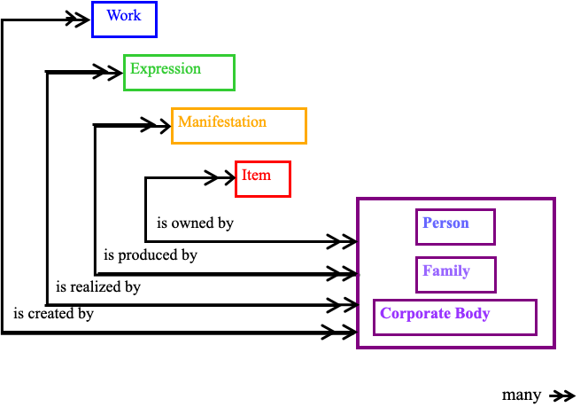{fig-align="center"}

::: notes
The relationships for the Group 2 entities reflect the roles played by
these persons/families/corporate bodies with respect to the
bibliographic resources – for example:

-   a work is created by a person, family, or corporate body – so we get
    the names of creators of works

-   an expression is realized by a person, family, or corporate body –
    so we have the names of translators or of the people or
    organizations responsible for producing a movie or an orchestra or
    other performer - as they express a work

-   a manifestation is produced by a person, family, or corporate body –
    for example the names of publishers

-   an item is owned by a person, family, or corporate body – like the
    Library of Congress being the owner of all the items in our
    collections
:::

## FRBR Entities

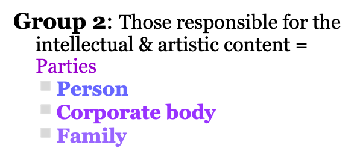{fig-align="center" width="302"}

::: notes
FRBR’s Group 2 entities are the people or sometimes called the “parties”
that are responsible for the intellectual or artistic content, or the
physical production, manufacture, and dissemination of manifestations,
or the custodianship of bibliographic resources.

These are person and corporate body. IFLA added “Family” from the new
conceptual model called FRAD – Functional Requirements for Authority
Data. This was added in particular for the needs of the archival
community.
:::

## Relationships vs. Element

{fig-align="center" width="476"}

::: notes
In FRBR we saw major advantages in declaring persons, families, and
corporate bodies as separate entities that would be related to other
entities.

We have traditionally thought of controlling the names for persons and
corporate bodies through authority records. By declaring persons,
families, and corporate bodies as entities we have much more flexibility
in the controlled naming and we can eliminate redundancies that would
occur if we made them elements to just describe an entity.

In an application of FRBR using the MARC format, as most of our library
systems do today, we could make a single authority record for a person
or corporate body and link it to other authority records or to
bibliographic records or holdings records as needed, depending on the
relationship we wished to identify.

Within the authority record or package of information about a person, we
would include all the variant forms of name used by that person and all
the various ways the names can be presented – different forms of the
name, different spellings in different languages in different scripts –
bringing all the variant forms together as the characteristics of that
entity to help identify it.
:::

## FRBR Entities

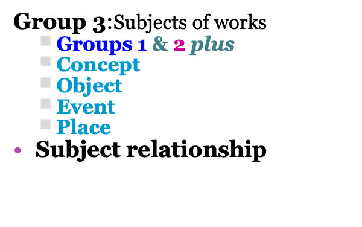{fig-align="center" width="40%"}

::: notes
Okay, now let’s talk about Group 3.

Group 3 includes any of the Group 1 or Group 2 entities, plus concept,
object, event, and place.

Concepts include the topics, or subject headings, or classification
numbers that we use to describe what works are about.

Objects are material things, like buildings, ships, pieces of sculpture,
or found objects.

Events are things that happen, like the Battle of Hastings, or a
conference, or an exhibition.

A place is a location, like Houston, Texas, Washington, D.C., or Mount
Rushmore, or the Pacific Ocean, or the moon.
:::

## FRAD

-   Functional Requirements for `Authority Data`
-   IFLA Division of Bibliographic Control working group 1999-2009
-   December 2008 final text
-   Approved March 2009

::: notes
Okay, let’s step back here for just a minute because we’ve been talking
about these different groups of entities, but we’ve also mentioned FRAD
and we’ve also started talking a little bit about FRSAD, so I want to
interject those here.

FRAD is another IFLA study that was looking at the Functional
Requirements for Authority Data. So, instead of looking at the
requirements that users need in records, in bibliographic records, FRAD
was examining the functional requirements that should be included in our
authority records or any type of authority data system.

It was, again, an IFLA group called the Division of Bibliographic
Control. They worked between 1999 and 2009. So, their report is
definitely more current than the FRBR report. In December 2008, they
came out with a final text that was approved in March 2009. And you can
see that they worked with the elements that we see in the Group 2
entities and those different relationships.
:::

## FRAD {.smaller}

-   Functional Requirements for Authority Data
-   User tasks:
    -   `Find`: Find an entity or set of entities corresponding to
        stated criteria
    -   `Identify`: Identify an entity
    -   `Clarify (Justify)`: Document the authority record creator’s
        reason for choosing the name or form of name on which an access
        point is based.
    -   `Contextualize (Understand)`: Place a person, corporate body,
        work, etc. in context
        -   `Example`: WorldCat Identities:
            http://worldcat.org/identities/

::: notes
The Functional Requirements for Authority Data also have identified user
tasks. And a few of these overlap with what we see in FRBR. These user
tasks are find, such as find an entity or a set of entities
corresponding to a stated criteria from the user; identify, being able
to identify a specific entity that it meets the criteria that you
specifically need for an item.

We have also added as part of the Functional Requirements for Authority
Data clarify and contextualize. Clarify means to justify, or to document
the authority record creator’s reason for choosing the name or the form
of the name on which an access point is based.

Now, what this means is that within the authority record, the person who
creates that record is supposed to explain why they chose that form of
name or chose that individual name as being the form we use as an access
point. The fourth user task is to contextualize, or to understand.

So, within our authority data, we need to be able to place a person,
corporate body, work, etc. in context with the other works, with other
individuals. And I’ve given you an example here that you can go take a
look at later. But there’s a system called WorldCat Identities that will
allow you to look at some FRAD authority records so you can see some of
the different relationships and attributes represented in these records.
:::

## FRAD Attributes

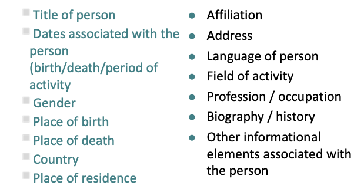{fig-align="center" width="70%"}

::: notes
FRAD also identifies some attributes, and those that are in green are
what we would call the ‘required’ or ‘core’ attributes. These are
attributes of a person or a corporate body. So, for example, our
authority data should include the title of the person, dates associated
with the person (meaning death date and the period of activity if
known), their gender, place of birth, place of death, country, place of
residence. Those are those core or required attributes.

Then we might also add to this affiliation, address, language of person,
field of activity, profession and occupation, biography, history, other
informational elements that are associated with that person.

Now, again, we’ll look at this later in topic 6, but I want you to think
about what you see in green here. Those are elements that we already
include in our authority data, but the ones in black are definitely new
attributes that are not in authority records. Think about how useful
that type of information might be in establishing some of these
relationships and providing more connections within records for our
users.
:::

## FRAD Attributes

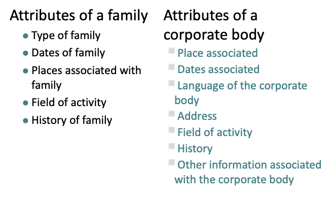{fig-align="center" width="70%"}

::: notes
Under the attributes of family, we have all new elements because
remember this is something that is new that was added. So, we have type
of family, dates of family, places associated with the family–such as
where they lived, where this individual wrote, etc.–field of activity,
and even history of the family.

Again, I have to emphasize these are brand new attributes that have
never been part of authority data. And then we have attributes of a
corporate body. And these in green, of course, are the required
attributes: *place associated, dates associated, language of the
corporate body, address, field of activity, history, and other
information associated with a corporate body*.

Again, some of these attributes are already in authority data for
corporate bodies, but not all of them.
:::

## Group 3 Entities (FRSAD)

{fig-align="center" width="80%"}

::: notes
Okay, now let’s look at those Group 3 entities. And these are what are
coming from FRSAD. And FRSAD was published in 2011. These are the
Functional Requirements for Subject Authority Data. So, FRSAD is part of
FRAD, and it was within the same working group, but also different
individuals. Glen Patton, which you have as one of the authors of your
readings, gives you a more detailed history of both FRAD and FRSAD.

But FRSAD are those entities related specifically to subjects. Remember
that subjects can be also Group 1 or Group 2 entities, intellectual
endeavor, and the elements that are included here are concepts, objects,
events, and places. These are all in blue because they are new to the
idea of authority work. Before we would have concepts represented in
subject records, but not necessarily objects as subjects or events or
places; however, these are what we see in our Group 3 entities as part
of our FRSAD model. Also keep in mind that persons can be subjects.

These are part of that Group 1 and Group 2 entities; they can also be
the subject of works, and here are some examples. So, a biography about
an individual, such as a criticism of the music of a particular
composer–like Bach,–those are some examples of when an individual is the
subject of a work. You can probably come up with some other ideas.

Concepts, objects, events, and places also have their own attributes and
identifying characteristics as identified in FRSAD and will in the
future be shown in RDA, at least that’s the hope. The target date was
2012, but FRSAD is just still in working group, and they’ve issued a
report, which you have a link to on your readings page.

But these have not been written into RDA as it’s currently published.
So, again, some of those identifying characteristics of events include
things like location, date, and perhaps relationships to organizing
bodies for that event. They also identify characteristics of places,
which might include GPS coordinates, variant names of the place, etc.
These attributes and relationships are all new ways of thinking about
and representing subjects within our bibliographic records, but they’re
also data that will be captured in our subject authority records.
:::

## Subject Relationship

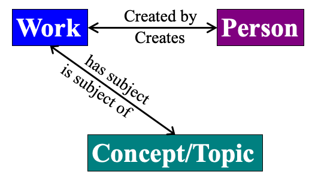{fig-align="center" width="76%"}

::: notes
Let’s take a look at the subject relationships within those Group 3
entities.

So, for example, we’re used to the idea that a work is created by a
person and that a person creates a work, but we also have to think about
the fact that a work has a subject, which would be its concept or its
topic, and now we can think about location and event as well.

And that concept, topic, location, event can be the subject of a work.
:::

## Group 3

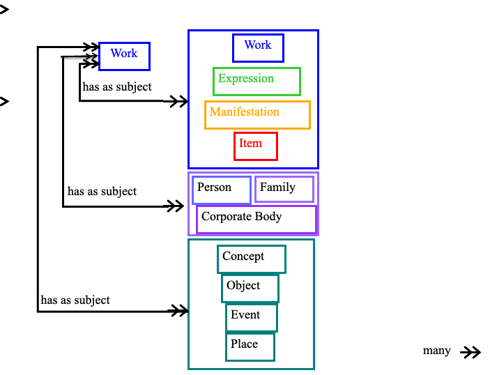{fig-align="center" width="73%"}

::: notes
A work can be about many things, so this subject relationship, as shown
on this slide, relates a work to all of the other entities –because a
work can be about another bibliographic resource, like a documentary
movie about the Gutenberg Bible or a work can be about a person – like a
biography – or about a corporate body – like the history of an
organization. But a work can also be about a concept, or about some
object, or event, about a place. We may also at some point add the
entity for time to this model (which is under consideration by the FRSAR
Wkg. Grp).

So those are the entities and relationships in the FRBR
entity-relationship model, and some of the elements or attributes that
characterize each of those entities. We’ve covered what FRBR is in terms
of its conceptual model, let’s now move on to why we need it. I’ve
already mentioned some reasons: like it reminds us of the importance of
being able to group related things together and it gives us a clear way
of identifying those things and describing them with specific elements
that can then be re-used or packaged to best suit the needs for
displaying information to users.

This is end of Part 1 slides. Proceed to Part 2.
:::
