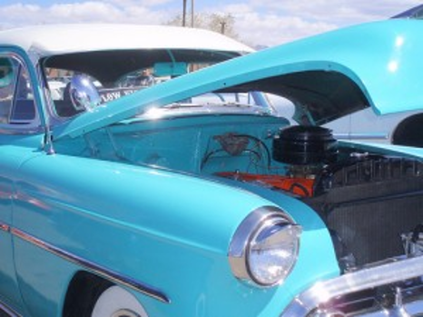
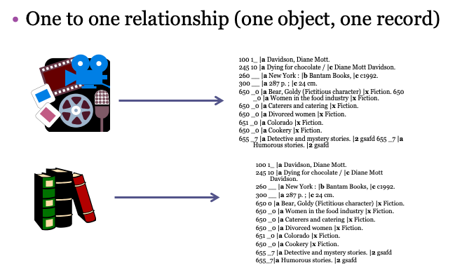
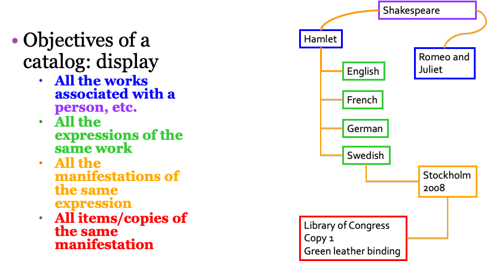
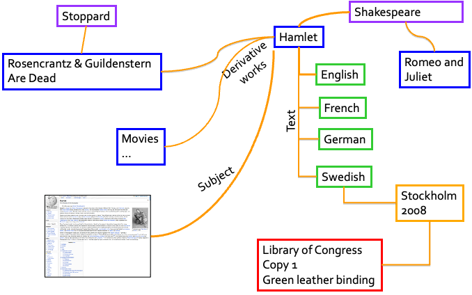
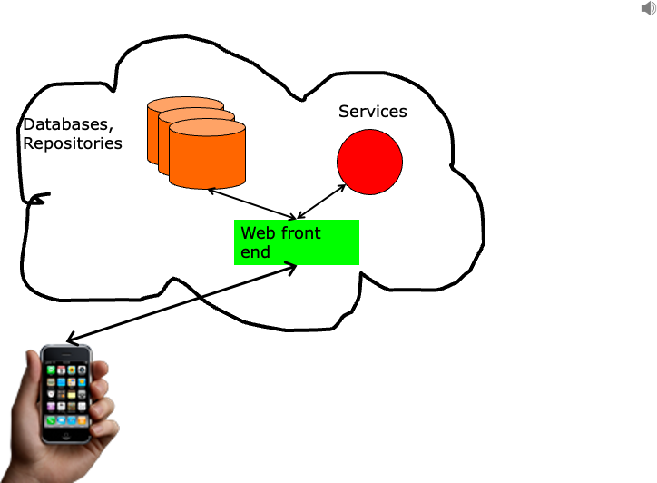

# Introduction

::: notes
In Part 1 of this lecture we covered what FRBR is in terms of its
conceptual model. Now, let’s move on to why we need it, why it’s
necessary. I’ve already mentioned some reasons, like it reminds us of
the importance of being able to group related things together, or that
collocation function we see in catalogs, and it gives us a clear way of
identifying those things and describing them with specific elements that
can then be reused or repackaged to best suit the needs for displaying
information back to our users.
:::

## FRBR vs. RDA vs. MARC

-   FRBR is a conceptual model
-   RDA is a cataloging standard that is based on the FRBR conceptual
    model
-   MARC is an encoding scheme by which computers exchange, use, and
    interpret bibliographic information

::: notes
I also want us to take a little step back here for a minute and just
clarify some of these concepts for you before we move forward.

FRBR, as we’ve been discussing here, is a conceptual model, which has
three groups of entities and the relationships within each of those
groups.

RDA is a cataloging standard that is based on the FRBR conceptual model,
but it also has elements of our legacy system, AACR2.

MARC, or MARC records structure, is an encoding scheme by which
computers exchange, use, and interpret bibliographic information. MARC
is the structure in which we create bibliographic records that we create
authority data records.
:::

## Why Do Libraries Need FRBR {.smaller}

-   To avoid becoming marginalized by other information delivery
    services
-   To cut costs for the description and access to resources in our
    libraries
-   To encourage redesign of our systems to move us into linked data
    information discovery and navigation systems in the Internet
    environment
-   To make our bibliographic descriptions and access data more
    internationally acceptable

::: footer
[Tillett, Barbara. Keeping libraries relevant in the semantic Web with
RDA: Resource Description and Access. Serials, Nov. 2011,
24(3)](https://serials.uksg.org/articles/10.1629/24266)
:::

::: notes
Let’s talk about why libraries need FRBR. Part of this discussion is
from Barbara Tillet’s “Keeping libraries relevant in the semantic Web
with RDA.” It was in Serials November 2011 issue if you want to read
further about some of the reasons why libraries need FRBR, and I’ve
added some additional information here as well.

Libraries need to implement FRBR within our systems to avoid becoming
marginalized by other information delivery services, like the web, like
linked data environments.

We can repackage our shared metadata into more interesting visual
information, and by using FRBR we, as you can see, are adding additional
elements to our catalogs that we do not presently include, such as
timelines for publication histories, or a map showing places of
publication. We can build links between works and expressions and we can
create some of those entity relationships that are not present in our
library catalogs.

We can also make our data more accessible on the web through linked data
systems, through allowing other systems to harvest our metadata. What’s
a roadblock right now is that systems that want to harvest our metadata
cannot decipher, the system itself cannot decipher some of the metadata
in our records because of the structure but also some of our encoding
rules.

FRBR can also potentially help cut costs for the subscription and access
to resources in our libraries. We can take advantage of metadata, as I
said, from publishers and other sources. We can share metadata as well
as harvest other metadata. We’ve shared metadata in the past, but we’ve
done so in somewhat limited capacity because we’re only sharing from
library to libraries around the world. Not to undercut the importance of
that, but using a FRBRized type of system allows us to share metadata
beyond the library borders.

It also will reduce costs. It will stop the redundant creation of
bibliographic and authority data. So, that again, is going to cut costs
for our libraries.

We also want to encourage redesign of our systems to move us into linked
data information discovery and navigation systems in the internet
environment. It will be more useful to our users and more effective
retrieval.

So, it would make our bibliographic descriptions and access data more
internationally acceptable and usable to individuals and to libraries in
general.
:::

## Why do we need FRBR?

-   Improve the user experience in locating information
    -   Guide systems designs for the future
    -   Guide rule makers
-   Cut costs for the description and access to resources in our
    libraries
-   Position information providers to better operate in the Internet
    environment and beyond

::: notes
Again, why do we need FRBR? We need FRBR to improve the user experience
in locating information. It will help us guide systems’ designs for the
future. Our integrated library systems can implement the FRBR conceptual
models in very unique, hyperlinked, multi-relational ways rather than in
a flat file system that we’ve had previously. And that can bring
together all of the works of a particular author, all of the derivations
or different manifestations of that work whenever we do a search. And
we’ll look at some examples of that in a few minutes.

It can also guide our rule makers, those that are creating our standards
and that will continue to create our standards in the future.

As I said, it will also cut costs to the description and access to
resources in our libraries.

Cataloging rules that are based on FRBR also will identify the works and
expressions in our resources and help us gather those together in our
search systems.

When FRBR is applied to future library systems, to future cataloging
systems, it will make it easier to link expressions or related works and
to link new manifestations to existing works and expressions that we
have in our collections and to save time and effort, for example, by
reusing the subject analysis that we’ve done once for a work as we get
new manifestations. We can simply link to that work in our collections.

FRBR also positions us to operate better in the internet environment by
clearly identifying the elements and relationships necessary for
navigating our bibliographic universe and making those elements
available on the web for more versatile displays that fit our users’
needs. So, we’ll be able to be more competitive within the internet
environment. We’ll be able to use linked data systems. These, again, are
some of the ideas of why we need to think about implementing FRBR and
its conceptual models.
:::

## A look under the hood

{fig-align="center" width="50%"}

::: footer
Image courtesy of
<http://heidicohen.com/most-useful-blog-plug-ins-for-non-geeks/>
:::

::: notes
Now that we understand a bit more about the conceptual models let’s
‘take a look under the hood’ at what it might look like if we implement
FRBR within our library systems. And as I mentioned, there are very few
systems out there now that are currently implementing FRBR, but there
are a couple and I do want to bring them to your attention. We’ll look
at a few screen shots of some, but I also want you to take a look at
them yourselves. And there’s some links at the end of this slideshow to
some of those working systems, and I’m sure there are some other
experimental systems you might find as well.
:::

## Bib records before RDA/FRBR

{fig-align="center" width="70%"}

::: notes
Okay, bibliographic records before FRBR and RDA were basically a one to
one relationship. We have one object that is represented in our systems
with one catalog record. So, regardless of whether it’s a movie or it’s
a book, we have one record that’s going to represent that object.
:::

## Collocation

{fig-align="center" width="70%"}

::: notes
We hope future systems will be developed to take full advantage of
mining the metadata that catalogers provide and have been providing for
many years. When we’re cataloging with FRBR- based rules, it should be
easier to fulfill the objects of the catalog to display all of the works
associated with the person, all of the expressions of the same work, all
the manifestations of the same expression, and all of the items and
their special characteristics.
:::

## Pathways to Related Works

{fig-align="center" width="70%"}

::: notes
Plus, all related works to movies or plays based on Hamlet. All of this
to guide a user through our rich collections and beyond.

We can also make collections to related information on the internet,
like the Wikipedia article about Hamlet or any other related resource
out on the web. This was not possible with book or card catalogs.

There is an amazing network of related information, and in the past
we’ve only been able to deliver it to our users in a very small view.
But once we’re able to share this linked data on the internet, we can
offer resource discovery systems that will show pathways to all sorts of
related resources, and this is really exciting when you take a look at
this pathways diagram.

This diagram is from Barbara Tillet, and I appreciate the way that she
characterizes, not just those items in the WEMI model, but some of the
ways in which they can be connected, or collocated together.
:::

## Internet "Cloud"

{width="70%"}

::: notes
The information systems and content in the future hopefully will be
freely accessible on the web. We can imagine it as something like the
internet cloud computing that we have today with Amazon, Google, and
other systems, where the elements that describe our resources are
available to libraries and users everywhere in the world throughout the
web front end that connects the users to services and data.

The data may come from multiple different sources, such as publishers,
from the creators of the resources themselves, from libraries and other
institutions around the world or anywhere. And it’s accessible by any
user anywhere in the world at any time, of course, provided they have
some type of access to the web.

Bibliographic data and digital resources are on the web now, and we’ve
started adding the controlled vocabularies to help identify these
resources. And we’ve even added web resources to our existing library
catalogs and created links to them.

And then we have such controlled values for naming the types of content,
types of carriers, and other elements that are already being registered
on the web and can be used to present displays and show pathways to
these related resources.

FRBR prepares us to identify all of those elements that are present in
different environments online, the identifying characteristics of all
the things we have in our collections in a way that machines and the
internet can manipulate and understand our data for more useful displays
for our users.
:::

## FRBRized systems

- [**WorldCat.org Online Computer Library Center (OCLC)**](www.worldcat.org/): The WorldCat database is the largest and most comprehensive union catalog, utilizing a `FRBRlike approach via the OCLC Work-Set Algorithm`.

- [**Libraries Australia**](http://librariesaustralia.nla.gov.au/apps/kss) with its FRBR
prototype demonstration system available at <http://ll01.nla.gov.au/>

- [**Nevada Digital Newspaper Project**](https://nvdnp.wordpress.com/the-project/)

:::notes
This slide shows links to some of these FRBRized systems. 
:::

