# Introduction

::: notes
In PART 3, we will discuss the concepts and process of
Bibliographic Control, MARC records and how they are structured, and
also Authority Control.

Bibliographic Control and Authority Control are both central to how we
organize information in libraries. This module is going to focus more
specifically on libraries than the last two lectures but many of the
standards and protocols we will be discussing are also included in other
systems for organizing information and knowledge resources.
:::

## Overview

-   Introduction to bibliographic control
-   Brief introduction to AACR2 cataloging
-   Overview of differences between AACR2 and RDA
    -   structures of both standards
    -   additions to AACR2 in RDA
    -   new to RDA
-   MARC and RDA
-   Access points/authority control

::: notes
So, we’re going to cover, as I said, a brief introduction to AACR2 and
AACR2 cataloging. We’re going to review the differences between AACR2
and RDA. We’ll do this in several ways. We’re going to look first at the
structure of both standards. And then we’ll look at some additions to
AACR2 that are present in the RDA standard and some that are entirely
new to RDA and then also how some of the guidelines for AACR2 have
changed, some of the local practices. Then we’ll talk just briefly about
MARC and RDA and access points and authority control.
:::

## Bibliographic Universe

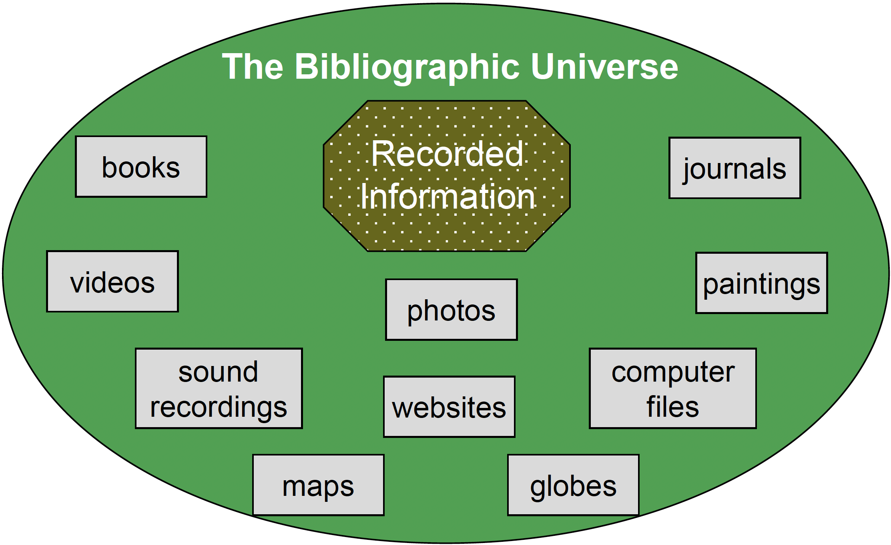

::: notes
Just to refresh our memories, when we talk about creating
representations or organizing information and knowledge resources we can
only represent those that are recorded in some manner. This graphic
illustrates some broad categories for information objects that we
organize.

This week, we are talking about this abstract idea of the universe of
knowledge, which is an abstract way of thinking about all of the
knowledge, information, etc. that is generated by the human presence
throughout the years. Within that universe of knowledge we can describe
and we can create records for items that have been recorded in some
manner, and we call those recorded items the bibliographic universe.

And this slide just illustrates that even though we have this larger
idea of the universe of knowledge, the item has to be recorded first
before you can actually create a representation or surrogate for it.
Also, this slide shows that there are many kinds of physical and virtual
manifestations of items within the bibliographic universe, which have in
some manner have recorded the creators’ representation of their ideas.
:::

## Bibliographic Control

We attempt to exert this control over the bibliographic universe

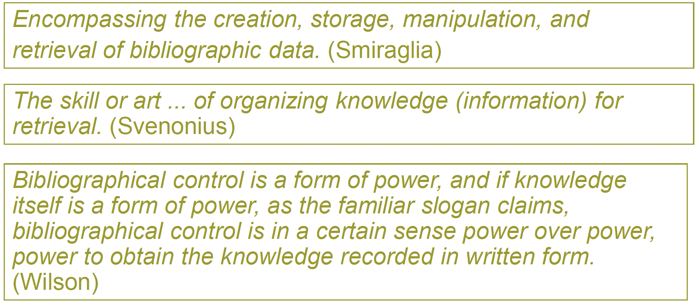{fig-align="center"}

::: notes
Bibliographic control is the process that the cataloger or other
information organizers conduct to create representations of the objects
in one’s collection. This slide presents some other views on what
Bibliographic control is. How are they different? How are they the same?

Smiraglia discusses or defines bibliographic control as “encompassing
the creation, storage, manipulation, and retrieval of bibliographic
data.” So, he not only sees it from the perspective of a cataloger or a
knowledge creator, but he also sees it from an information retrieval
perspective, meaning that we create the representations of the different
items so that they can then be retrieved. And so, we manipulate them in
different ways.

Svenonius sees bibliographic control as a “skill or art … of organizing
knowledge (or information) for retrieval.” So, again, we’re seeing not
just the idea of creating a representation, it stands in place of
something something–the bibliographic items, those recorded pieces of
information. But also we have to think about the ultimate outcome, the
retrieval of those items. So, we have to create representations that are
useful to our users.

Patrick Wilson, who was a philosopher in our field and who I highly
recommend his writings, sees bibliographic control as a form of power.
And if knowledge itself is a form of power, as the familiar slogan
claims, bibliographic control is, in a certain sense, power over power.
And it’s the power to obtain the knowledge recorded in the written form.

Wilson also saw catalogers or those that organize information as
possessing an unique power as well in that they have to make some
decisions about the systems that we design in order to represent those
different items in the bibliographic universe. We had to think about our
users and how they might retrieve the information in order to design
systems that were actually useful to our users.

Wilson’s definition illustrates the power that representations/bib
control embed into bibliographic records. But he also states that we
organize things in an arbitrary manner we decided long ago (we have
really only codified bibliographic control over the last century) what
aspects to represent in bibliographic records. Who is to say that those
choices were the best choices to make? Later we will talk a bit about
FRBR studies of users and what they uncovered.
:::

## Two Primary Challenges

-   How to individually represent information objects **as concrete
    entities** so they can be found when needed?
    -   container-oriented
    -   uniqueness-oriented
-   How to represent and relate information objects **as sources of
    information on various subjects** so they can be found by those in
    search of the information?
    -   content-oriented
    -   relationship-oriented

::: notes
Distilling this all down, there are really two primary challenges when
we represent objects for bibliographic access. They are noted on the
slide and we discussed them in Week 2 also.

One is how to individually represent those information objects as the
concrete entities that they are so they can be found when needed. And
when we’re talking about it from this perspective, we’re talking about
those container oriented aspects or attributes, such as the name of the
work, the author or the creator, things that are describing the size or
the color or the shape things like that. They’re not related to content.
We’re also at this point concerned with creating records that uniquely
represent each item in our collection. So, we’re uniqueness oriented as
well.

The other challenge, then, is how to represent and relate information
objects as sources of information on various subjects. So, in this case,
we’re concerned with the content contained in the objects themselves.
And so, we’re representing subject and geographic location if it’s used
as a subject or chronological representation if we’re thinking about it
in terms of a particular time period. Purpose, function those are other
ways we can think about content oriented representation. And then also
it comes into the play the different relationships that are related to
this particular item, not from the container oriented aspect, but how
those content oriented aspects are related to other content oriented
aspects in other works within the collection.

So, again, we’re looking at this as a dichotomy. We’re looking at the
idea of how to represent that item from a container perspective and how
to represent the content oriented aspects of the item as well.
:::

## Relations in the Bibliographic Universe

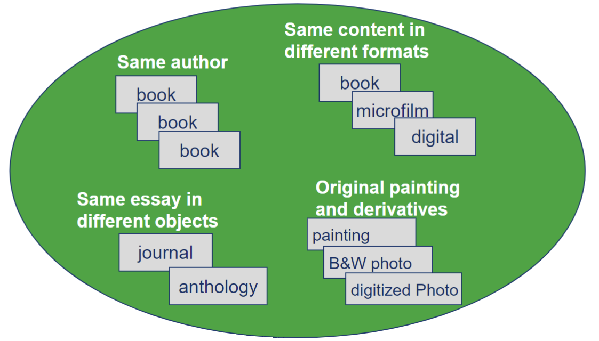

::: notes
We also have to represent relationships that exist within the
bibliographic universe. This slide presents a few.

There are relations related to the same author. Several books are
created by the same author, or several works are created by the same
author. Or same content in different containers. We might have a book
but it’s manifested also in microfilm also in digital. Or we might have
the same content itself, the same essay in different objects, such as
journals and anthologies. Or we may have original and derivative
relationship, where we have an original painting then we have a black
and white painting and then we have a digitized photo of that painting
itself. They’re all the same item within the bibliographic universe but
being represented in different ways. So, again, we have to build these
relationships into our bibliographic records, into those representations
so that our users can find exactly the item or items they’re looking
for.

Can you think of others present in library catalogs? In other
information systems you have used? Are there relationships that YOU
think should be present that are NOT present in bibliographic records?
:::

## Idenitfying Relationships {.smaller}

-   Separate containers, same content
    -   different formats
-   Separate containers, similar content
    -   translation, abridged, versions, editions
-   Separate containers, same author, different content
    -   link together all objects by author
-   Separate containers, different authors, similar content
    -   link together all objects by subject
-   Unique representations of container
-   Relationships established through various means
    -   name authority control
    -   controlled vocabulary

::: notes
This slide just talks a little bit more about identifying those
different relationships.

If we’re looking at separate containers but they have the same content,
then we’re dealing with the idea of formats. And how do we represent
different types of formats within the same collection so that a user can
evaluate our representation and determine if it’s what they want.

We also, as I said, can have separate containers but similar content,
and this would be applicable when we’re talking about translations of a
work or abridged versions or different editions. That again, we’re
talking about similar content, but they’re slightly different in each
iteration.

Or separate containers with the same author but different content. We
can link all of the objects in our catalog that are written by a
particular author or created by a particular creator within our catalog
even though they’re in different containers and have different content.
So, if we have several different books written by the same author, we
would have separate containers, same author, but different content, and
we want to be able to link those representations by that author
attribute so that when a user does an author search, they can find those
representations. One way in which we do this is through the use of
authority control.

We might have a relationship within separate containers but different
authors but similar content, and we link together then all the items
that are related to the same or similar subject. Again, we use
mechanism, such as controlled vocabularies, which are considered subject
authority control in order to create this relationship within our
records and our catalogs.

And then we also have unique representations of different containers.
Again, we want to represent each item within our collection as its own
unique entity and to have its own unique record even though we also
establish those different relationships so that users can find all of
the same objects by the same author or related to a particular subject
area when they do searches in our catalogs.

And, as I said, some of these relationships are established through what
we call ‘authority control.’
:::

## Bibliographic Records

-   Aggregate of data that are associated with entities described in
    library catalogs and national bibliographies

-   A record which accurately describes an item (book, map, computer
    file, etc.) both physically and intellectually in such a manner as
    to distinguish it from all other items in the bibliographic file

-   What should be included in bibliographic records?

-   Why is certain information contained in bibliographic records?

    -   remember the objectives of the catalog
    -   bibliographic records must support the objectives

::: notes
Now let’s talk about bibliographic records. You know them as library
catalog records, but really this concept can be extended to any record
that is representing an information or knowledge resource. They are
basically as the slide notes, “an aggregate of data that are associated
with entities”.

A bibliographic record can be defined as an “aggregate of data that are
associated with entities describes in library catalogs and national
bibliographies.” In other words, a bibliographic record is a catalog
record within your OPAC system. What you’re doing is you’re aggregating
that container oriented and content oriented data about the objects in
your collection, and that record itself is what stands in place of the
item.

The record should also accurately describe an item, both physically an
intellectually in such a manner as to distinguish it from all other
items in the bibliographic files. So, again, we’re looking at the
uniqueness oriented aspects, where each item in our collection is
represented by one bibliographic record within our file.

A lot of your readings as well as a lot of the more current discussions
and some of the more current issues are rethinking what should be
included in bibliographic records. And throughout class you’re going to
see we’ve had kind of the same model throughout the years. We’ve
expanded, obviously, from a paper catalog or paper based records when we
moved into card catalogs. We then set some very specific standards for
what should be included in bibliographic records and even within our
different bibliographic utilities like OCLC and even within Library of
Congress standards and cooperative arrangements, we have sets of
elements that we consider ‘core’ in bibliographic records, or that need
to be included in a bibliographic record for it to be an actual
representation.

But what we’re doing now is starting to think forward and to think
whether or not what we’ve been doing all these years is actually working
for our users and if we need to change the items that are included in
our bibliographic records.

When you think about why certain information is contained in
bibliographic records, we need to think back about those objects of the
catalog to find and identify, to collocate or bring like items together,
to be able to evaluate items. The bibliographic record at the core
really must support those basic objectives, and now that we’re in an
electronic environment (and actually beginning in the card catalog
environment), we began to give the additional function of location to
those records. But if our records contain no other information, we have
to have enough information to allow our users to allow the records to
fulfill those objectives of the catalog. And again, now we’re starting
with the FRBR studies in 1994 and forward. We’re starting to rethink
about what should be included in bibliographic records.

In Week 2, you looked at library and non library contexts for
organizing objects. Assignment 2 required you to go out and examine a
specific commercial context and think about how it was organized. Then
you had to describe it/discuss it within your group.

-   What did you learn from that exercise that could be extended to this
    concept?
-   Did you see elements of organization that could be included in
    bibliographic records that are not?

Think also about the Weinberger readings: WHY do we include certain
elements/attributes within records?

In libraries, mainly because it was established in the early 1900’s that
records should support Cutter’s objectives of the library catalog. We
will discuss these in a few minutes. Other cataloging visionaries made
choices about what to include and we have not really altered these
choices much, until the past 5-7 years. Your readings will talk more
about this issue.
:::

## Creating Bibliographic Records {.smaller}

`Descriptive Cataloging`

-   oriented towards intrinsically derived attributes of information
    objects (e.g., titles from books, copyright date, etc.)
-   primarily concerned with describing/representing the information
    object as an physical entity. Also referred as “bibliographic
    cataloging”

`Subject Analysis/Cataloging`

-   combination of intrinsically derived attributes (e.g., what is this
    information object about) and extrinsically defined attributes
    (e.g., controlled vocabulary that represents the concepts treated by
    an information object)
-   uses words and phrases to represent the intellectual content of the
    object

`Classification`

-   based on subject analysis, but can use other attributes besides
    topic to group together items that are related to one another
-   bibliographic classification in the library community provides a
    unique physical location/address to the object

::: notes
We’re going to focus, as I said, primarily at this point of learning
more about how we create these bibliographic records. We’ll talk about
these different processes that you see on the slide, but then we’ll talk
about different tools and standards that are in place to help us create
this piece of the bibliographic record. When we create bibliographic
records in libraries, there are three distinct processes:

1.  Descriptive cataloging geared more specifically in representing the
    container of objects
2.  Subject cataloging to represent subject, topic, etc. of the object
3.  Classification related to subject in most systems. In libraries it
    provides for physical location of the object also. On the web, it is
    a way of collocating a product based on specific attributes or what
    are called "facets".

When you create a bibliographic record, there’s actually three processes
that you’ll go through, each with its own standards and tools. One is
descriptive cataloging, which is the piece we’re going to focus on in
this topic. But then we’ll talk about subject analysis and cataloging
and classification in later lectures.

Descriptive cataloging is that which is oriented more towards the
container aspects, or those that are considered intrinsically derived
attributes of information objects titles from books, copyright date,
publisher information, author or creator information. And descriptive
cataloging is primarily concerned with describing and representing the
information object as a **physical entity**. And we’re talking about,
again, those container aspects. You’ll also hear descriptive cataloging
referred to as ‘bibliographic cataloging.’ You’ll see that in the
reading. You’ll see that in different presentations.

The second piece, of course, of creating a bibliographic record is
subject analysis and subject cataloging. This is a combination of
intrinsic derived attributes, or what is the information object about?
And we actually will refer to this as the word ‘ aboutness ’ in the
literature as well as you’ll hear that a lot in common parlance. And
also in extrinsically defined attributes, those are the attributes, that
we have created words if you will, that represent the different concepts
that are present within the information object. And one such tool would
be a controlled vocabulary, or a subject heading list is an example,
such as LCSH. And we would use these different tools to then represent
the concepts or the subjects that are present within the information
object itself.

The third piece of this, which is related also to subject analysis, is
what’s called ‘classification.’ Classification is based on the subject
analysis that the cataloger conducts with each item as they create a
bibliographic record, but it can also use other attributes besides topic
to group items together that are related to one another. Bibliographic
classification in the library community provides that unique physical
location, or what you might consider an address, for the object. It’s
where we create the classification number or the call number on the side
of a book or within our catalog so that the user can actually locate the
item physically within our collection.

You put these three processes together using the different tools that
are unique to each and the standards that are relevant to each to create
one bibliographic record.
:::

## Recall What Lubetzky Emphasized...

`The functions of descriptive cataloging are`

-   To describe the significant features of the book which will
    serve (a) to distinguish it from other books and other editions of
    this book, and (b) characterize its contents, scope, and
    bibliographical relations

-   To present the data in an entry which will (a) fit well with the
    entries of other books and other editions of this book in the
    catalog, and (b) respond best to the interests of the majority of
    users

::: notes
Also, to consider as we learn about bibliographic control and creating
of bibliographic records is what Seymour Lubetzkey emphasized as
functions of descriptive cataloging, which are to describe the
significant features of the book, and, of course, he’s thinking of book
because that’s primarily what they were cataloging at the time, but that
can include any kind of information object. But to describe the
significant features of the book, which will serve to (a) distinguish it
from other books and other editions of this book so again, to make it
unique from other items in your collection. And (b) to characterize its
contents, scope and bibliographic relations so, to start to create those
relations that we mentioned a few slides ago but also to look at the
scope or the contents of the work itself.

He also believed one of the functions of descriptive cataloging was to
present the data in an entry that will (1) fit well with the other
entries of other books and other editions of this book in the catalog,
which basically means that you would need to create representations that
are similar to or with following the same standards or local practices
of the items that are already in your catalog, and you’ll see more of
this when we start looking at MARC records where we have structures in
place to tell us what kinds of information to include in each of our
records. And Lubetzky was very concerned with this standardization. And
then (2) to respond best to the interests of the majority of users.

So, Lubetzky was more of a user-centered person where he wanted
representations to be useful for the majority of our users so that those
standards come into play. By having standard entries within our
catalogs, our catalogs work more effectively.
:::

## Functions of the Library Catalog

-   Represents holdings of particular collection
-   Early objectives of the catalog defined by Charles Cutter
    -   identification/finding
    -   collocation/gathering
    -   evaluation/selecting
-   Functions of bibliographic instruments (FRBR)
-   Catalog adds one additional function:
    -   location or acquisition

::: notes
Let’s go back briefly and review the functions of the library catalog.
One is to represent holdings of a particular collection. Library
catalogs at a local level are representative of the collection that the
library houses itself. And again, now that we’re thinking more in a
digital environment and we’re making our OPACs web accessible, we’re
still within our own catalog representing items that are the holdings of
our particular collection and primarily for the use of our local users.
So, a lot of cataloging agencies, as a result of this idea, have their
own local practices, or they have their own, for example, set of subject
headings they might use to represent different subjects so that they can
provide that second objective defined by Cutter, the collocation or
gathering function.

So, again, you have to think about that as we have standards within the
library community that are used across different collections so that we
can then share more effectively the records that we do create
representing our own local collections. But then we might also in house
have what we might call local practice, where we have our own locally
applied standards different from other collections and other records.
And we’ll talk more about that when get more into the specifics of the
different processes. But again, I want you to remember that we’re
representing for particular collections and a particular set of users.

Cutter developed the objectives of the library catalog in the early
1900’s and they still hold today. Representations (bib records) should
enable the three functions of 1) identification/finding, 2)
collocation/gathering together based on similarity usually subject, but
can be author, title, series, etc., 3) evaluation/selecting enough
information so user can determine if it is the object they want
operating system if CD, version if editions, etc.

FRBR and RDA are two of the hottest topics in the LIS cataloging
community today. You will read quite a bit about the FRBR user studies,
their resulting models, and how these models are being incorporated into
the new cataloging standard, RDA (Resource Description and Access) as
you engage with the readings and web explorations.

The FRBR studies added one additional function/objective to the catalog,
location or acquisition. This should come as no surprise. Once you find
the object you want in the system, you also need to know WHERE/HOW to
access it.

The RDA represents a very significant departure from the cataloging
standard we have used since the late 1960’s, the AACR2 (Anglo American
Cataloging Rules).
:::

## International Standard Bibliographic Description (ISBD) {.smaller}

`Areas of Bibliographic Description include`

1.  Title and statement of responsibility area
2.  Edition area
3.  Materia(or type of publication) specific details area
4.  Publication, distribution area
5.  Physical description area
6.  Series area
7.  Note area
8.  Standard number and terms of availability area

::: notes
Another standard that we use in cataloging is the ISBD. This standard
spells out specifically which elements should be part of the descriptive
aspects of bib records. The eight areas of ISBD description are listed
on this slide.

What is not included that you think should be? Or do the elements
encompass what you think is necessary for descriptive access (non
subject)? or be expanded upon in the new digital environment.
:::

## Levels of Description

-   First Level

    ```         
        Gypsy ballads/Federico Garcia Lorca -- Warminster: Aris & Phillips. c1990. -- vii, 161p. -- ISBN 0-85668-490-2.
    ```

-   Second Level

    ```         
        Gypsy ballads = Romancero gitano translated and with an introduction and commentary/Federico Garcia Lorca; translated by R. Harvard; illustrated by M. Gollanz. -- Warminster: Aris & Phillips. c1990. -- vii, 161p: ill; 22cm. ----. ISBN 0 85668 490 2.
    ```

-   Third Level

    ```         
          Gypsy ballads = Romancero gitano translated and with an introduction and commentary/Federico Garcia Lorca; translated by R. Harvard; illustrated by M. Gollanz. -- Warminster: Aris & Phillips. c1990. -- vii, 161p: ill; 22cm. ---- (Hispanic classics). -- ISBN 0 85668 490 2.
    ```

::: notes
ISBD also codifies three levels that could be present in a bibliographic
system. Each are shown on this slide. The first and maybe second level
are used in smaller libraries, while the second and third levels are
used in larger libraries.
:::

## Record in Card Form {.smaller}

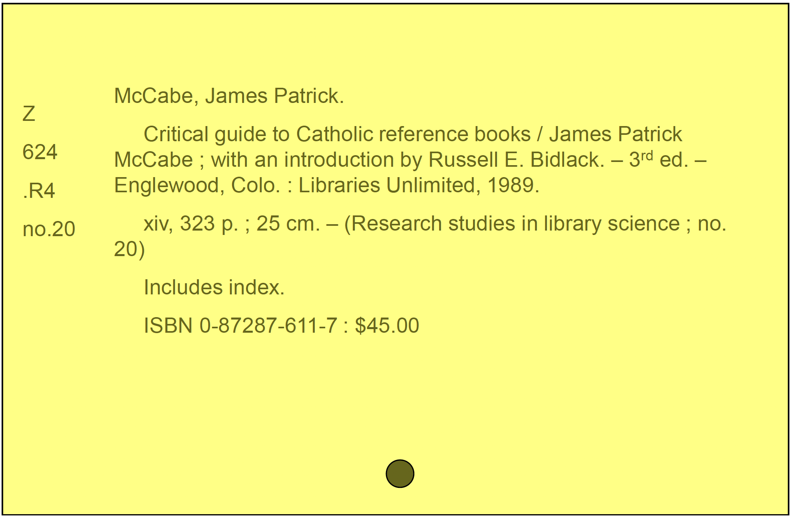{fig-align="center" width="700"}

(Card info from Taylor 2000, 15)

::: notes
Putting them to use results in a catalog card. We will look at MARC
record examples in the next lecture.

See if you can identify the ISBD elements in the bib record. We would
add in subject headings and added entries for additional authors, etc.
The classification number is also present on this example.
:::

## Same Info in MARC Bibl.

The descriptive cataloging information (plus main entry) from the
previous record in MARC:

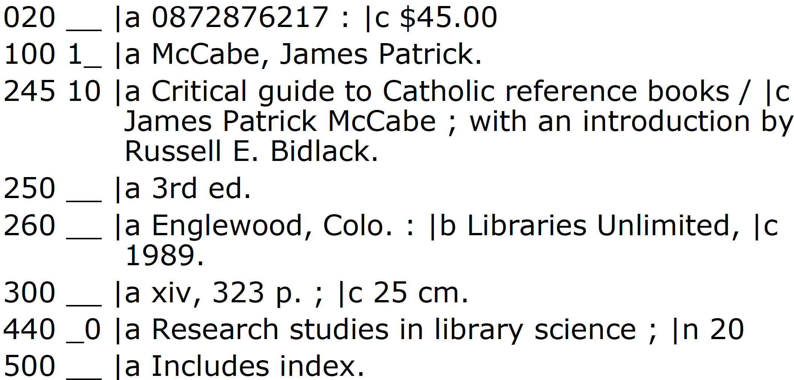{fig-align="center" width="700"}

::: notes
Here is what a MARC (Machine Readable Cataloging) record looks like. We
will learn more about MARC in the next lecture but all of the same
elements we saw on the previous slide with the catalog card are still
present on this example.

So, moving from a card form to a MARC environment, we can see very
little differences. However, when we look at MARC, you’ll notice that
there are many additions that we’ve added as records have changed,
record structures have changed, and as formats of objects have changed
through the years.
:::

## Anglo American Cataloging Rules (AACR2)

-   AACR2 is the standard sets of rules used for descriptive cataloging
    until 2013 and later

    -   AACR2 was replaced by Resource Description and Access or RDA
        which was implemented in March 2013

-   Identify elements that should be included in a descriptive record

-   Provide a sense of the semantics of those elements

::: notes
Okay, let’s shift now away from the idea of bibliographic control and
talk more about descriptive cataloging itself as a process as well as
the different tools that we use within descriptive cataloging itself.

The AACR2 as stated earlier, is one of the cataloging standards for
bibliographic description and also for choosing and developing access
points and creating them in a process called authority control. We will
address authority control in the next lecture. RDA (Resource Description
and Access) has replaced AACR2 in March 2013, but it may take years for
AACR2 to no longer be used in libraries.

First let’s take a brief look at the AACR2 and then we’ll address RDA
and compare the two. The reason for this is if you’re working as a
cataloger in a library, you’re going to encounter both these standards
being applied within your bibliographic records. So, it’s important for
you to understand that there was a predecessor to the RDA and that many
of the catalog records will still be using both standards or a hybrid of
them.

Beginning in 2015 OCLC stopped creating AACR2 records, and so from that
time forward, they only used RDA. However, many libraries have not
converted to RDA presently, especially smaller, rural libraries. And so,
you’re going to need to know both AACR2 as a cataloger if you’re working
in a smaller organization that hasn’t made the move to RDA.

Any of you that have worked in libraries or have worked in cataloging
departments know that the AACR2 is our bible for instructions on how to
create the container related aspects of bibliographic records. The AACR2
itself identifies elements that should be included in a descriptive
record, but those elements were defined by what we call the “ISBD” or
the International Standard for Bibliographic Description. Each of those
elements are included within the AACR2 rules. The rules themselves also
provide a sense of semantics or a definition of what those different
elements mean within a record. So, for example, what does title mean?
And then it would be defined within the AACR2.

You won’t be using AACR2 or RDA rules in this class. If you decide to
take Cataloging and Classification, 5403, then you will learn to create
records using RDA. For our purposes, you will be using existing bib
records and identifying the fields/subfields within the records that
hold the information asked for.

Next assignment gives you the opportunity to dissect a MARC bib record
and to use a tool called the MARC Bibliographic Format to decode the
record.
:::

## AACR2 and RDA

-   Give the content rules for entering the data into the MARC record
    structure

    -   Chief source of information: where to find the data on the
        object
    -   Capitalization and spelling rules
    -   Form of entry (order of name, elements to include, parenthetical
        qualifiers, etc.)

-   Also, provide guidance in determining access points for names,
    titles

-   Does NOT tell us how to enter subject related data for our records

::: notes
The AACR2 (and now RDA) is primarily your go to place for the content
rules so that you can create and enter the data into you bibliographic
records and within the MARC record structure itself as most of our
catalogs are using today.

Within each of the different kinds of formats within the AACR2, you’ll
see what’s called a chief source of information outlined, and what the
chief source of information is, is where you would look on the item
itself to find the data to put within that area within your
bibliographic record. Also within AACR2 are capitalization and spelling
rules.

AACR2 has very detailed rules relating to forms of name within spelling,
capitalization what to capitalize, what not to capitalize ––, it also
has rules for form of entry the order of name or names, the elements to
include in each of those different areas, when to include parenthetical
qualifiers, when to include bracket information, and things like that.

AACR2 also has a section for providing guidance on how to determine
access points and authorized headings for names and for titles. But what
AACR2 does not do for us is tell us how to create subject entries within
our records.
:::

## AACR2 Layout {.smaller}

`Part I: Description`

Introduction

::::: columns
::: {.column width="50%"}
1.  General Rules for Description
2.  Books, Pamphlets, and Printed Sheets
3.  Cartographic Materials
4.  Manuscripts
5.  Music
6.  Sound Recordings
:::

::: {.column width="50%"}
7.  Motion Pictures and Videorecordings
8.  Graphic Materials
9.  Electronic Resources
10. Three Dimensional Artefacts and Realia
11. Microforms
12. Continuing Resources
13. Analysis
:::
:::::

::: notes
Here is how AACR2 is organized.

First, it is divided into two parts. Part I includes a general chapter
with rules that can be applied in general situations. The other chapters
are specific to the format of the object you are representing. Chapters
2 12 often will refer you back to Ch. 1 for the general rule. Ch. 13
includes instructions on when to include what is called an analytic
entry when to add in additional access points that refer to additional
authors, series titles, etc.

Just looking at this structure you can see that the AARCR2 is really
quite nicely organized. One of the problems with the AACR2, however, is
that the language of the rules is counterintuitive and hard to follow. I
added a sample of Chapter one to the Canvas so you can take a look at
AACR2.
:::

## ISBD, AARC2, RDA, and Catalog Cards

AACR2 and the ISBD were written to accommodate cards. However, some
aspects of these rules were changed when the record is moved from card
form to MARC record form.

</br>

For example, from AACR2 1.0C1: “Precede each area, other than the first
area, or each occurrence of a note or standard number, etc., by a full
stop, space, dash, space (. --) unless the area begins a new paragraph.”

::: notes
Here is an example of an AACR2 rule. I have added a few chapters of
AACR2 to the Canvas site for your review. Both AACR2 and the ISBD were
written originally to accommodate catalog CARDS (remember those?).

So, you’ll see that some of this information may seem a little out of
date; however, the elements that were in card catalogs in cards
themselves still remain in today’s electronic MARC records.
:::

## FRBR and RDA

-   Functional Requirements for Bibliographic Description
    -   Began research/development in mid 1990’s by an IFLA
        (International Federation of Library Associations) study group
    -   Resulted in a set of models for elements that should be present
        in bibliographic records based on what we understand about
        user’s use of MARC catalog records
    -   Also resulting in the complete revision of the AACR2 into the
        RDA

::: notes
The FRBR models, as you learned about in last part of this lecture, began development
back in the mid 1990s. The study itself resulted in a set of models that
would show elements that should be present in bibliographic records
based on what we understand about how our users actually use MARC
catalog records. And the FRBR studies because they’re conducted by IFLA,
the International Federation of Library Associations, are more of a
global perspective than say just an American or Canadian or Australian
perspective. They’re really looking at more of a global user or MARC
catalog records. The study itself resulted in the complete revision of
the AACR2 into the Resource Description and Access, or the RDA.
:::

## What is RDA?

-   RDA is based on the conceptual metadata models, the **FRBR**
    (Functional Requirements for Bibliographic Records) and **FRAD**
    (Functional Requirements for Authority Data), developed by IFLA and
    the international cataloging community

-   It is also aligned with the principles of the **International
    Cataloging Principles** (ICP)

::: notes
Now that we’ve talked just briefly about AACR2 and you’ve had a bit of a
refresher about how the standard was developed and some of the goals
behind this standard, let’s talk a little bit more about RDA.

As you already know, RDA is based on the conceptual metadata models from
the FRBR, or Functional Requirements for Bibliographic Records, and
FRAD, Functional Requirements for Authority Data, that were developed by
the IFLA and International Cataloging Community. RDA is also aligned
with what we call the ‘International Cataloging Principles’ or the ICP.
:::

## RDA

-   Efforts have been underway since 2003 to completely revise the
    AACR2. The Resource Description and Access or RDA began testing in
    2010

-   In 2011 a decision was made by US national libraries to implement
    RDA

-   Individual libraries will have to determine if and when they will
    also implement but many academic and larger public libraries are
    already implementing RDA

-   International libraries are already beginning to implement

::: notes
The effort to develop the RDA really began in 2003-2004, when the AACR2
committee got together and started determining if are we were going to
have an AACR3, which was the initial intention of the committee, or
develop a new standard. But then they clearly determined at that point
that really they needed to go beyond the AACR2’s Band Aid approach of
revisions and restructure and reorganize the AACR2 to accommodate the
digital environment and a lot of resources that are now available that
do not fit well in the AACR2 structure.

In 2011 the decision was made by the US national libraries, and others
around the world to implement RDA. Academic libraries followed suit. Now
public libraries and school libraries had to decide to adopt RDA or stay
with AACR2. At this point the extent of implementation is not known but
in Oklahoma, I have heard that many libraries, of all types, have
adopted RDA and currently are converting AACR2 records to RDA or
creating new records using RDA.
:::

## Why was RDA developed?

-   The world and the world of data has changed since the AACR, AACR2,
    and MARC were developed
    -   We now have the Internet
    -   Many communities are creating metadata that could be used/useful
        to libraries
    -   Libraries share data between themselves but our current
        structure (MARC records) is not designed to share data
        **easily** with other systems (databases, Web)/communities
        (publishers, vendors, Web and metadata e.g., Dublin Core, ONIX)

::: notes
The RDA was developed because we realized that the Anglo American
Cataloging Rules in its present form was not going to give us enough of
a solution for cataloging environments, but also we realized and again
this is something catalogers and others that create metadata have been
thinking about for a long time is that the whole world of data and the
world itself has really changed since the first AACR was developed and
even since MARC was developed in the 1960s. We have the internet now,
which allows people to share data, create data, and encode data in
various different ways. We’ve had many different communities creating
metadata and developing metadata schemes that are not MARC but can be
used or a very useful to libraries.

So, we want to be able to take advantage of these other metadata
communities that are creating metadata and to harvest data from them as
well as to share data with them. Libraries have always shared data even
when we were in the card catalog days, though it was a little more
difficult then. Through our MARC record structure, it made it even more
easy to share data internationally, not just locally. And MARC itself is
designed to share data as I mentioned, but it’s within only the MARC
record structure. It’s not designed to share data easily with other
systems, such as databases or web environments, other communities, such
as publishers and vendors, and web and metadata communities that are
using other non MARC structures. Though, over the last ten years we’ve
made great strides in mapping MARC to other metadata schema, such as
Dublin Core or ONIX.
:::

## Goals of RDA

-   A new standard for `resource description and access`

-   Designed for the `digital world`

    -   Optimized for use as an online product
    -   Description and access of all resources
    -   All types of content and media
    -   Resulting records usable in the digital environment (Internet,
        Web OPACs, etc.)

::: notes
One of the goals of RDA as a new standard for Resource Description and
Access, is that it is designed for the digital world. It is optimized so
that it can be used as an online product, and it is designed to be
useful for the description and access of *all types* of resources
whether they’re analogue or digital all types of content and media. And
these resulting records that we create using the RDA standard will be
useable in various different digital environments, from the internet to
web to OPACs and within different communities as well.
:::

## Goals of RDA

-   A consistent, flexible, and extensible framework
-   Compatible with internationally established principles, models, and
    standards
-   Primarily for use in libraries, but also adaptable across many
    information communities worldwide
-   Support user tasks of FRBR/FRAD

::: notes
Other goals of the RDA is that it is a *consistent, flexible*, and
*extensible* framework, meaning that it can be used in various different
contexts and various different formats and within different communities
without needing to change. It also, we’re hoping, will not need to be
updated as frequently as the AACR2.

It’s also compatible with internationally established principles,
models, and standards, not just within the communities that have
developed it.

It will be primarily used in libraries, but it is also written in a way
that it can be adaptable across many information communities worldwide.

And we hope that RDA, once implemented in FRBRized systems, will
actually support those users in the FRBR and FRAD models, as well as
provide additional relationships and the collocation functions that are
possible when we encode these new relationships into our systems.
:::

# 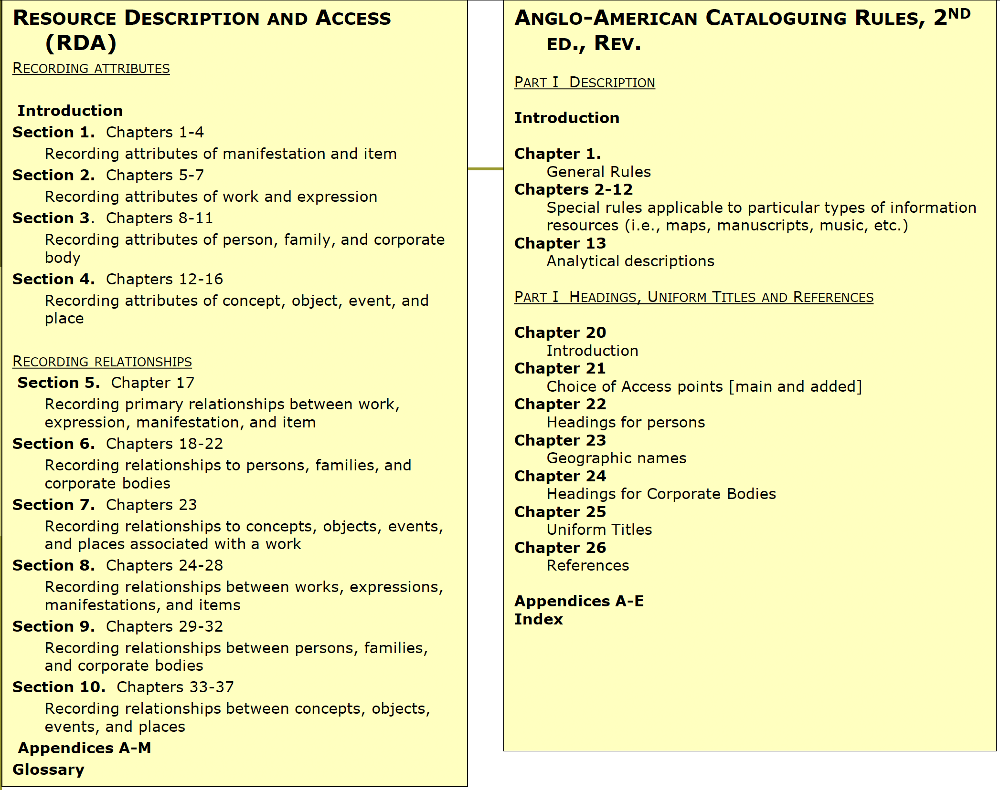

::: notes
On this slide I wanted to show you the differences between the RDA and
AACR2 structures.

The Anglo Anglo-American Cataloging Rules is set out in two separate
parts. First is for the use for creating the descriptive aspects in
catalog records, and then Part II is for headings, uniform titles, and
references references–creating access points, such as authorized
headings for names of people, corporate bodies, geographic names,
uniform titles.

The Part I description is set out by type of resource. So, in Chapter 1
we have general rules that you’re referred back to continually from the
other chapters. And then in Chapter 2-12 we have rules that are specific
to a type of format. So, for example, in Chapter 2 is dealing with books
or monographs, so that you would have specific rules you would go to
Chapter 2 if you’re cataloging a book.

RDA, however, is not set up in the same way. It’s set up in four main
sections that have chapters within them. And they’re looking at the item
at a work level as opposed to a database record level, which we would
see in the Anglo Anglo-American Cataloging Rules. And then in Sections
5-10 we have rules for recording those different relationships we saw in
the FRBR models and in the FRAD model as well. And then we have
Appendices A-M and Glossary that give us special considerations, and
then in the AACR2, we have appendices A-E which talk about punctuation
and abbreviations.

Tables extracted from [Miksa, S.D. (2009), Resource description and
access (RDA) and new research potentials. Bul. Am. Soc. Info. Sci.
Tech., 35: 47-51.
https://doi.org/10.1002/bult.2009.1720350511](https://asistdl.onlinelibrary.wiley.com/doi/10.1002/bult.2009.1720350511)
:::

## AACR2 vs. RDA: Difference in Proportions

`AACR2`

-   Description of information entities -- 13 chapters (Part 1)

-   Weak on access points; talks of main and added access points, have
    to look all over Part II for access point provisions (e.g., title
    access points are discussed in chapter 21 only and then only as a
    default provision, not much direction)

-   Is not really based on the idea of a “work”, rather it is very much
    based on the unit record system

::: notes
AACR2 arranges chapters by the type of information resource and then by
type of main or added access points (see Tables 1 and 2). In AACR2’s
Part I, chapters 2-12 each focus on a separate format and address only
the description of the resources.

It is weak on access points, even though Part II is devoted to choice
and formation of personal, corporate body, title access points, and
talks of main and added access points.

AACR2 is not really based on of the idea of a work, rather it is much
more based on the unit record within the system. So, in AACR2 we’re
looking at one bibliographic record for one item within your catalog,
where RDA is looking at that work level and then breaking it down into
expression, manifestation, and item and all the different elements that
are associated with each of those.
:::

## AACR2 vs. RDA (Cont.)

`RDA`

-   Description is covered in 4 chapters, everything else is about
    access points
-   Form is no longer the first decision; chapters are not based on form
    (e.g., no longer have chapters 2-12 as in AACR2)
-   Does not focus on the unit record system -- it can be, but it
    doesn’t need to do so -- rather it operates on the idea of a “work”
-   Does not put the cataloger in the decision of having to decide Main
    and Added Access points; we don’t need those distinctions any longer
    although it does use the idea of a “preferred access point”

::: notes
So, as I mentioned, there’s a big difference in the structure of how
AACR2 and RDA are set up. And this has been one of the contentions of
the library community, is that why did we have to shift our whole way of
thinking about how to describe resources or even what comprises a
resource? Within RDA, we’re no longer going to have to go to Chapter 2
whenever we’re looking for rules for describing books, which for
catalogers was pretty straightforward. If you had a book in your hand,
you knew which chapter in AACR2 to use. It would oftentimes refer you
back to Chapter 1 for the general rule. But if you had a more
specialized resource, such as cartographic materials, or maps, you would
go to that specific chapter, and it would have very specialized
instructions, where you don’t see that at play in the RDA.

In the RDA the description is covered in four chapters as I said, and
the rest is all about access points and building those relationships
into the records so we can serve that collocation function within our
systems.

The form of the object is no longer the first decision. Chapters are not
based on form, which again, is what a lot of catalogers are having real
issues with. It also does not focus on the unit record system. It can,
but it doesn’t need to do so. It relates mainly to the idea of “what is
a work?” So, it’s really important that you really understand that
concept of ‘work’ in the conceptual model.

It also does not put the cataloger in the decision of how to decide
between main and added entry points, such as who is the “main” author,
therefore the main access point or the main heading? And then who might
be additional creators or contributors to that work? In RDA we don’t
need those distinctions any longer. Although it does make use of the
term “preferred access point,” meaning that you have to have at least
one access point to the creator or the contributors of the work, and
that would be the preferred access point. There were limits within AACR2
as to how many access points you could create for an individual item,
and in RDA, those limits are no longer in play.
:::

## RDA and AACR2

-   RDA now outlines the first step in creating a catalog record as
    deciding on the type of description to be represented, and not
    deciding on format, although format is still integral

-   Types of description (rules 1.2)

    -   Comprehensive, analytical, or multi-level description

-   More emphasis on showing bibliographic relationships (e.g., taxonomy
    of bibliographic relationships) in order to better allow clustering
    of records

::: notes
RDA also now outlines the first step in creating a catalog record as
deciding on the type of description to be represented, whether it’s a
work, an expression, a manifestation, or an item - but not deciding on
its format - whether it’s a book or a CD ROM or a DVD. But format is
still integral, and as you’ll see, when you start looking at those
different maps from AACR2 to RDA, that we deal with format in new ways.

We have more of a comprehensive, analytical, or multi-level description
rather than just one item equals one record in a database.

We also have more of an emphasis on showing those bibliographic
relationships that I mentioned earlier and that are present in FRBR
models in levels one, two, and three. This, again, is going to allow us
to have better clustering, or collocation, of records within our library
catalogs once the vendors takes advantage of these new FRBRized systems.
:::

## Comparing RDA to AACR2

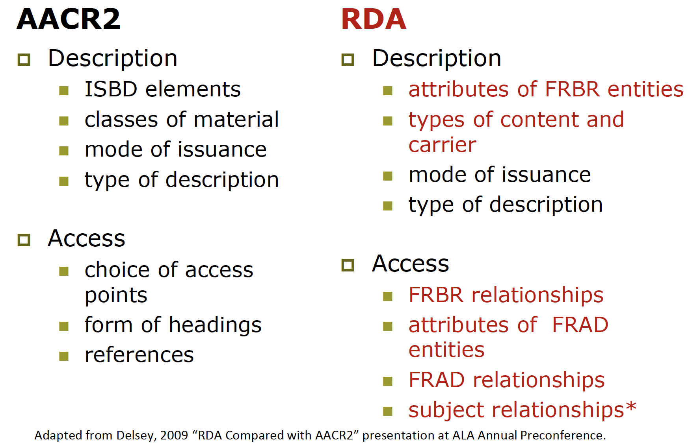{fig-align="center" width="700"}

::: notes
We can also take a table to table comparison from AACR2 to RDA. The
points that are in red are those that have been added or are specific to
RDA as opposed to AACR2. You can see that quite a bit has carried over
from AACR2 to RDA. You can also see that the names of some of these
items have changed as well, though they’re still very similar to the
actual element being described that we have in the AACR2.

So, for example, under “Description” we use the International Standard
Bibliographic Description elements, those eight areas of ISBD
description. Within RDA we’re no longer using those eight elements.
We’re using the attributes of FRBR entities, the WEMI model.

And we are no longer using classes of materials, such as we saw in
AACR2; we are using types of content and carrier.

Mode of issuance is still the same. Type of description is still the
same.

Now, in terms of access points in AACR2 we had guidance for how to
choose access points, and they were very prescriptive. We had name,
title, and subject access points, though subject access points were not
part of AACR2 unless it was using an individual or corporate name as a
subject. In RDA we have those FRBR relationships built in as access
points. So, for example, we would point from the work was created by an
individual individual–that would be on relationship.

That then becomes an access point. In AACR2 we had rules for how to
create these headings, or the form headings for the names.
:::

## AACR2 Structure

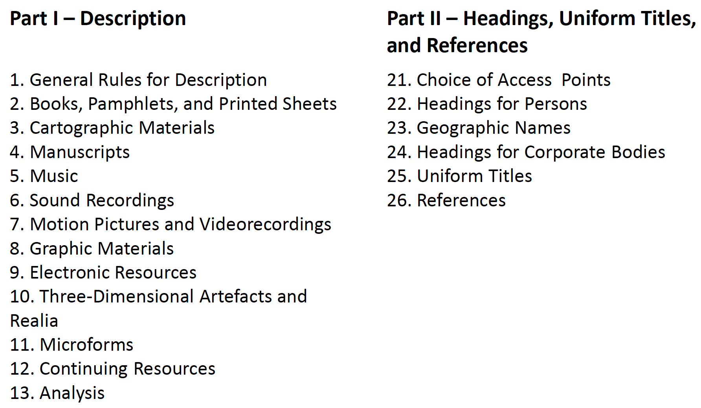{fig-align="center"}

::: notes
Okay, so just to go back to the idea of the RDA versus AACR2 structure.
In AACR2 we have Parts I and II. Part I is where we have all the rules
about how to create the descriptive aspects in our records using those
eight areas of ISBD description, such as author, title, statement of
responsibility, editions statement, etc.

You can see Part I is set out by chapters, which are specific to the
form of the work you actually have in your hand, or the form of the item
you have in your hand, such as books, cartographic materials,
manuscripts, music, sound recordings, etc. Each of these different forms
have their own individual chapter. Now, in the case of books, you’re
often referred back to Chapter for General Rules for Description, and
this again can happen for other forms as well.

In Part II that’s where we have the guidelines and rules for choosing
access points, how to create those actual headings, how to deal with
headings for people, geographic names, corporate bodies, uniform titles,
and references.
:::

## RDA Structure

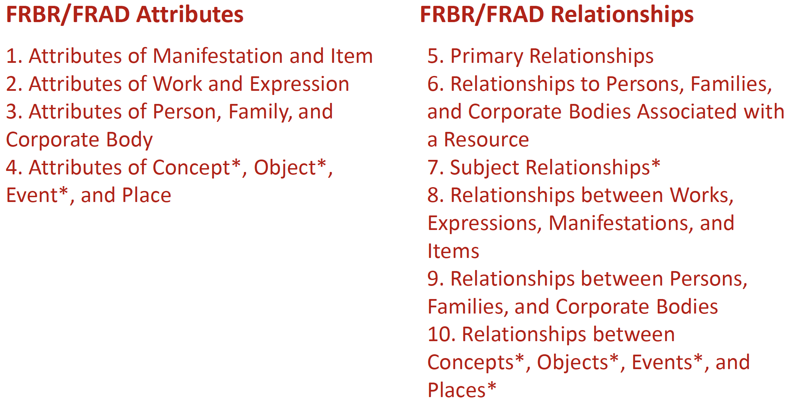

::: notes
RDA, as you can see here, is structured very differently. Instead of the
descriptive aspects, RDA is structure according to the FRBR and FRAD
attributes. RDA includes the attributes of manifestation and item, work
and expression; attributes of person, family and corporate body;
attributes of concept, object, event, and place all of which are derived
from the FRBR and FRAD models that you looked at in the last topic. So,
it’s really important to understand those different conceptual models
and the role that they will play in the new RDA framework.

Also in Sections 5 10 the FRBR and FRAD relationships set out as well as
how to establish each of those different relationships within our
records.
:::

## Categorization of Resources

`General Material Designations`

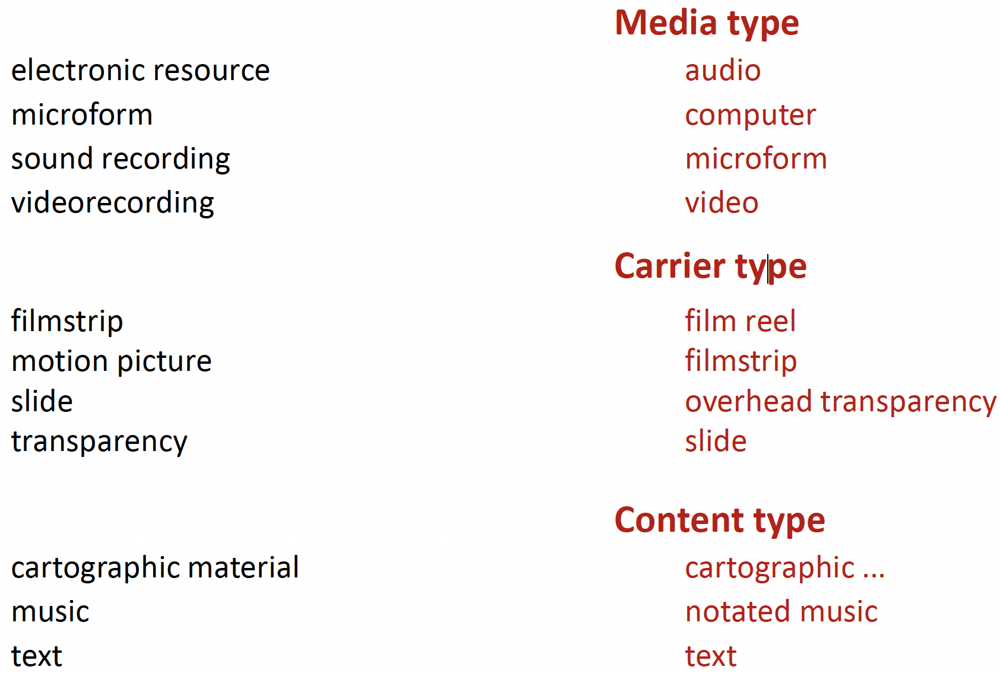{fig-align="center" width="700"}

::: notes
On this slide we’re looking primarily at categorization of resources, or
how RDA puts different resources into categories. For example, we would
have electronic resources in AACR2 on microform or sound recording or
video recording. With RDA we have broken this out into different types
of categories.

So, for example, in AACR2 we had what were called “General Material
Designations,” or GMD, which in your catalog, if you’re sorting by say
book or CD or DVD, the system itself is reading that GMD designation,
which is 245 subfield H in a MARC record. And it would allow you and
your users to actually filter through all of the different works on a
specific title by format.

So, if they only wanted books, they would only get books in their
search. If they wanted CDs, they would get CDs, etc. Now, with RDA we’re
no longer going to be creating GMDs, which is again is a point of
contention among librarians, especially in public and school libraries,
whose users like to filter or like to sort by different format of
object.

So, we’re no longer going to be creating GMDs; however, some people have
decided they’re going to do it anyways. As long as their system will
still read that field and sort, they’re going to include GMDs in their
records, even in their RDA record structure.

In RDA we’ve broken those General Material Designations into three
different categories, we have media type, carrier type, and content
type. And this is where RDA gets a little bit more confusing than AACR2.
But just keep in mind that there are now three, what we would have
called before, categorization of resources. We no longer have the GMDs.
We now have media type, carrier type, and content type.
:::

## Sources of Information

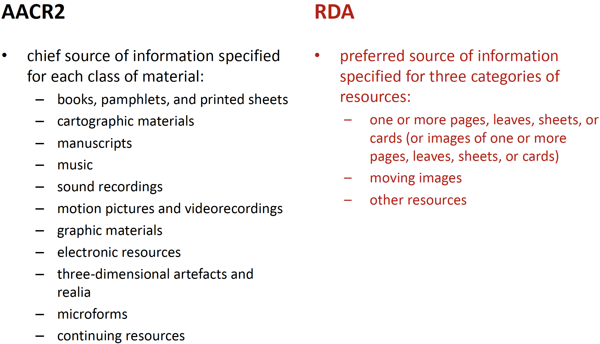{fig-align="center"}

:::notes

There are also some changes into what is considered a source of information.
In AACR2 we referred to this as the chief source of information. And the chief
source of information is specified for each class of material. Chief source of
information basically means that where do you look on the item itself in order
to find information to put into your bibliographic records. So, where do you
look for title? Where do you look for statement of responsibility or who
created this resource? And in AACR2 there’s a different chief source of
information for each of those different forms of items. So, for books it would
be the title page or the verso of the title page, meaning the back of the title
page. For manuscripts or maps you would have a different chief source of
information. For sound recordings, for example, you might look at the title
screen or you might look at the liner notes if it’s a CD of music. So, there
would be various different places you would look on the item, and again, we
would call that ‘chief source.’


In RDA we now call it preferred source of information, and it’s specified for
three categories of resources. So, things that are print based would be in one
group. You would look for one or more pages, leaves, sheets, or cards, for
example. So, you would look at pages, leaves, sheets, or cards to find the
information to enter for the title. For moving images, we would have a
different chief source of information. Generally, if it’s a moving image, it’s
going to be the title screen or even the credits. And then we would have other resources. All these other formats would have specific chief sources that are identified
within that other resources category.

So, AACR2, again, is set out specific to each class of material. RDA is specified for
three categories of resources. And then there’s a lot of differences in the language
here, and that’s something that people that have been using AACR2 for years now
have to change their mindset. They now have to think about instead of ‘chief source of
information,’ ‘preferred source of information.’ So, any new catalogers that are
coming in under RDA, at least in the probably first five years of its implementation,
are probably still going to have to learn both sets of vocabulary and how AACR2
versus RDA works. But anyone that’s coming in towards the end of this transition
period will probably just learn the new language of RDA and not have to learn some
of the other vocabulary that was present in the AACR2.
:::


## Transcription {.smaller}

- Elements transcribed from source
  - title, statement of responsibility, edition statement, etc.
- Modification of transcribed data
  - capitalization, diacritics, symbols, spacing of initials and
acronyms
- Abbreviation
  - AACR allows abbreviations to be used in certain transcribed
elements (e.g., edition statement, numbering, place of
publication, distribution, etc., series)
  - RDA permits abbreviations in transcribed elements only if
the data appears in an abbreviated form in the source
- Inaccuracies
  - AACR allows inaccuracies to be corrected within
transcribed elements
  - RDA requires inaccuracies to be recorded as they appear in
the source

:::notes

Okay, let’s look at some other changes in terms of transcribing information
from the resource into the bibliographic record. Using RDA we now are going
to transcribe elements directly from the source. Before we followed AACR2
conventions. Now we have this kind of “see it as it is” viewpoint, that even if
there is some type of an error, we’re supposed to transcribe it in the same way
using RDA. In AACR2 we could indicate that there was an error, and we could
put things in brackets, indicating some issue with the title, for example. So,
elements that are transcribed exactly from the source are the title, statement of
responsibility, edition statement, etc.

We also can modify transcribed data in term of capitalization, diacritics,
symbols, spacing of initials, and acronyms. There are some differences
between how we’re doing this in AACR2 and in RDA. In AACR2 we used
sentence style capitalization. In RDA we’re supposed to keep the same
capitalization as on the item itself, which again is a contention that librarians
are not very happy about right now, especially as it’s translated into systems
where we might have records that have one form of capitalization and other
records that have a different form.

Also in AACR2 we allow abbreviations to be used in certain transcribed
elements, and those are listed here. We even have specific appendices in
AACR2 that tell you how to abbreviate certain words. In RDA they permit
abbreviations in transcribed elements only if they appear as an abbreviated
form in the source itself. So, we’re no longer using these abbreviations that catalogers
have learned through the years. Things like “illustrated” will now be spelled out as
opposed to “Ill.” The idea behind this is that our users do not understand our
abbreviations, nor do other systems and metadata schemes that we want to share our
data with. So, we’re now going to get rid of abbreviations and use them only when
prescribed that way on the actual item itself, which again for me is a real issue
because it deals with the consistency of how things are displayed in records, how
they’re searched or how a system reads them and understands what to do with them.

In terms of inaccuracies, AACR2 allows inaccuracies, as I mentioned earlier, to be
corrected within those different transcribed elements. RDA requires inaccuracies to be
recorded as they appear within the source. So, if something is misspelled, you have to
leave it according to RDA. You should no longer be putting it in the correct form and
then in brackets and indicating that it was in some way inaccurate.
:::


## Rules of Three {.smaller}

- Collaborative words
  - AACR2: entry under title if more than three persons or
corporate bodies responsible
   - RDA: first named person, family, or corporate body with
principal responsibility (or first named if principal
responsibility not indicated)

- Compilations of works by different persons or bodies
  - AACR2: entry under heading for first work if no collective
title (with added entries if no more than three works in the
compilation)
  - RDA: separate access points for each work (and/or devised
title for compilation)

- Treaties, etc.
  - AACR2: entry under title if more than three parties
  - RDA: party named first (exception for single party on one
side) ; title if first named party cannot be determined

:::notes

Okay, another thing that was changed from AACR2 to RDA is what is called
‘the rule of three.’ And this is the rule that states that no more than three
access points should really be created for an individual item. Now, RDA has
changed this obviously because we see in the FRBR and the FRAD models
that access points are very important to our users to fulfill those user tasks. So,
let’s talk a little bit about how these are addressed within AACR2 and RDA.

In collaborative works, meaning that the work was created by more than one
individual, in AACR2 we would have a main entry under the title. The entry
under the title if more than three persons or corporate bodies was responsible.
So, we would have a main entry for the main author, the main creator. Then we
would have additional access points in the 700 field of our records. We could
also under the statement of responsibility in the 245 subfield C in a MARC
record include that addition of those persons’ names. In RDA we treat this a
little bit differently. We have the first named person, the family or corporate
body, with the principle responsibility. So, they’re the first named if principle
responsibility is not indicated in collaborative works. But we have the ability
to go beyond that rule of three to provide additional access points.

Now, if we had a compilation of works by persons or bodies
say we have a
conference proceeding or we have an anthology ––, under AACR2 the entry
under the heading is for the first work if no collective title with added entries if
there are no more than three works in the compilation. So, if we have an anthology and we have no more than three separate works in that item, then we would
be able to add those entries as access points. If we had a conference proceedings,
however, we might have 400 different contributors, that really wasn’t very helpful
with AACR2. With RDA we can create a separate access point for each work and/or
devised title for that compilation. So, if we had 400 authors, I’m not sure we would
want to put all these in an RDA record, but you have the possibility of doing that now.

Under treaties under AACR2 we have an entry under title if more than three parties. In
RDA we have a party named ‘first,’ again, with an exception for single party on one
side. And then in title if first named party cannot be determined, we would also give
additional information in the title area.

So, there are some differences. And some of these things are very minor, and some of
these to catalogers are actually good changes that they’ve really wanted for a long
time, and this rule of three is an example of one of those. They have wanted for years
to be able to provide access to not just the overall work itself, but in the case of the
conference proceeding, the individual authors or titles within that work.

:::

## RDA and MARC

- The MARBI working group (comprised of
members from the Library of Congress,
British Library, Library and Archives Canada,
and other entities) has been working to revise
the MARC structure to work with RDA

- MARBI disbanded in 2012/13 joint
LITA/ALCTS group on metadata and new bib
framework forming

- Documentation [(www.loc.gov/marc)](www.loc.gov/marc)
  - Draft documentation of approved changes
  - Links to documents describing possible changes
under discussion

:::notes

RDA changes are of course related to changes that were made
to the MARC
record structure. The MARBI working group was tasked with this effort early
in the development of RDA. However, MARBI was disbanded in 2012/13 and
a new working group comprised of members from the Library Information
Technology Association (LITA) division of ALA and ALCTS, division of ALA
are now tasked with suggesting and making changes to MARC and emerging
bibliographic frameworks, like BIBFRAME, that will be used to create
bibliographic records.


You can learn more about the changes to MARC and the joint working group
following the link on the slide.
:::


## Putting it all together

- Descriptive cataloging using AACR2, RDA
- Combined with subject analysis and
selection of controlled terms from
controlled vocabularies like: LCSH,
MESH, Sears, ERIC
- Classification added, based on subject of
object (LCC, DDC, faceted schemes)
- Implemented in different formats/tools
  - In past: manual card catalog
  - Presently: MARC records (OCLC), metadata
schemes (Dublin Core), XML MARC

:::notes
All in all, in this module, you learned more about how bibliographic
records are structured, the standards that guide cataloger/record creators, and
the tools we use to create the descriptive aspects of the records. 

In the next
lecture, we will look at the MARC record standard and discuss the concept of
authority control and how it is used in bibliographic records.

:::


